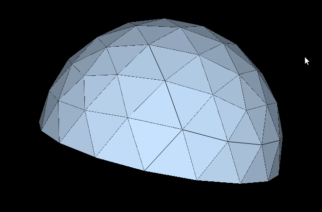

pyLair - An Agentic Geodesic Structure Designer
======

[](https://github.com/badass-data-science/pyLair-agentic-geodesics/actions/workflows/ci.yml)
[](pyproject.toml)
[](LICENSE)



A geodesic dome calculator written in Python.

pyLair calculates vertices and chords of Class I ("Alternate"), Class II ("Triacon"), and Class III ("Skew"/chiral) geodesic domes of arbitrary size. Domes created by pyLair can be truncated to facilitate structure design. The program produces DXF for easy import into CAD programs, and VRML output for easy display, plus a Bill of Materials report (chord lengths/counts, hub angles, and total strut length/cost) for construction.

For the geometric method (icosahedron/octahedron subdivision, projection, truncation) and reference images, see [METHOD.md](blog-posts/METHOD.md).

## Installation

Requires Python 3.9+.

```
pip install -e .
```

This installs `numpy`, `pandas`, `scipy`, and `matplotlib` as dependencies, and provides a `pylair` console command. For running the test suite, install the `test` extra instead:

```
pip install -e ".[test]"
pytest
```

## Usage

```
pylair -o output/mydome -f 4 -r 1.0
```

produces `output/mydome.dxf`, `output/mydome.wrl`, and prints a JSON Bill of Materials report to stdout.

## MCP interface

For agentic use (an LLM assistant interactively designing a dome), install the `mcp` extra:

```
pip install -e ".[mcp]"
```

This provides a `pylair-mcp` console command: an [MCP](https://modelcontextprotocol.io) server (stdio transport) exposing four tools, all sharing one geometry parameter schema (`radius`, `frequency`, `polyhedron`, `dome_class`, `n_frequency`, `truncation_x`/`truncation_y`/`truncation_z`, `elongation_x`/`elongation_y`/`elongation_z`, `vertex_equal_threshold`):

| Tool | Purpose |
|---|---|
| `design_dome` | Computes geometry only (no files) and returns vertex/edge/face counts, bounding box, height, footprint, and total strut length — a cheap way to try configurations. |
| `preview_dome` | Renders the wireframe preview and returns it as an inline image, so the dome can be seen in-conversation before any file is written. |
| `get_bill_of_materials` | Returns the JSON Bill of Materials (strut lengths/counts, hub angles, total length/cost, and panel shapes/counts with a chirality flag, total panel area/cost/weight, and bevel angles between adjacent panels — panel data is included regardless of truncation, since `truncate()` clips faces correctly on any combination of axes) as structured data, no files. Accepts optional `cost_per_unit_area`/`panel_areal_density`. |
| `export_dome` | Writes output files to disk (DXF/VRML by default; STL/OBJ/hub-templates/face-templates/preview PNG optionally). Truncation on any combination of axes correctly preserves face data, so all output types work regardless of `truncation_x`/`truncation_y`/`truncation_z`. Returns the paths written plus the Bill of Materials. |

Configure it in an MCP client (e.g. Claude Code/Desktop) by pointing at the `pylair-mcp` command. All four tools share the same validation as the CLI (`pylair/api.py:validate_geometry_params`) — an invalid combination (e.g. Class II with an odd frequency) raises a clear error rather than producing bad geometry.

## OpenClaw interface

For agentic use through [OpenClaw](https://openclaw.ai/), pyLair ships an [OpenClaw skill](https://docs.openclaw.ai/tools/creating-skills): [`SKILL.md`](SKILL.md) at the repo root. OpenClaw doesn't consume MCP servers directly, so this skill wraps the `pylair` CLI itself rather than `pylair-mcp` — it's gated on the `pylair` binary being on `PATH` (via `metadata.openclaw.requires.bins`), so it only loads once `pip install -e .` (or a published `pip install pylair`) has been run.

To install it:

1. Copy (or symlink) `SKILL.md` into your OpenClaw workspace's skills directory, e.g. `~/.openclaw/workspace/skills/pylair/SKILL.md`.
2. Merge [`openclaw.config.snippet.jsonc`](openclaw.config.snippet.jsonc) into the `skills.entries` object of `~/.openclaw/openclaw.json` to enable it.

The skill instructs the agent to drive the same `pylair` CLI documented below, so its behavior always matches the CLI/MCP interfaces — there is still one geometry/validation engine (`pylair/api.py`) underneath all three.

### Command-line options

| Flag | Long form | Description | Default |
|---|---|---|---|
| `-o` | `--output` | Output file path; `.dxf`/`.wrl` are appended. Required. | — |
| `-r` | `--radius` | Dome radius. Must be > 0. | `1.0` |
| `-f` | `--frequency` | Subdivision frequency. Must be a positive integer. | `4` |
| `-p` | `--polyhedron` | Base polyhedron: `icosahedron` or `octahedron`. | `icosahedron` |
| `-c` | `--class` | Subdivision class: `1` (Alternate), `2` (Triacon), or `3` (Skew/chiral). Class 2 requires an even `-f`. Class 3 requires `-n`. | `1` |
| `-n` | `--n-frequency` | Second frequency parameter for `-c 3`. `-f`/`-n` play the roles of `m`/`n` in the `(m,n)` Goldberg-Coxeter construction; must be a positive integer different from `-f`. Ignored for classes 1 and 2. | — |
| `-t` | `--truncation` | Cutoff ratio (0-1) from the minimum Z (vertical) extent; keeps the portion above this fraction, discards the rest. Passing this enables Z-axis truncation. Correctly clips face data too, so it's compatible with `-F`/`-s`/`-O`/`-T`/`-a`/`-w`. | off (full sphere) |
| `-x` | `--truncation-x` | Same rule as `-t`, but along X. Off by default; combine with `-t`/`-y` to clip more than one axis (applied in X, then Y, then Z order, so a later axis's cutoff is computed against that axis's range *after* earlier axes are already trimmed). Also correctly clips face data, alone or combined with the other axes. | off |
| `-y` | `--truncation-y` | Same rule as `-t`, but along Y. See `-x`. | off |
| `-v` | `--vthreshold` | Distance below which two computed vertices are treated as the same point. | `0.0000001` |
| `-b` | `--bom-rounding` | Decimal places to display, and merge granularity, for the Bill of Materials (see caveats below). | `9` |
| `-m` | `--material-cost` | Price per unit length of strut material. If given, adds an estimated total material cost to the report alongside the total strut length (which is always reported). Must be > 0. | off (length only) |
| `-F` | `--face` | Emit face data (not wireframe) in the WRL output; skips DXF entirely. Works with truncation on any axis. | off |
| `-P` | `--preview` | Also save a quick 3D wireframe preview image (`<output>.png`) for a fast sanity check without opening a CAD/VRML viewer. | off |
| `-s` | `--stl` | Also save an STL file (`<output>.stl`) of the dome's surface triangles, e.g. for 3D-printing a scale model. Requires face data; works with truncation on any axis. | off |
| `-O` | `--obj` | Also save an OBJ file (`<output>.obj`) of the dome's surface triangles. Requires face data; works with truncation on any axis. | off |
| `-H` | `--hub-templates` | Also save one 2D DXF cutting template per unique hub connector shape (`<output>_hubtype1.dxf`, `<output>_hubtype2.dxf`, ...), for laser-cutting/CNC connector plates. | off |
| `-T` | `--face-templates` | Also save one 2D DXF cutting template per unique panel (face) shape (`<output>_facetype1.dxf`, `<output>_facetype2.dxf`, ...), for laser-cutting/CNC panel material. Requires face data; works with truncation on any axis. | off |
| `-a` | `--area-cost` | Price per unit area of panel material. If given, adds an estimated total panel material cost to the report alongside the total panel area (both reported whenever face data is available). Requires face data; works with truncation on any axis. Must be > 0. | off (area only) |
| `-w` | `--panel-density` | Areal density (mass per unit area, e.g. kg/m²) of panel material. If given, adds an estimated total panel weight to the report. Requires face data; works with truncation on any axis. Must be > 0. | off |
| `-e` | `--elongation` | Stretches the dome along all three axes by independent factors `"fx,fy,fz"` before truncation, turning the sphere into a general axis-aligned ellipsoid (values > 1 stretch that axis, values < 1 squash it -- e.g. `"1.0,1.0,1.8"` raises ceiling height only, `"1.3,1.0,1.0"` widens the footprint along X only). All three factors must be > 0. | `"1.0,1.0,1.0"` (no elongation) |
| `-h` | `--help` | Show usage and exit. | — |

## Caveats and known limitations

A few behaviors are worth understanding before relying on the output for a real build.

- **Truncation at a chord exactly flat against the cutoff plane fails loudly.** If a truncation cutoff (on any of `-t`/`-x`/`-y`) happens to land exactly on a chord that lies flat against that plane, `truncate()` raises a clear `ValueError` describing the degenerate case rather than producing a corrupted vertex (the message doesn't identify which specific chord — just that one was found flat against the cutoff plane). This is why the `-t/--truncation` help text recommends sticking to `0.499999` or `0.333333` — these ratios are chosen to avoid landing exactly on a vertex ring for typical frequencies. If you hit this error, nudge the offending axis's cutoff slightly.

- **`-b/--bom-rounding` controls two things at once: display precision and merge granularity.** Chords are grouped into Bill-of-Materials rows by clustering their lengths, not by independently rounding each one — this avoids splitting a single true strut length into multiple rows due to floating-point noise. The clustering tolerance is derived from `-b`, so a coarser value (e.g. `-b 2`) intentionally merges strut lengths that are close but not identical, which is useful when your fabrication tools can't distinguish sub-millimeter differences. The default is `9`, which stays exact (no unintended merging) at any practical dome frequency. If you deliberately lower `-b` for a high-frequency dome, be aware it may merge lengths that are actually meant to be different — check the DXF/report before cutting material to a merged length.

- **`-f/--frequency` must be a positive integer and `-r/--radius` must be greater than zero.** Both are validated with a clear error message; there is no dome at frequency 0 or radius 0.

- **`-v/--vthreshold` controls vertex deduplication**, i.e. how close two computed vertices must be to be treated as the same point where polyhedron faces meet. The default (`1e-7`) is tuned for the default unit radius; if you use a very large or very small `-r`, you may need to adjust `-v` proportionally.

- **`-F/--face`, `-s/--stl`, `-O/--obj`, `-T/--face-templates`, `-a/--area-cost`, and `-w/--panel-density` all require face data — and truncation on any axis, or any combination of axes, now correctly preserves it.** `truncate()` clips the face list against the cutoff plane, reusing the exact same edge-intersection points as vertex/chord splitting, so a clipped panel's new corner and the strut running along that same cut land on the identical point rather than two independently-rounded near duplicates. Sequential multi-axis truncation composes correctly too: each axis's `truncate()` call computes crossing points fresh from whatever geometry the previous axis's call produced, including any diagonal seam a previous quad-split introduced (see the next caveat).

- **A quad-shaped boundary panel (from truncating 2+ axes through the same original triangle) is reported as 2 separate triangular panels sharing a strutted seam, not one physical quad panel.** When a single original triangle gets its corner clipped by one axis's cutoff, the result can be a quadrilateral rather than a triangle; pyLair splits it into 2 triangles along a diagonal so every panel in the report stays a simple 3-edge shape. That diagonal is a real, physically bracable edge — since both sub-triangles lie in the same plane as the original (undivided) face, it is added to the strut/chord list like any other chord (so it gets a length in the Bill of Materials and appears in hub/connector output at both endpoints), and it gets a bevel angle from the panel edge report, which will read flat (~180° dihedral, ~0° bevel) since the two sub-panels it joins are coplanar.

- **`-c 2` (Class II / Triacon) requires an even `-f/--frequency`.** Each polyhedron face is first split into 6 LCD (lowest common denominator) sub-triangles around its centroid before the requested frequency subdivides each of those further, so the frequency is implicitly divided by 2 internally; an odd frequency has no valid Class II construction and is rejected with a clear error.

- **Chord/vertex counts grow with the square of frequency.** A Class I subdivision of an icosahedron produces `20*f^2` faces; Class II produces `120*(f/2)^2` faces (more, at a given frequency, since Class II is already 6-way subdivided before the frequency-level grid is applied); Class III produces `20*T` faces, where `T = m^2 + mn + n^2` (`m`/`n` from `-f`/`-n`). Vertex deduplication uses a KD-tree and scales well even at high frequency, but very high frequencies will still produce large DXF/VRML files and correspondingly large Bill of Materials reports.

- **`-c 3` (Class III / Skew) requires `-n/--n-frequency`, a positive integer different from `-f/--frequency`.** `-f`/`-n` play the roles of `m`/`n` in the `(m,n)` Goldberg-Coxeter construction (equal values would be Class II — use `-c 2` instead). `(m,n)` and `(n,m)` are mirror-image (chiral) domes of the same size and strut-length total, but not the same specific strut pattern — swap `-f`/`-n` to get the other one. Unlike Class I/II, a chiral lattice's near-edge points don't land at coincident 3D positions when each polyhedron face computes its own grid independently, so pyLair stitches adjacent faces together combinatorially (matching each face's grid points by an integer index rather than 3D proximity) instead of relying solely on `-v/--vthreshold`. This construction was cross-checked bit-for-bit against the independent [`antitile`](https://github.com/brsr/antitile) library (used only as a development-time correctness oracle, not a runtime dependency) across several `(m,n)` pairs on both base polyhedra.

- **Small-length chords and panels in the output can be truncation-boundary artifacts, not intentional struts/panels — and the report flags them explicitly.** A truncation cutoff that lands extremely close to (but not exactly on) an existing vertex ring produces a sliver: a chord shortened to a near-zero length, or a panel clipped down to a near-zero-area triangle. This is easy to trigger by accident — `-t 0.4999999` versus the documented `0.499999` looks like a rounding difference, but can shift the cutoff from "safely clear of the equator's vertex ring" to "practically on top of it." Any `Bill of materials` chord, or `Panel shapes and counts` panel, under 0.1% of the dome's largest strut length is reported in a `Possible truncation-artifact chords`/`Possible truncation-artifact panels` list alongside the full data, so these don't have to be spotted by eye in a long report. Note that even the documented "safe" cutoffs (`0.499999`, `0.333333`) aren't universally immune at every frequency — they reduce how often a cutoff lands close to a vertex ring, but don't guarantee avoiding it, which is exactly why this flagging exists rather than relying on doc advice alone. Check any flagged entry in a DXF viewer before building; nothing is automatically dropped from the report or the output files.

- **`-H/--hub-templates` clusters hubs by a rotation-invariant "shape" signature** (valence, plus the cyclic pattern of angular gaps and tangential angles going around the hub), not by symmetry group membership — two hubs get the same template if and only if one is a rotation of the other, regardless of *why*. The clustering tolerance (3 decimal places on angle values) was tuned empirically: the geometry pipeline's floating-point noise was observed to reach the 6th decimal place on otherwise-identical hubs, and a precision of 6 failed to merge them, silently doubling the reported template count. If you're working at a much higher frequency than has been tested (up to 16) and the template count looks suspiciously large for the dome's symmetry, that noise floor is the first thing to check.

- **`-e/--elongation` is applied before truncation, and truncation is applied in X, then Y, then Z order when more than one of `-x`/`-y`/`-t` is given.** A truncation cutoff always describes where to cut that axis's *final* extent, not the original sphere's: elongation happens first for all three axes, and each axis's own cutoff (if given) is computed against that axis's range in the vertex set as already trimmed by any earlier axis. All angle-based output correctly accounts for the resulting general (triaxial) ellipsoid's true surface normal (the gradient of the ellipsoid equation, generalized to three independent semi-axes) rather than naively treating each vertex's position vector as the normal — that naive approximation is only exact for a true sphere (`-e 1.0,1.0,1.0`), and silently gives wrong tangential/spoke angles for any other elongation otherwise, so don't reintroduce it.

- **Panel shapes are grouped by edge length alone (SSS), which can't distinguish a triangle from its mirror image.** Every dome face is a triangle, so distinct panel "shapes" in the report are clustered by their 3 edge lengths, exactly like `-H`'s hub-shape clustering. Two panels with identical edge lengths can still be mirror images of each other — this is common even on a Class I dome, not just chiral Class III ones — so each group's `chiral` flag and `orientations` breakdown should be checked before cutting from a directional material (wood grain, printed film). A DXF cutting template covers both orientations of a shape (a physical template can always be flipped over), so `-T` only ever writes one file per shape group, not per orientation.

- **Bevel angles between panels are reported per strut, not per panel shape**, because the same panel shape can border a different neighbor (and thus a different dihedral angle) at different places in the dome — unlike edge length, bevel angle isn't a property of the shape itself, so it can't be baked into the `-T` templates the way edge lengths are.

## Project structure

`pylair` is a regular Python package (`pyproject.toml` declares it under `[tool.setuptools] packages = ["pylair"]`), not a flat collection of top-level modules.

| File | Responsibility |
|---|---|
| `pylair/__init__.py` | Package marker; intentionally empty besides the license header. |
| `pylair/__main__.py` | Enables `python -m pylair`; delegates to `cli.main()`. |
| `pylair/cli.py` | CLI entry point (`pylair` console command → `cli:main`): argument parsing and orchestration via `pylair/api.py`. |
| `pylair/api.py` | Programmatic entry point shared by the CLI and the MCP server: `build_dome(...)` (validation, symmetry-triangle construction, projection, elongation, sequential X/Y/Z truncation) and the shared `ValueError`-raising validators. |
| `pylair/mcp_server.py` | MCP server (`pylair-mcp` console command, optional `mcp` extra): `design_dome`/`preview_dome`/`get_bill_of_materials`/`export_dome` tools built on `pylair/api.py`. |
| `pylair/polyhedral.py` | The base polyhedra (`Icosahedron`, `Octahedron`), the `Vertex`/`Chord`/`Face` primitives, `build_lcd_faces` (splits each face into 6 sub-triangles for Class II), and `compute_face_adjacency` (which face/edge borders which, for Class III's cross-face stitching). |
| `pylair/symmetry_triangle.py` | Subdivides a single polyhedron face (Class I) or LCD sub-triangle (Class II) into a triangular vertex/chord/face grid. |
| `pylair/class_three.py` | Builds the Class III (chiral `(m,n)`) grid for a single polyhedron face, plus the combinatorial cross-face vertex-matching data (`cross_face_matches`, `local_priority`) `GeodesicSphere` needs to stitch adjacent faces together correctly. |
| `pylair/geodesic_sphere.py` | Replicates the symmetry triangle across every polyhedron face, deduplicates the vertices shared along adjacent-face edges (via a KD-tree, plus Class III's combinatorial matches when supplied), and projects the result onto a sphere of the requested radius. |
| `pylair/truncation.py` | Cuts a geodesic sphere at a plane perpendicular to a given axis (`-t/-x/-y`, applied independently and sequentially per axis) to produce a dome, including clipping the face list into correctly-shaped smaller triangles along the cutoff -- composes correctly across repeated calls on different axes. |
| `pylair/elongation.py` | Scales all three axes independently (`-e/--elongation`) to turn the sphere into a general axis-aligned ellipsoid, for ceiling-height/footprint tradeoffs on any axis. |
| `pylair/output.py` | DXF, VRML (wireframe or face), STL, OBJ, hub-connector-template, and panel(face)-template file writers. |
| `pylair/preview.py` | Renders a quick 3D wireframe preview PNG (`-P/--preview`), with equal axis scaling so the plot itself never distorts the dome's proportions. |
| `pylair/bill_of_materials.py` | Clusters chords into strut-length groups, computes hub tangent-plane and spoke angles (using the true ellipsoid surface normal when elongated), clusters hubs into connector-plate "types" (`-H/--hub-templates`); on the face side, clusters triangular panels into shape "types" with a mirror-image (chirality) flag, computes total panel area/cost/weight and per-strut bevel angles between adjacent panels, and generates panel cutting templates (`-T/--face-templates`); prints the report as JSON. |
| `tests/` | pytest suite: unit tests per module (importing from `pylair.*`) plus subprocess-level CLI integration tests (invoked via `python -m pylair`). |
| `SKILL.md` | [OpenClaw](https://openclaw.ai/) skill definition wrapping the `pylair` CLI, for agentic use through OpenClaw (see "OpenClaw interface" above). |
| `openclaw.config.snippet.jsonc` | Config snippet to enable the `pylair` skill in `~/.openclaw/openclaw.json`. |
| `blog-posts/METHOD.md` | The geometric method walkthrough with reference images (icosahedron subdivision, projection, truncation). |
| `images/` | Diagrams referenced by this README. |

Internally, vertices/chords/faces are referenced by plain integer index into Python lists — 0-indexed throughout, matching how they're actually used (this wasn't always true; earlier versions numbered them 1-indexed and subtracted 1 at every point of use).

## Development

```
pip install -e ".[test]"
pytest
```

The test suite includes golden-value checks against known geodesic-dome vertex/edge/face-count formulas (e.g. a Class I icosahedron-derived sphere at frequency `f` has `10f²+2` vertices, `30f²` edges, `20f²` faces; Class II has `60m²+2` vertices, `180m²` edges, `120m²` faces, where `m=f/2`; Class III has `10T+2` vertices, `30T` edges, `20T` faces, where `T=m²+mn+n²`), so a correctness regression in the geometry pipeline should show up as a failing count rather than just an exception. The Class II formulas were verified empirically (via Euler's formula `V-E+F=2` and `2E=3F`, which must hold for any closed triangulated mesh) rather than taken purely from a derivation — an earlier version of `ClassTwoMethodOneSymmetryTriangle` had a real bug (assumed an orthogonal local coordinate basis that only happens to hold for Class I's equilateral triangle) that these identities caught immediately, before the golden-value formulas were even known.

Class III required more than Euler's formula to get right: a first implementation (per-face-independent grid, merged only by 3D proximity like Class I/II) satisfied Euler's formula and even the golden-value counts while still being *wrong* — it left all 30 of the icosahedron's original edges as long, unsubdivided chords, because a chiral (`m != n`) lattice has no reflection symmetry, so a point near a face's edge generally doesn't land at the same 3D position when computed independently from the neighboring face's own basis. The fix (`pylair/class_three.py`) stitches adjacent faces together combinatorially — matching grid points by an integer index derived from the lattice's own structure, not 3D coordinates — and was verified against the independent [`antitile`](https://github.com/brsr/antitile) library (a development-time-only oracle, not a runtime dependency): the full sorted, mean-normalized edge-length distribution matched antitile's output to within `1e-15` for several `(m,n)` pairs on both base polyhedra.

The face Bill of Materials' dihedral-angle formula and the `-T/--face-templates` DXF layout got the same oracle treatment, this time against two independent, general-purpose libraries rather than a domain-specific one. `pip install -e ".[verify]"` installs [`trimesh`](https://trimesh.org/), [`shapely`](https://shapely.readthedocs.io/) (a transitive dependency `trimesh.intersections.slice_mesh_plane` needs but doesn't pull in on its own), and [`ezdxf`](https://ezdxf.readthedocs.io/); `tests/test_geometry_oracle.py` (skipped automatically if they're not installed) loads pyLair's own OBJ output back into `trimesh` and cross-checks its independently-computed face areas and face-adjacency angles against `bill_of_materials.compute_face_data`/`compute_dihedral_angles` across several polyhedron/frequency combinations, separately cross-checks truncated-face output against `trimesh.intersections.slice_mesh_plane` as an independent ground truth for the panel-clipping work described above, and separately parses a generated face template back out with `ezdxf` to recover each vertex's 2D position from the raw `LINE` entities and confirm the recovered edge lengths match what was asked for — validating `OutputFaceTemplateDXF`'s law-of-cosines placement via a parse-then-measure path rather than re-deriving the same trigonometry in the test.

This codebase was ported from Python 2 to Python 3, and most of the Python 2-isms found along the way (bare `except:` clauses, wildcard imports, a private/deprecated `numpy.linalg.linalg`/`numpy.matrix` API, 1-indexed vertex numbering) have been cleaned up. If you spot code that still looks unusual for modern Python — e.g. the manual dict-based grouping in `pylair/bill_of_materials.py` where a `collections.defaultdict` would read more clearly — it's likely another such holdover rather than an intentional design choice. Feel free to modernize it if you're in the area, just add/update tests alongside.

## References

Material consulted while building the Class III (Skew/chiral) subdivision:

- Šiber, A. (2007). ["Icosadeltahedral geometry of fullerenes, viruses and geodesic domes"](https://arxiv.org/abs/0711.3527). arXiv:0711.3527. Source for the `(m,n)` Caspar-Klug/Goldberg-Coxeter framework and the `T = m² + mn + n²` triangulation-number formula that Class I, II, and III all turn out to be special cases of.
- [`antitile`](https://github.com/brsr/antitile) (brsr). An open-source Python library implementing the general Goldberg-Coxeter construction. Used only as a development-time correctness oracle (installed in a scratch environment, never a pyLair runtime dependency) to verify `pylair/class_three.py`'s output bit-for-bit; reading its `breakdown.py`/`gcopoly.py` source was also what led to correctly diagnosing the cross-face stitching bug described above.

## License

MIT. See [LICENSE](LICENSE).
