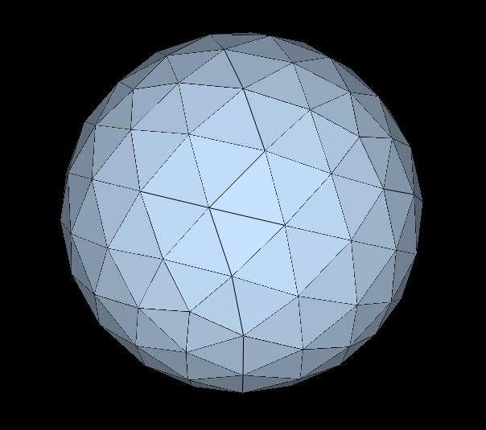
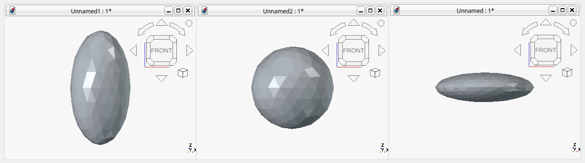
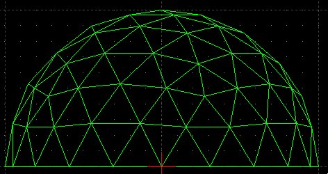
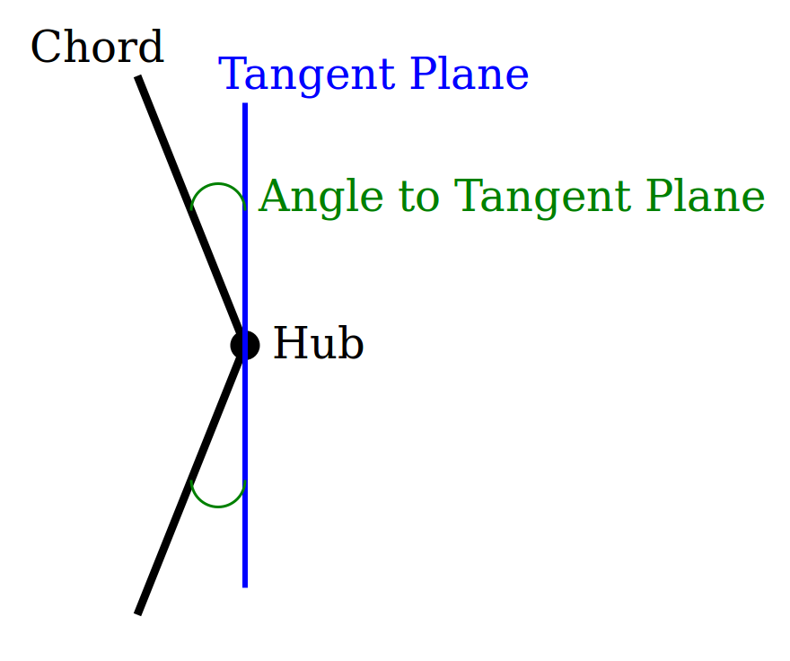

# Introducing pyDome (or, How Our Heroine Designed Her Geodesic Secret Lair)

Our heroine's secret laboratory is quickly becoming too big to fit inside her studio apartment, and that issue's now throwing a real grenade into the wheels of her Ultimate Cunning Master Plan&trade;.  She needs more room to house her bold experiments, and, being rather stylish, she wants that additional space to look cool. Our heroine also wants the structure to handle pressure gradients well, because one should deploy a secret laboratory either deep under the ocean's surface or in circumpolar orbit; certainly not within an unassuming San Diego neighborhood!

Enter geodesic design.

Geodesic structures distribute structural stress relatively evenly across their surfaces, rather than concentrate such stress in focal points such as walls and a roof. This makes them strong for their weight, the primary reason individuals keep building them despite the aggravating number of angular calculations involved. This also makes geodesic structures more robust to pressure variation when inserted deep into a water column.

One can buy a geodesic dome kit, of course, but why do that when one wants extreme customization? Therefore, before touching any power tools or even a CAD interface, our heroine requires her own geodesic calculations.

But she definitely doesn't want to do the math herself. And its far more fun to instruct a computer to perform the geodesic arithmetic instead whilst she slams Mojitos on the beach.

So our heroine built pyDome.
# What It Does

Essentially, pyDome computes the vertices, chords, and panels of a geodesic dome (or sphere) and writes them out as both DXF and VRML files (for CAD software and for impressing friends with cool 3D graphics, respectively). Optionally it produces STL and OBJ files to facilitate 3D printing of scale models.

Additionally, pyDome delivers a full **bill of materials** for the user's geodesic project: every strut length and how many struts of each the user needs, the exact angles at which each strut meets at the hubs, an optional overall cost estimate for the strut material. Additionally, the software provides a parallel accounting of the panel shapes needed to skin the structure, complete with cutting templates, mirror-image warnings, and material cost/weight estimates.

Users tell pyDome how big they want their geodesic dome/sphere to be by setting the radius. They also specify the "frequency" of the structure, i.e., how finely to divide the source polyhedron's faces (see below) into the sub-triangles which later get projected onto the sphere (again, see below). Users select between three different polyhedral face subdivision patterns, specify whether and how much they want to truncate the sphere into a dome along any of its three axes, and whether they want the structure stretched or squashed along any of those same three axes, independently of each other. pyDome then returns all the strut, angle, and panel information required to actually produce a physical structure.
# How It Works

Here is the basic method pyDome applies:

**Step one: pick a base polyhedron.** pyDome starts from an icosahedron by default (twenty triangular faces, twelve vertices), although it can also start from an octahedron if the user requests it. Either way, the basic idea is that if one is going to approximate a sphere, one should start from an object that is already reasonably sphere-shaped and symmetric.

**Step two: subdivide the polyhedral faces.** pyDome divides one of the faces into a grid of smaller triangles (taken together, the resulting face is called a "symmetry triangle"). After computing the symmetry triangle for one face, the software copies rotated versions of it onto the other faces, replacing those original faces with the new symmetry triangles as shown below:

pyDome's "frequency" setting enables users to specify how finely they want each of the original polyhedron's faces divided; the higher the frequency, the more spherical the final projection. The trade-off though is that the higher the frequency the more distinct strut types and hub angle configurations are required to actually build the structure.

When creating the initial symmetry triangle, pyDome will draw the grid in one of three distinct ways. The Class I, "Alternate" method draws the grid parallel to each face's own edges This is the software's default configuration and the one shown in the image above.

The Class II, "Triacon" method first splits each face into six smaller triangles around its center then divides those smaller triangles instead, producing a strut pattern significantly different from that of Class I. Class II requires an even frequency setting due to the nature of this construction method.

Class III, the "Skew" method, lays its grid down at an angle instead of running it parallel to the original polyhedron's face boundaries or radiating it from the polyhedron faces' centers.

**Step three: project onto a sphere.** By this point, every point still flatly resides on the faces of the polyhedron. pyDome then pushes these points outward onto the surface of an actual sphere, preserving the chord pattern that connects them as it goes. The result appears to the human eye as a sphere composed of struts. As it does this, the software ensures that points computed for different symmetry triangles, but sharing the same physical location, are collapsed into single points, rather than simply duplicated in the structure's manifest.

**Step four: optional elliptical stretching.** Not everyone wants a perfect sphere. pyDome can stretch or squish the whole structure along any of its three axes independently, each by its own factor, turning the sphere into a general axis-aligned ellipsoid — raise the ceiling without touching the footprint, widen the footprint in one direction only, or combine all three however you like. Every downstream angle calculation, from the hub deflection angles described below to the panel bevel angles described even further down, correctly accounts for the true surface normal of whichever ellipsoid results, rather than the sphere's simpler radial one — a formula our heroine double-checked against an independent numerical approximation of the same gradient before trusting it on more than one axis at a time.

**Step five: optionally truncate the sphere/ellipsoid into a dome.** Doors prove difficult to install on the underside of a full sphere, so pyDome provides the option to slice the (possibly now ellipsoidal) shape along any of its three axes, discarding everything below a chosen fraction of that axis's extent. The vertical axis is the classic case — slicing off the bottom third or half to produce a proper dome that sits flat on the ground — but the same trick works sideways too, flattening a wall flush or trimming the footprint into something less than a full circle. All three axes can be sliced together in a single pass, applied in X, then Y, then Z order, so that each cut's fraction describes what's left after the earlier cuts, not the original sphere.

**Step six: produce visualizations.** In addition to providing a bill of material (discussed below), pyDome creates a DXF file for import into CAD software, and VRML file to help users impress their friends with archaic 3D web formats. Because VRML players sometimes prove difficult to track down, the software can also optionally produce STL or OBJ output, useful for not just 3D visualization but also 3D printing as well. Users can also ask the software to produce a preview PNG image to facilitate rapid concept iteration.

**Step seven: bill of materials.** This is our heroine's favorite part, and arguably the actual point of the whole exercise. For every hub in the structure (every point where two or more struts converge), pyDome reports two kinds of angle:

First, the software reports the angles between each strut and the plane tangent to the sphere (or ellipsoid) at that hub, which tells users how far a hub connector has to deflect inward to receive a given strut:

Second, the software reports the "spoke" angles: pyDome projects all struts entering a given hub onto that same tangent plane, picks one of the struts as the reference strut, and then measures how far around the hub each of the other struts sits relative to it:

Taken together, these two angle types define, for every single joint in the entire structure, exactly how to bend/cut/grow one's source material to fit the whole structure together correctly.

pyDome also produces a list of strut lengths and how many struts of each length are required to build the structure, as well as a summation of the total length of strut material required. If the user provides a price per unit length, then a cost estimate of total strut material required is reported as well.

While an exposed lattice of hubs and struts might look appropriately stylish for a secret lair, it is not exactly draft-proof. Therefore the bill of materials extends similar treatment to the dome's actual *skin*. Every triangular panel gets grouped by its three edge lengths, the same way strut lengths are grouped, and pyDome reports how many of each shape are needed. It flags, along the way, cases where two panels with identical edge lengths are *mirror images* of each other rather than true duplicates, which matters in cases where the panel material itself is directional (e.g., due to wood grain, a printed pattern, a one-sided finish, or solar panels--or even spikes--on the outside).

The report also totals the panel area, with optional per-unit-area cost and areal-density weight estimates; calculations qualitatively similar to the those provided for the total strut length. The report also lists a bevel angle for every strut in the structure (the angle each bordering panel's edge needs to be cut at) so that when two flat panels meet they join flush along that strut instead of leaving a gap or an overlap.

Occasionally, a truncation cutoff lands so close to an existing vertex that a few of the resulting struts and panels prove mathematically valid but practically useless, e.g., a strut appears that is a millionth the length of its neighbors or a panel is specified whose edges round down to zero. Nothing crashes in this situation; the geometry is mathematically fine, just absurdly small. The bill of materials flags these situations (anything under 0.1% of the dome's largest strut length, a ratio chosen because legitimate strut classes in a real geodesic subdivision essentially never differ by more than about an order of magnitude from each other). These outcomes do not get silently dropped; they are surfaced so a builder doesn't have to eyeball a hundred-row JSON report looking for the one entry that's secretly a rounding artifact.

**Step eight: hub and panel cutting templates.** A geodesic project will likely require multiple (but repeated) distinct hub angle configurations, and, once the dome has a skin, a similarly repeated handful of distinct panel shapes. To assist designers, pyDome optionally creates a 2D DXF cutting template for each genuinely distinct hub shape and, symmetrically, for each genuinely distinct panel shape--correctly recognizing that two hubs (or two panels) which are actually the same shape, just rotated (or, for panels, mirrored) relative to each other, only require one template between them. A single panel template covers both a shape and its mirror image, since a physical cutting template can always be flipped over on the material.
# pyDome's Agentic AI Interface

Mojitos, as it turns out, do not mix well with typing command line incantations like `pydome -o output/secret-lair -f 6 -c 3 -n 4 -t 0.4`, squinting at a JSON wall of hub angles, then opening a CAD program just to check whether frequency 6 actually looks like anything sensible before committing to it. Our heroine wanted to describe the dome she wanted in plain language and have something else handle the fiddly bits, so she added to pyDome an [MCP](https://modelcontextprotocol.io) (Model Context Protocol) agentic AI interface. (The pre-existing command line interface still remains for those who prefer the traditional method of interaction with the software).

The bundled MCP server hands an AI assistant four tools instead of one command:

* **`design_dome`**, for cheaply asking "what does frequency 6 Class III with n=4 give me?" without writing a single file, just vertex/edge/face counts, a bounding box, and a total strut length to sanity-check against a budget.
* **`preview_dome`**, for rendering a wireframe of the generated structure, handing the picture straight back into the conversation. No CAD viewer, no opening a PNG in a separate window, just "here's what your dome looks like" right where the user asked for it.
* **`get_bill_of_materials`**, for interrogating strut counts and connector angles before deciding a design is worth building.
* **`export_dome`**, for when the design is actually settled and it's time to write the DXF, VRML, STL, OBJ, and hub-connector-template files to disk for real.

The idea is to let an AI assistant iterate the way our heroine would iterate: try a shape, look at it, check what it costs, adjust, and only export once it's actually right, as opposed to making round trips between the command line and a separate viewer with every iteration. All four of these agentic tools enforce the exact same validation rules as the command line interface because a single geometry engine underlies both interface methods.
# Next Steps

* At the moment a risky truncation cutoff that produces absurdly small struts/panels only gets flagged *after* the fact, the warning buried in the bill of materials' artifact lists. A more proactive version would catch such cases before export, then warn (or refuse) the moment a chosen `-t`/`-x`/`-y` value lands suspiciously close to an existing vertex. Therefore the builder would not have to squint to notice warnings in the design report after generating the files.
* The "unstrutted diagonal" from clipping two or more axes through the same original triangle is currently just... there, silently splitting one physical quad panel into two unconnected triangles in the report. Worth revisiting: either let a panel genuinely be a quadrilateral (a bigger change — the rest of the bill of materials, from SSS panel-type grouping to the DXF templates, currently assumes every panel is a triangle) or offer to add a real diagonal support strut across that seam when the builder wants one, instead of leaving it to their judgment.
* Truncation currently always leaves the cut boundary open (no floor, no wall) — the right choice for a dome that just sits on the ground, but not for every use case. An optional cap, triangulating the boundary ring into real panels instead of leaving a hole, would suit anyone building a fully enclosed structure rather than an open-bottomed one.
* Our heroine will likely experiment with AI-based interaction with pyDome's source code, such as asking Claude Code to review the existing code and then design a DXF file modification that creates a door-frame design. Our heroine is not sure if this will work, but thinks it worth a try. (Doorways are hell for any geodesic building design; if AI can improve this situation that would be awesome!).
* This is going on PyPI soon!
# Conclusion

Our heroine decided that a computer should perform the geodesic arithmetic necessary for designing her future secret laboratory, while she drinks cocktails by the pool. Therefore, she wrote pyDome to make these computations happen.

The actual construction of the forthcoming geodesic secret laboratory will (of course) be kept secret.
# Works Consulted

* Kenner, H. (1976). _Geodesic math and how to use it_. University of California Press.
* [`antitile`](https://github.com/brsr/antitile). A well-established, independently written geodesic dome library used to validate pyDome's computation results. (Our heroine assumed that either both she and this project's authors are simultaneously correct--their results matched to 15 decimal places--or that both are wrong in the exactly same way!).
* [`trimesh`](https://trimesh.org/) and [`ezdxf`](https://ezdxf.readthedocs.io/). Two independent, general-purpose Python libraries, used the same way as `antitile` above but for the panel-related bill of materials calculations and cutting templates: `trimesh` independently recomputes panel areas and inter-panel angles from pyDome's own exported files, and `ezdxf` reads a generated cutting template back out and confirms it actually reproduces the shape it claims to. `trimesh`'s own mesh-slicing routine also served as the independent ground truth for the truncated-dome panel-clipping work described above, matching pyDome's own panel areas and counts across both polyhedra, several frequencies, and every combination of truncated axes.
* Šiber, A. (2007). _Icosadeltahedral geometry of fullerenes, viruses and geodesic domes_. [arXiv](https://arxiv.org/abs/0711.3527). https://arxiv.org/abs/0711.3527
# Code

pyDome is available [here](https://github.com/badass-data-science/Engineering/tree/main/Geodesic-Dome-Design/pyDome).
# AI Use Statement

Our heroine wrote this article about 95% manually, with a small amount of outline assistance from Claude Code.

She wrote the original pyDome implementation from scratch in Python, and then had Claude code refactor it a bit to make it PyPI-ready. She then collaborated with Claude Code to quickly add features missing from her original implementation (Class II and III polyhedra face subdivision methods, sphere elongation functionality, STL/OBJ/PNG output, face truncation, multi-axis ellipsoid projection, multi-axis truncation, and face-aware truncation).
# Tags

geodesic
geodesic math
geodesic dome
pyDome
Python
engineering
CAD
DXF
STL
OBJ
VRML
3D printing
polyhedron
geometry
analytic geometry
NumPy
Claude Code
agentic AI
MCP
Model Context Protocol
chirality
Ultimate Cunning Master Plan

