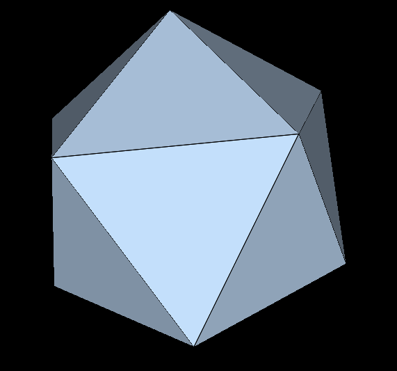
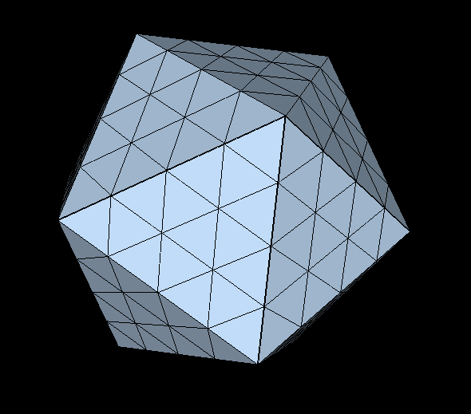
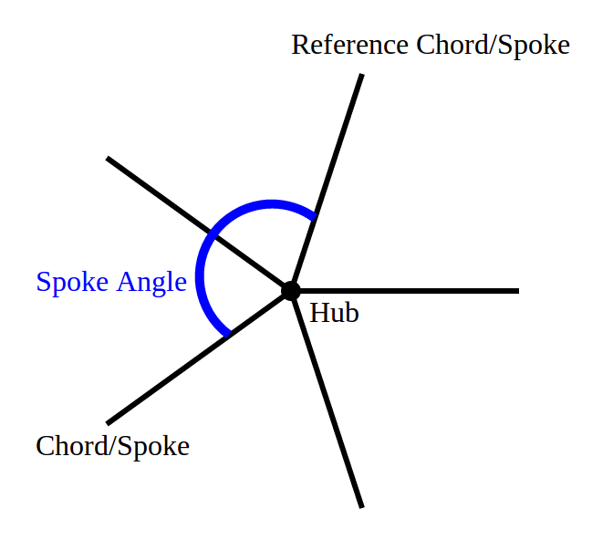

# Meet pyDome, or: How Our Heroine Decided a Regular House Was Beneath Her

Somewhere between "I would like a nice backyard structure" and "I have written a thousand lines of Python to compute the precise angle at which forty different steel struts must meet at a single point in three-dimensional space," our heroine made a decision. She called the resulting software **pyDome**.

Most people, faced with the desire for a dome-shaped structure, consult a tape measure, possibly a friend, and definitely a beverage. Our heroine consulted the icosahedron instead. This is the correct order of operations if you consider "buy a kit" a deeply unsatisfying answer to "how do I build a dome," and would rather derive the entire thing from first principles, in code, with a bill of materials attached. pyDome is what happens when that instinct runs unsupervised for a while.

A geodesic dome distributes structural stress across its entire surface rather than concentrating it in walls and a roof, which is the mathematical reason domes are strong for their weight and the practical reason people keep insisting on building them despite the aggravating number of distinct angles involved. pyDome exists so a computer handles the aggravating part — the angles, the strut lengths, the "wait, how many of these do I actually need to cut" part — instead of leaving it to increasingly creative profanity on a job site.

## So What Does It Actually Do?

In the most boring possible terms: pyDome computes the vertices and chords of a geodesic dome and writes them out as a DXF file (for your CAD software), a VRML file (so you can spin it around on screen and feel powerful), and, if you ask nicely, an STL or OBJ file for 3D printing a scale model. It also hands you, unprompted, a full bill of materials — every strut length, how many of each you need, the exact angle at which they meet at every hub, and a running total cost if you tell it what your steel runs per foot — because our heroine decided that "I'll figure out the angles later, on site, with a protractor and my dignity" is not an acceptable plan.

You tell it how big you want the dome, how finely subdivided you want its surface (the "frequency" — higher numbers mean smaller, more numerous, more sphere-like triangles), which of three different subdivision patterns to draw that surface with, and whether you want the whole sphere, a dome-shaped slice of it, or something stretched tall or squashed wide. It hands back everything a person needs to actually go build the thing, which is either extremely convenient or extremely ambitious, depending on how much steel you own.

## How It Actually Works, for People Who Enjoy Geometry as a Spectator Sport

Here is the method, in the order pyDome performs it, narrated at a pace suitable for people who have not thought about polyhedra since a geometry class they resented at the time and now, inexplicably, miss.

**Step one: pick a base polyhedron.** pyDome starts from an icosahedron by default — twenty triangular faces, twelve vertices, extremely pleased with itself — though it will just as happily start from an octahedron if you ask. Either way, the idea is the same: if you're going to approximate a sphere, start from something that already agrees to be reasonably sphere-shaped and symmetric about it.

**Step two: subdivide, one of three ways.** pyDome chops each face into a neat grid of smaller, equal triangles — it calls this smaller unit the "symmetry triangle," computes it once, and stamps a copy onto every face like a very geometrically disciplined rubber stamp. The "frequency" setting governs how fine that grid is: ask for a higher frequency, and you get more struts and a dome that looks less like a soccer ball and more like an actual sphere.

pyDome will draw that grid three different ways, and picking one is what the `-c`/`--class` flag is for. Class I, "Alternate," runs the grid parallel to each face's own edges — the default, and the one in the picture above. Class II, "Triacon," splits each face into six smaller triangles around its center first and grids those instead, producing a visibly different strut pattern and, not incidentally, demanding a frequency the software can actually divide evenly.

Class III, "Skew," is the one that fought back. It lays the grid down at an angle instead of running it parallel or radiating it from the center — the geodesic-dome equivalent of installing your hardwood floor on a diagonal, and just as fussy to get right. Our heroine built a first version and checked it against Euler's formula, the same "vertices minus edges plus faces equals two" identity that had already caught a real bug in Class II. It passed. She checked the vertex, edge, and face counts against the formulas the mathematics predicted. Those matched too, exactly. By every number she knew to compute, the dome was correct — and it was not correct: buried among several hundred properly-sized struts sat thirty long ones, one per edge of the original icosahedron, each roughly four times too long because nobody had subdivided it at all. Euler's formula only confirms a mesh is *some* valid closed shape; it has no opinion on whether it's the *particular* shape you meant to build, and a skewed pattern has no mirror symmetry to fall back on, so a point near one face's edge doesn't land on the same spot in space as the "same" point computed from the neighboring face. The two faces were shaking hands only at their three shared corners and shrugging at everything in between.

Rather than trust her own second attempt at the math, our heroine found someone else's math to check it against: [`antitile`](https://github.com/brsr/antitile), a well-established, independently written geodesic dome library, installed purely as a private fact-checker (it never touches pyDome's own dependency list). She rebuilt Class III to stitch adjacent faces together combinatorially instead of by 3D position, and didn't stop until her dome's edge lengths matched antitile's output to fifteen decimal places. `-c 3`, together with its companion flag `-n`, now produces a Class III dome — and for anyone who wants the underlying theory rather than the war story, the whole `(m,n)` construction traces back to [Šiber's 2007 paper on icosadeltahedral geometry](https://arxiv.org/abs/0711.3527), which she also read, presumably while muttering.

**Step three: project onto the sphere.** Every point pyDome just created is still living smugly flat on the face of its polyhedron. pyDome pushes them all outward onto the surface of an actual sphere, preserving the chord pattern that connects them as it goes — the step that turns "a polyhedron with a lot of triangles on it" into "something that reads, to the human eye, as a sphere made of struts." Along the way it also notices any two points that landed on the seam between adjacent faces — computed twice, once by each face — and quietly merges them back into one, so the dome doesn't end up with a bunch of secretly-doubled vertices lurking at every seam.

**Step four: stretch it, if you're feeling less than spherical.** Not everyone wants a perfect sphere. If you ask for elongation, pyDome stretches the whole structure along its vertical axis, turning it into an axis-aligned ellipsoid for anyone whose ceiling-height ambitions exceed their footprint, or the reverse — which required teaching the software that an ellipsoid's surface doesn't point straight outward from its center the way a sphere's does, a distinction most people never have to think about and one our heroine now thinks about rather more than she originally planned to.

**Step five: cut it down to size.** Doors are hard to install on the underside of a complete sphere, so pyDome slices the (possibly now ellipsoidal) shape off at a chosen height and hands you a proper dome instead of a full globe.

**Step six: write it all down.** pyDome saves the result as a DXF file, which loads into a CAD program looking like an actual, legitimate architectural drawing rather than the output of someone who spent their weekend deriving polyhedra, and as a VRML file for spinning around on screen. Ask it to, and it will also save an STL or OBJ mesh for 3D printing, or a quick 3D wireframe preview PNG so you can confirm the thing actually looks like a dome — and not, say, a lopsided egg — before hunting down software that still knows how to open a VRML file. Considerable stubbornness went into making sure that preview's three axes are scaled honestly relative to one another, on the theory that a tool which quietly lies to you about the shape of your own dome is worse than no tool at all.

**Step seven: report the angles, because someone has to.** This is our heroine's favorite part, and arguably the actual point of the whole exercise. For every hub in the structure — every point where multiple struts converge — pyDome computes two kinds of angle.

First, the angle between each strut and the plane tangent to the sphere at that hub, which tells you how far a hub connector has to tilt inward to receive that particular strut:

Second, the "spoke" angles: pyDome projects all the struts at a hub onto that same tangent plane, picks one as a reference, and measures how far around the hub each of the others sits relative to it:

Put the two together and you know, for every single joint in the entire dome, exactly how to bend metal or cut wood to make it meet correctly. pyDome also totals up every strut's length across the whole dome, adds an estimated material cost if you give it a price per foot, and — because the connector plates where five or six struts converge are the part everyone actually dreads building — generates a 2D DXF cutting template for every genuinely distinct hub shape in the dome, correctly recognizing that two hubs which are secretly the same shape, just rotated relative to each other, only need one template between them. This is the difference between a construction plan and a very expensive pile of triangles.

Our heroine looked at all of this, decided the computer should do the arithmetic, and wrote pyDome so it would. The dome, presumably, is out there somewhere now, standing on the strength of several hundred correctly-computed angles, three distinct ways of getting to a sphere, and not one single argument with a protractor.
