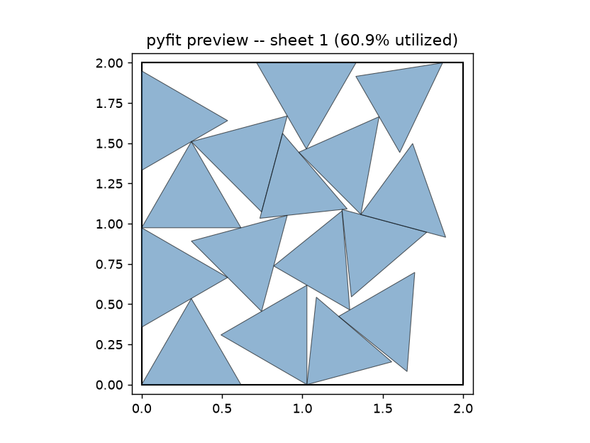

# Chapter 1: Introducing pyLair, pyFit, and the Agentic Interface

The studio apartment had, by any objective measure, reached capacity.

Not in the ordinary sense — our heroine's collection of mid-century furniture and modestly menacing houseplants still fit comfortably enough. The problem was the sub-basement, which by this point contained: one particle accelerator (secondhand, mostly functional), four hundred liters of a coolant our heroine would prefer not to name in writing, a whiteboard labeled "ULTIMATE CUNNING MASTER PLAN™ — DO NOT ERASE" that nobody had erased and everybody had stopped reading, and, as of last Tuesday, a shipping crate containing something the invoice optimistically described as "decorative atmospheric processing equipment, quantity 1." The building's homeowners' association had already sent two strongly worded letters. A third seemed imminent, and a third letter, our heroine had learned, was usually the one with a lawyer's name at the bottom.

It was time to build somewhere else. Somewhere bigger. Somewhere that looked appropriately impressive from a helicopter, and — this part mattered rather more than the aesthetics — somewhere built to actually survive wherever "somewhere else" turned out to be. A proper secret laboratory, our heroine had always maintained, belongs deep beneath the ocean's surface or in a lonely circumpolar orbit, not tucked behind a hedge in an unassuming San Diego cul-de-sac. Both of those environments come with opinions about pressure, and a structure with no opinion of its own about pressure is a structure that ends the conversation early, and badly.

So: something that looks cool. Something that survives contact with either the deep ocean or the vacuum of space, depending on the week. And — a detail our heroine's growing henchman payroll made unavoidably real, in a way the studio-apartment years never had — something that a team of henchmen with a laser cutter and a truck full of plywood could actually *build*, on a schedule, without personally re-deriving three semesters of solid geometry first.

That last part turns out to be the hard part. This is a book about solving it properly.

## What This Book Is Actually About

This is a book about **geodesic geometry** — the specific, well-studied branch of computational geometry concerned with subdividing a polyhedron into a fine triangular grid and projecting that grid onto a sphere, so that a structure built from many small, nearly-identical triangular panels can approximate a dome or a full sphere without needing a single panel large enough to be structurally weak on its own. It is also, in its second half, a book about **2D nesting** — the equally well-studied, and rather less forgiving, problem of taking a pile of flat shapes and figuring out how to arrange them on a sheet of real material with as little wasted offcut as geometrically possible. Both subjects have names, citations, and known-correct formulas, and this book intends to make sure you understand all three before it lets you touch a laser cutter.

It is also, unavoidably, a book about doing both of those things *with* an AI agent driving the actual tool calls, because that is how our heroine actually built the two pieces of software you're about to learn. The dome-design half is called **pyLair**. The sheet-nesting half is called **pyFit**. They are genuinely separate projects — pyFit has no code dependency on pyLair whatsoever, and will happily nest a pile of shapes that have nothing to do with any dome at all — but a real fabrication project needs both, in sequence, and so does this book.

If any of this voice sounds familiar, it's because pyLair already has a companion blog post (`blog-posts/introducing-pylair.md`, in this project's GitHub repository) and pyFit has its own (`blog-posts/introducing-pyfit.md`, in *its* repository) that cover this same material in shorter, punchier form. This book is the long version — the one with exercises, a glossary, and enough room to actually teach the mathematics underneath both tools, not just their command-line flags.

## What "Agentic AI" Does Not Mean

Let's dispense with the vaguest possible definition first, because it's the one that gets sold the hardest and does the least: "agentic AI" does not mean "an AI that writes code for you and then you run it." That's just autocomplete with extra confidence. If you ask a general-purpose chat model to "design me a geodesic dome," here is, roughly, what happens: it writes some `numpy` from memory, picks an icosahedron because that's the polyhedron every geodesic-dome tutorial it was ever trained on happens to use, computes a subdivision using whatever half-remembered trigonometry seems plausible, and hands you back a list of vertex coordinates that *looks* like a dome. Ask it to figure out how to lay a hundred triangular panels onto sheets of plywood with minimal waste, and you'll get something that looks like a packing arrangement, computed by an LLM improvising placement logic on the fly, with no actual collision check behind any of it.

Nothing in that process confirmed the dome's vertices and edges actually satisfy Euler's formula. Nothing checked whether two of those "packed" panels actually overlap on the sheet. Nothing reported a bevel angle you could hand to a fabricator with any confidence, because computing one correctly, inside a wall of improvised code, is genuinely hard to get right every single time — and an LLM improvising geometry is not going to reliably remember to get the hard part right. You will get numbers. You will not get a *reason* to trust those numbers, and — this is the part that should actually worry you — you usually won't be told that you should be worried. The dome will just sit there in a JSON blob, looking finished, right up until a henchman tries to bolt two hubs together that were never going to physically meet.

**Agentic AI**, as this book uses the term, means something narrower and much less glamorous: an AI model that reasons about *which typed tool to call next*, calls it, reads a structured result back, and reasons about what to do with that result — repeatedly, in a loop, until it has enough evidence to report something defensible. The geometry and the packing logic are not improvised. They're pre-built, tested functions a human already wrote and verified — `pylair/api.py`'s `build_dome`, `pyfit/api.py`'s `run_nest` — and the agent's job is sequencing and judgment, not arithmetic. Ask pyLair's agent to build a Class III dome at `(m,n)=(4,1)`, and it calls a function that has been checked, bit-for-bit, against an independently written library. Ask pyFit's agent to nest forty triangles onto three sheets of plywood, and it calls a function that re-validates every single placement for overlap before accepting it, no matter how the candidate was found. This is a much smaller, much more achievable ask of an LLM, and it is the architecture both toolkits are built around.

Concretely: both pyLair and pyFit expose their functionality as **MCP servers** — MCP being the Model Context Protocol, a standard way for an AI agent to discover a set of typed tools and call them, over `pylair-mcp` and `pyfit-mcp` respectively — with companion **OpenClaw-style skills** for agents that drive the CLI directly instead. You'll install both in Chapter 2. For now, just hold onto the shape of it: typed tools an agent can't get wrong the way it can get free-form code wrong, plus a documented interface for using them well.

## Two Tools, One Underlying Discipline

pyLair answers one question: *given a base shape, a subdivision scheme, and some amount of stretching and slicing, what are the exact vertices, struts, and panels of the resulting dome, and what does it cost to build?* It hands back four kinds of things — a shape (vertex/chord/face counts and positions), export files (DXF for CAD import, VRML for display, STL/OBJ for 3D printing), a bill of materials (every strut length and count, every hub angle, every panel shape and cost), and cutting templates (one DXF per distinct hub connector shape and one per distinct panel shape) — and nothing else. It does not know anything about water pressure, orbital debris, or building codes. It reports geometry, honestly and exactly, and stops there.

pyFit answers a different question, one dimension down: *given a pile of flat 2D shapes, how many of each you need, and the size of your sheet stock, where does each one go, and how many sheets does it actually take?* It hands back a placement report (sheet index, position, rotation, and mirror flag for every part instance) and, once you're satisfied, one ready-to-cut DXF file per sheet actually used. It has no opinion about where those shapes came from — feed it a pyLair panel-template DXF, or a stencil for a henchman's uniform patch, and it treats both identically.

Neither tool will design the other's job for you. pyLair has nothing to say about how many sheets of plywood your dome's panels will actually consume — its own `cost_per_unit_area` parameter computes a *theoretical* material cost assuming zero waste, a number Chapter 22 will show you is reliably, honestly wrong once real sheet layout is accounted for. And pyFit has no idea what a geodesic dome even is; it just sees triangles. This book spends Parts II through V entirely inside pyLair's half of the problem, and Part VI entirely inside pyFit's, precisely because pretending they're one seamless product would hide a real, useful fact: they're not, and the DXF file sitting between them is the whole handoff.

## Why Every Answer Comes Back as JSON, Not Prose

One detail is easy to skim past the first time you see it, and important enough to slow down for: every single result in this book — every one of the hundreds of "What Comes Back" blocks in the chapters ahead, whether it's a pyLair bill of materials or a pyFit placement report — is written in a format called **JSON**, not in a sentence. That's not a stylistic tic of this book. It's a load-bearing part of what makes an agentic geometry tool trustworthy in the first place, and if you've never worked with JSON before, get comfortable with it now, before your first real dome in Chapter 3.

**JSON** stands for JavaScript Object Notation, which tells you where it came from and almost nothing about why it matters here — it long ago outgrew JavaScript and became the closest thing computing has to a universal, plain-text way of writing down structured data. The rules are few enough to hold in your head all at once:

- Curly braces `{ }` mark an **object** — an unordered bag of `"name": value` pairs, the way a labeled measurement goes with its label.
- Square brackets `[ ]` mark an **array** — an ordered list of values, used whenever a result is a sequence of things rather than one thing (a list of strut lengths, say, or a list of per-sheet placements, rather than a single number).
- Every value has one of a small handful of unambiguous types: a **string** in double quotes (`"icosahedron"`, `"Class III"`), a bare **number** (`4`, `1.618034`), `true` or `false`, or the literal `null` — which means, explicitly and unambiguously, *there is genuinely no value here*, not "zero," not "unknown," not "didn't feel like computing it."

Put those pieces together and a JSON object looks like this:

```json
{
  "polyhedron": "icosahedron",
  "dome_class": 1,
  "frequency": 4,
  "n_vertices": 162,
  "n_edges": 480,
  "n_faces": 320,
  "total_strut_length": 214.7183
}
```

Seven labeled values, each with a type that isn't in question, nested inside one object. That's the entire syntax. There is no ambiguity left to resolve about what `162` refers to, because it's sitting right next to the label `"n_vertices"` that says so — not three sentences later in a paragraph, not implied by context.

**Why an agent needs this, specifically.** Go back to the freeform-code failure mode from earlier in this chapter: an LLM improvising geometry or packing logic from memory, with nothing checking its work. The version of that same failure mode at the *output* stage would look like this — a tool that answers in a sentence instead of a structured result: *"The dome has about 162 vertices and roughly 320 triangular faces, and the total strut length comes to somewhere around 215 units."* A human reads that sentence just fine. An agent that needs to *act* on it — compare the vertex count against a golden-value formula (Chapter 4 teaches you exactly this check), pass the strut total into a cost calculation, decide whether a panel count matches what a nesting job spec expects — first has to re-parse ordinary English back into numbers, guessing where in the sentence each value lives. Phrase it slightly differently on the next call ("about 162, give or take rounding" versus "162 exactly") and that ad-hoc parsing can silently break, even though nothing about the underlying dome changed at all. This is the kind of improvisation this chapter already told you not to trust an LLM with — except now it would be happening on the way *out* of a tool, not just on the way in.

JSON closes that gap. `"n_vertices"` is always spelled the same way, always holds a number, on every call, from every tool, forever. An agent doesn't have to interpret pyLair's or pyFit's output — it just reads the field by name, the same way a spreadsheet formula reads a cell by its address. That's what "typed tool" from earlier in this chapter actually cashes out to at the moment a result comes back: the *shape* of the answer is promised in advance, and JSON is the concrete, checkable form that promise takes. A prose summary can always drift; a field named the same thing every time cannot.

This also explains a habit you'll see in nearly every chapter from here on: this book always shows you the *real* JSON a tool actually returned, not a paraphrase of it. That's not pedantry. Reading the raw structured result — the exact field names, the exact `null`s, the exact nesting — is precisely the discipline an agent is supposed to apply every time, and the book holds itself to the same standard it's teaching you to expect from pyLair and pyFit.

## The Danger Is Always at the Joint, Not the Piece

Here's the specific shape of the failure this whole book keeps circling back to, in both of its halves. In dome design, a chord's length is a forgiving kind of wrong — get one slightly off, and you have a strut that's slightly the wrong length, an annoyance, not a catastrophe. A **hub angle** is not forgiving in the same way: every strut meeting at that hub inherits the error, and a dome with even one systematically wrong hub angle may simply fail to close in three dimensions no matter how careful the rest of the build is. The danger lives at the *joint*, not the individual piece.

Nesting has its own version of exactly this danger, one dimension down, and it lives at the **no-fit-polygon**, not the individual shape. A no-fit-polygon (Chapter 19 will define this properly) describes every position a shape is *not* allowed to occupy relative to its neighbors on a sheet. Get one shape's outline slightly wrong and you've wasted a little material on a slightly-off panel. Get the no-fit-polygon computation itself wrong, even slightly, and you can silently validate a placement where two panels physically overlap — a mistake that doesn't show up as "slightly the wrong length," it shows up as two panels contesting the same patch of plywood the moment a henchman actually tries to cut them out.

This is the core design tension both toolkits are built around, and it's the single idea worth carrying out of this chapter above everything else: **agent judgment is genuinely valuable for open-ended reasoning — which polyhedron fits this design goal, which rotation step trades packing quality for speed acceptably — and genuinely dangerous at the exact points where a small, plausible-looking error compounds into a structure that doesn't close, or a cut plan that overlaps.** Both `pylair/api.py` and `pyfit/api.py` deliberately keep their actual geometry — validation, hub-angle computation, no-fit-polygon construction — as one shared, rule-based engine used identically by the CLI and every MCP tool, rather than letting an agent freelance that specific math per request. You'll meet the sharpest illustration of exactly why in Chapter 6, where a first version of pyLair's own Class III construction passed every count-based sanity check available and was still wrong — and its nesting-side counterpart in Chapter 19, where a first version of pyFit's own no-fit-polygon computation passed its first hand-checked test case cleanly and only failed on a second one. If you remember nothing else from this chapter, remember that both of those near-misses happened to careful, deliberate engineers checking their own work — which is exactly why the checking has to be systematic, not just a feeling that the shape looks right.

## A Preview, Not Yet an Answer

Chapter 3 is where you'll actually pick a polyhedron and get a real dome back. This chapter is deliberately too early for that — but here's the *shape* of what's coming, now that the format itself is no longer a mystery. Here is the field-name skeleton of what `design_dome` eventually hands back, once Chapter 3 fills in real numbers:

```json
{
  "vertex_count": ...,
  "edge_count": ...,
  "face_count": ...,
  "truncated": ...,
  "bounding_box": ...,
  "height": ...,
  "footprint_diameter": ...,
  "total_strut_length": ...,
  "resolved_parameters": {
    "radius": ..., "frequency": ..., "polyhedron": ..., "dome_class": ..., ...
  }
}
```

And here, its counterpart one problem domain over, is `design_nest`'s own skeleton — the shape you'll meet for real in Part VI, once there are actual panels worth nesting:

```json
{
  "sheets_used": ...,
  "utilization_by_sheet": [...]
}
```

Notice what the two have in common, despite answering completely different questions: both are flat, labeled, and immediately actable — `vertex_count` next to `face_count`, `sheets_used` next to `utilization_by_sheet`, never a clause buried in a paragraph. That's not decoration. It's the same rule showing up in both toolkits, in every layer, without exception: **a result worth trusting is a result you can name a field in, not a sentence you have to interpret.** You'll see both of these skeletons filled in with real numbers as soon as Chapter 2's own installation smoke test, and then again, with a real design behind them instead of just a wiring check, for the rest of the book.

## The Cast of Environments You'll Actually Build For

One more thing worth knowing before Chapter 2 hands you a keyboard: every dome and every nesting job in this book belongs to *somebody*, and that somebody always wants it for a specific, defensible, only-slightly-unhinged reason. This book could have taught geodesic subdivision and 2D nesting against a generic "Dome A" and "Dome B" — plenty of textbooks do exactly that, and forget every one of those shapes by the next chapter. Instead, every worked example here is a commission, from a client who will absolutely be inspecting the strut count personally, and that turns out to matter for reasons well beyond keeping you entertained: a design constraint stops being abstract the moment it's *your* pressure hull, *your* launch mass, *your* henchmen waiting on a cutting template. Villainy, in other words, isn't the garnish on this book. It's the load case.

Here's the full roster, introduced properly as each one comes up, but worth previewing now so you know what you're building toward:

- **The Actual Secret Lair.** The dome this entire book is secretly *about* — introduced unglamorously in Chapter 4, put through every subdivision class this book teaches, stretched for headroom in Chapter 8, sliced flat for a foundation in Chapter 9, fully accounted for by Part IV, and finally exported and nested for real by the end. If you only ever build one dome from this book, this is the one with the most chapters' worth of opinions about it.
- **The Proof-of-Concept Yurt.** Not a real design at all — Chapter 2's own installation smoke test, a deliberately coarse, deliberately unremarkable frequency-2 sphere whose entire purpose is proving the wiring works before anyone's reputation is riding on the output. Every empire needs a shakedown cruise; this is our heroine's.
- **The Under-the-Ocean Prototype.** A pressure hull for the day the San Diego lease finally, definitively falls through (Chapters 3, 8, and 11). The design brief is refreshingly honest: the ocean does not negotiate, so neither does the shell.
- **The Orbital Panopticon.** A circumpolar surveillance station where "which way is down" stops being a law of physics and starts being a design choice (Chapter 11) — which turns a geometry problem into a launch-mass problem, since every extra kilogram of strut has to survive a rocket first.
- **The Magma Redoubt and the Permafrost Cache.** Two lairs built on the same design logic — stay buried, expose only a small cap — for two opposite reasons: one hiding from heat, one hiding from cold (Chapter 11). Proof that "keep most of the structure underground" is a legitimate geodesic strategy and not just a supervillain cliché.
- **The Ostentatious Mesa Spire.** The one stop in this book that actively rejects the "stay hidden" brief, because its client doesn't want to hide (Chapter 11). A tall, narrow, deliberately conspicuous spire, and this book's clearest proof that "what the site demands" and "what the villain wants" are genuinely different design inputs, sometimes at direct odds.
- **The Studio Apartment (coda).** A callback, near the end of Chapter 11, to the cramped sub-basement this very chapter opened with — the same tool, the same parameters, scaled down to a closet, because pyLair's geometry engine has no opinion about your ambition.
- **A henchman's uniform patch, and a throwing-star stencil.** pyFit's own running example (Chapter 19), chosen specifically to have nothing to do with any dome at all — proof that the nesting half of this book's toolkit is a genuinely standalone tool, not a bolt-on feature that only works on pyLair's own output.

None of these briefs make the underlying mathematics any less rigorous — Euler's formula holds exactly as hard for a volcano lair as it does for a boring test sphere, and a no-fit-polygon doesn't care whose throwing stars it's nesting. What the briefs *do* is give every formula, every gotcha, and every hard-won bug story in this book a reason to exist beyond "because the syllabus says so." Keep an eye on which environment's demands actually shaped which design decision as you go — Chapter 11 makes a running sport of it, and by the end it's the single habit most worth carrying past this book's last page.

## What's Next

Chapter 2 gets both pyLair and pyFit actually installed and connected to a real agentic platform — OpenClaw, Claude Code, Hermes, Claude Desktop, or another MCP-speaking client of your choice — and proves both connections work with one small, deliberately trivial tool call each. After that, Part II picks the design problem back up for real: a real base polyhedron, a real subdivision, and the first genuine geometric question this book asks — not "does the connection work," but "which shape should this even start from, and why."

The homeowners' association, for what it's worth, never did send that third letter. By the time it would have arrived, the sub-basement was empty, the particle accelerator was in transit, and the "decorative atmospheric processing equipment" had found a much more spacious new home.

*(Figure 1-1: The Actual Secret Lair, fully truncated and exported — the shape this book spends Parts II–V earning the right to build. Real pyLair `preview_dome` output.)*


*(Figure 1-2: A real pyFit nesting result — pyLair-designed triangular panels laid out on a sheet, ready to cut. The problem Part VI exists to solve.)*


