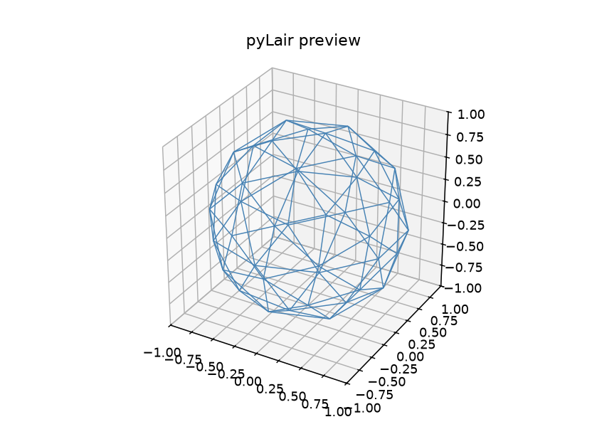
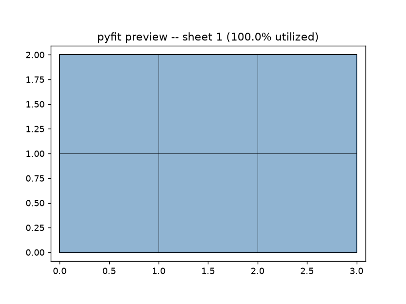

# Chapter 2: Installing pyLair and pyFit (OpenClaw, Claude Code, Hermes, Claude Desktop, and Any MCP Framework)

Before Chapter 3 can pick a polyhedron for real, something more tedious has to happen first: the actual wiring. This chapter has no geometry in it, and no nesting either. What it has is a working connection between an AI agent and two small servers that know how to talk to it correctly — and, because this is the kind of book that shows its work, one real installation failure, narrated exactly as it happens, because you are going to hit some version of it too, and it is much less alarming once you've seen it coming.

## What You're Actually Installing

Both pyLair and pyFit are ordinary, installable **Python** packages — Python being the general-purpose programming language both are actually written in, if that word is new to you — as of this writing, neither has been published to PyPI yet (pyLair's own blog post lists that under "Next Steps," and pyFit's `AGENTS.md` is explicit that "nothing has been published to PyPI yet; publishing is a separate, deliberate step"). So for now, both are installed the same way: clone the repository — pyLair's own source lives at [github.com/badass-data-science/pyLair-agentic-geodesics](https://github.com/badass-data-science/pyLair-agentic-geodesics), pyFit's at [github.com/badass-data-science/pyFit-agentic-polygon-nesting](https://github.com/badass-data-science/pyFit-agentic-polygon-nesting) — then install it editable, optionally with the `mcp` extra:

```bash
git clone https://github.com/badass-data-science/pyLair-agentic-geodesics.git
cd pyLair-agentic-geodesics
pip install -e ".[mcp]"
```

```bash
git clone https://github.com/badass-data-science/pyFit-agentic-polygon-nesting.git
cd pyFit-agentic-polygon-nesting
pip install -e ".[mcp]"
```

Each install gives you two **console scripts** — small executable commands — a plain CLI (`pylair`, `pyfit`) and, once the `mcp` extra is in, an MCP server (`pylair-mcp`, `pyfit-mcp`): a lightweight process that speaks the Model Context Protocol (MCP) over standard input and output and, when asked, reports exactly which typed tools it exposes.

One naming detail worth knowing before you go looking for pyFit on PyPI once it *is* published: the distribution name will be `pyfit-agentic-polygon-nesting` (plain `pyfit` was already taken on PyPI by an unrelated neural-net library), but the importable package, the CLI command, and the MCP console script all stay plain `pyfit`/`pyfit-mcp` regardless. pyLair has no such divergence — distribution name, package name, and CLI command are all just `pylair`.

Once both are installed, confirm all four console scripts actually landed on your `PATH`:

```bash
which pylair pylair-mcp pyfit pyfit-mcp
```

Each one should resolve to a path inside whatever virtual environment you installed into. If any of them come back empty, the install didn't finish cleanly — fix that before going any further, because every installation problem downstream of this point in the chapter is really just a variation on "the agent couldn't find the command."

## Understanding the Connection, Not Just Copy-Pasting It

Every agentic platform that can use pyLair or pyFit needs to do the same three things, however differently they each phrase it in their own configuration format:

1. **Know the command** that starts each server (`pylair-mcp`, `pyfit-mcp`).
2. **Launch it over stdio** — meaning the platform starts the server as a subprocess and talks to it through its standard input/output streams, not over a network port.
3. **Discover its tools** by asking the running server what it exposes, rather than the platform having them hardcoded anywhere.

Once you understand that this is *all* that's actually happening underneath any given platform's configuration screen, installing pyLair or pyFit anywhere stops being platform-specific trivia and becomes "fill in these three things in whatever format this particular tool wants." The rest of this chapter walks through that for a few real platforms, and then for "whatever you're actually using instead," because this book would rather teach you the pattern than assume you're on the one platform it screenshots.

### OpenClaw

OpenClaw doesn't consume MCP servers on its own for these two projects — instead, each ships an **OpenClaw skill**: a Markdown playbook that teaches an OpenClaw agent to drive the plain CLI (`pylair`, `pyfit`) directly, with no MCP server involved at all. This is a genuinely separate integration path from the `pylair-mcp`/`pyfit-mcp` servers below, not a alternate way of reaching the same server, and — worth knowing before you copy one project's setup steps onto the other — **the two skills use different directory conventions**, so following pyLair's own layout for pyFit will leave pyFit's skill undiscovered.

**pyLair's skill** lives as a single file at the repo root, `SKILL.md`. To install it:

1. Copy (or symlink) `SKILL.md` into your OpenClaw workspace's skills directory, e.g. `~/.openclaw/workspace/skills/pylair/SKILL.md`.
2. Merge pyLair's `openclaw.config.snippet.jsonc` into `~/.openclaw/openclaw.json`:

```jsonc
{
  skills: {
    entries: {
      pylair: {
        enabled: true,
      },
    },
  },
}
```

That's the whole config — pyLair has no API key or environment variable to set. The skill's own frontmatter gates it on the `pylair` binary being on `PATH` (`metadata.openclaw.requires.bins: ["pylair"]`), so this entry just needs to exist and be enabled once the CLI itself is installed.

**pyFit's skill**, by contrast, lives nested at `skills/pyfit/SKILL.md` inside its own repository — OpenClaw discovers skills by scanning configured roots for `<root>/<skill-name>/SKILL.md` up to several levels deep, and pyFit's own config snippet takes advantage of that by pointing straight at the repo's `skills/` directory instead of asking you to copy anything into your OpenClaw workspace at all:

```jsonc
{
  "skills": {
    "load": {
      "extraDirs": ["/absolute/path/to/pyFit-agentic-polygon-nesting/skills"]
    },
    "entries": {
      "pyfit": {
        "enabled": true
      }
    }
  }
}
```

Merge that into `~/.openclaw/openclaw.json` (replacing the `extraDirs` path with wherever you actually cloned the repo), with `pyfit` itself installed and on `PATH` — again, no API key or environment variable needed, just the same `requires.bins` gate pyLair's own skill uses.

Two skills, two real conventions: **copy pyLair's file in; point at pyFit's directory instead.** Getting this backwards — trying to symlink pyFit's nested file the way pyLair's flat one works, or pointing `extraDirs` at pyLair's repo root expecting the same nested-directory discovery — is a real, easy mistake, and the honest fix is just reading each project's own installation section rather than assuming the two mirror each other.

### Claude Code

Claude Code registers MCP servers through its own configuration — either a project-level `.mcp.json` file using the same `command`/`args` shape shown throughout this chapter, or via `claude mcp add` from the command line. Because CLI flags are the part of any tool most likely to have changed by the time you're reading this, run `claude mcp add --help` for the exact current syntax rather than trusting a book to have it memorized correctly forever; the important, stable fact is that you're giving it the same information as everywhere else in this chapter — a name, a command, and (empty, here) arguments — once per server:

```jsonc
{
  "mcpServers": {
    "pylair": { "command": "pylair-mcp", "args": [] },
    "pyfit":  { "command": "pyfit-mcp",  "args": [] }
  }
}
```

Both projects' `SKILL.md` files are written in the format OpenClaw consumes natively as a full agentic playbook. Claude Code doesn't necessarily read them the same way, but they remain useful reference material regardless — point your agent at either one when you want it to follow that project's documented CLI workflow precisely.

### Hermes, and Other MCP-Speaking Agent Frameworks

Rather than guess at a specific proprietary configuration format for a platform this book can't screenshot with confidence, here's the honest version: **if Hermes — or any other agentic framework you're using — can launch a subprocess by command and arguments and speak MCP over stdio, the same three things from earlier in this chapter apply unchanged.** Register `pylair-mcp` and `pyfit-mcp` the same way you would for any other client. Consult that platform's own documentation for where its configuration file lives and what key holds the server list; the *shape* of what goes in it is what this chapter has already taught you.

### Generic MCP Clients (Claude Desktop and Others)

Several general-purpose AI assistants beyond the ones named above also speak MCP directly — Claude Desktop is a common one, configured via a `claude_desktop_config.json` file (location varies by OS) with an `mcpServers` key holding the same `command`/`args` shape one more time:

```jsonc
{
  "mcpServers": {
    "pylair": { "command": "pylair-mcp", "args": [] },
    "pyfit":  { "command": "pyfit-mcp",  "args": [] }
  }
}
```

If a pattern is starting to feel repetitive by this point in the chapter, that's the point: this is a *standard*, and once you've set pyLair and pyFit up on one MCP client, setting them up on the next one is mostly finding where that client keeps its config file.

## The Gotcha, Demonstrated Live

Here is a failure worth hitting on purpose once, in a terminal, before an agentic client ever hides it behind a less legible error — narrated exactly as it happens, because it's the single most common installation problem across both projects, and it looks alarming right up until you know what it is.

The setup: a virtual environment, both projects installed into it with `pip install -e ".[mcp]"`, both console scripts confirmed present with `which pylair-mcp pyfit-mcp`. Then, a client configuration pointing at a server by its bare command name:

```json
{ "mcpServers": { "pylair": { "command": "pylair-mcp", "args": [] } } }
```

Connecting can produce something like:

```
RuntimeError: Client failed to connect: [Errno 2] No such file or
directory: 'pylair-mcp'
```

Which is deeply confusing the first time you see it, because `pylair-mcp` unquestionably *does* exist — `which pylair-mcp` just said so, in the same terminal, thirty seconds earlier.

Here's what's actually going on: when your agentic platform launches a server, it's starting a **new subprocess**, and that subprocess does not automatically inherit the activated virtual environment's `PATH` the way your interactive terminal session does. The bare command name `pylair-mcp` only resolves if the launching process's `PATH` includes your venv's `bin/` directory — and depending on how your agentic platform spawns subprocesses, it may or may not. The exact same thing happens to `pyfit-mcp`, for the exact same reason — this isn't a pyLair-specific or pyFit-specific bug, it's a property of how subprocess launching works, and it's worth fixing for both servers identically rather than being surprised twice.

The fix is one line per server: use the **absolute path** to the installed console script instead of its bare name.

```jsonc
{
  "mcpServers": {
    "pylair": { "command": "/path/to/your/venv/bin/pylair-mcp", "args": [] },
    "pyfit":  { "command": "/path/to/your/venv/bin/pyfit-mcp",  "args": [] }
  }
}
```

Find those exact paths with `which pylair-mcp pyfit-mcp` while your venv is activated, and paste the results in verbatim. This one change resolves the overwhelming majority of "the tool obviously exists but the client can't find it" reports you'll run into across every platform in this chapter.

A second, smaller gotcha worth knowing before you build a CI matrix or reach for an older interpreter: **neither `pylair-mcp` nor `pyfit-mcp` has a published release supporting Python 3.9.** Both projects pin `mcp<2.0` for the identical reason — `mcp` 2.0.0 removed `mcp.server.fastmcp` entirely, and both servers' `FastMCP`/`Image` imports depend on it — and no version of `mcp` on PyPI supporting that pinned range also supports 3.9. The plain CLIs (`pylair`, `pyfit`) install and run fine on 3.9; only the `mcp` extra itself requires 3.10+.

## Proof of Life

Installation isn't actually finished until you've watched real tool calls succeed — "the install command didn't error" is not the same claim as "the connection works," and this book isn't going to let the distinction slide even in the setup chapter. No competent supervillain commissions a circumpolar fortress from a contractor who has never once been asked to build a shed, and our heroine isn't about to either: here's the smoke test for both toolkits, using configurations too small to be anyone's actual secret lair, deliberately unimpressive so that nothing about impressing anyone gets in the way of just watching the wiring work — **the Proof-of-Concept Yurt** for pyLair, and **the Proof-of-Concept Nesting Job** for pyFit.

**Prompt:**
> Confirm the pyLair MCP server is running and list every tool it exposes. Then run `design_dome` on the smallest, cheapest configuration you can, just to prove the connection works end to end.

**What Comes Back** (a real result, from a real running server — a Class I icosahedral sphere at frequency 2 and radius 1.0, the smallest, plainest configuration this book has a name for: the Proof-of-Concept Yurt):

```
Tools exposed: design_dome, preview_dome, get_bill_of_materials, export_dome

design_dome result:
{
  "vertex_count": 42,
  "edge_count": 120,
  "face_count": 80,
  "truncated": false,
  "bounding_box": {
    "x": [-0.9510565162951536, 0.9510565162951536],
    "y": [-1.0, 1.0],
    "z": [-1.0, 1.0]
  },
  "height": 2.0,
  "footprint_diameter": 2.0,
  "total_strut_length": 69.87402279451425,
  "resolved_parameters": {
    "radius": 1.0,
    "frequency": 2,
    "polyhedron": "icosahedron",
    "dome_class": 1,
    "n_frequency": null,
    "elongation_factors": {"x": 1.0, "y": 1.0, "z": 1.0},
    "truncation": {"x": null, "y": null, "z": null}
  }
}
```

**What It Means:** Four real tools came back from a real subprocess, and `vertex_count`/`edge_count`/`face_count` — 42, 120, 80 — match Chapter 4's own golden-value formula for a Class I icosahedral sphere exactly (`10f²+2 = 10(4)+2 = 42`; `30f² = 120`; `20f² = 80`, at `f=2`). Nothing here is dome-shaped enough to build — a frequency-2 sphere is about as coarse as this construction gets, structurally closer to a yurt than a fortress, which is the whole reason it earned that name — and that's entirely the point: this proves the wiring works, not that the design is good.

Look at the shape directly rather than only trusting the summary:

*(Figure 2-1: The Proof-of-Concept Yurt, a real `preview_dome` render — a frequency-2 Class I icosahedral sphere, unremarkable on purpose.)*



**Prompt:**
> Now confirm the pyFit MCP server is running and list every tool it exposes. Run `design_nest` on six unit squares and a 3×2 sheet — a case small enough to check by hand — just to prove that connection works too.

**What Comes Back** (a real result):

```
Tools exposed: design_nest, preview_nest, get_nest_report, export_nest

design_nest result:
{
  "sheets_used": 1,
  "utilization_by_sheet": [1.0]
}
```

**What It Means:** Four more real tools, from a second real subprocess — and a result that's genuinely checkable by hand: six unit squares have a combined area of 6, a 3×2 sheet has an area of exactly 6, and pyFit's own README states this exact case tiles perfectly. `utilization_by_sheet: [1.0]` — 100% — confirms it did, on the very first sheet, with none left over. This is this book's version of Chapter 1's own promise: a boring, hand-verifiable result, shown here specifically because there's nowhere for a packing mistake to hide in it.

*(Figure 2-2: The Proof-of-Concept Nesting Job, a real `preview_nest` render — six unit squares tiling a 3×2 sheet at exactly 100% utilization.)*



One more thing worth confirming while you're here, since Chapter 1 made a point of it: the MCP tools enforce validation, not just convenience — nothing about calling `design_dome` instead of a command line lets an invalid configuration slip through.

**Prompt:**
> Ask `design_dome` for a Class II (Triacon) dome at frequency 3 — deliberately invalid, since Class II needs an even frequency. What comes back?

**What Comes Back** (a real tool error, not a crash):

```
-c 2 (Class II / Triacon) requires an even --frequency. Exiting.
```

**What It Means:** That's the identical message the `pylair` CLI's own `-c 2 -f 3` would give — not a coincidence, and not a looser or differently-worded approximation for the agentic side. One shared engine (`pylair/api.py`, and `pyfit/api.py` on the nesting side) validates every request regardless of which interface it arrived through, which is the whole reason this book trusts an agent's tool calls as much as it trusts a terminal.

## What's Next

The plumbing works, on both toolkits, and Part I closes with it. Part II picks the design problem back up for real: a real base polyhedron, a real subdivision, and the first genuine geometric question this book asks — not "does the connection work," but "which shape should this even start from, and why." Chapter 3 starts there.
