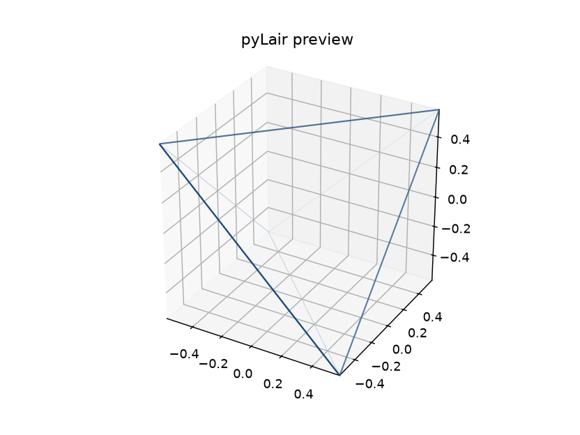

# Chapter 3: Picking a Polyhedron

Every geodesic dome pyLair will ever build starts the same way: not with a sphere, but with something that merely *resembles* one — a plain, flat-faced polyhedron, subdivided later into something rounder. This chapter is about that first, easy-to-skip decision, and about the first of this book's two smaller running examples: **the Under-the-Ocean Prototype**, our heroine's contingency plan for the day the San Diego lease finally, definitively falls through and the secret laboratory relocates somewhere the neighbors can't file noise complaints about it. A homeowners' association has opinions and a strongly worded letterhead; the Pacific Ocean has neither, and settles every disagreement with several tons of ambient pressure per square foot of hull instead. That's precisely why this design gets to go first: it's the stop in this book with the least patience for a shape chosen carelessly, which makes it the right place to insist, from the very first decision, that "which polyhedron" is a decision at all, and not a default nobody bothered to question.

## Why Start From a Polyhedron At All

A sphere is the one shape geodesic design is trying to approximate, and also the one shape it never actually starts from. The reason is practical, not aesthetic: a true sphere has no natural way to divide itself into a repeating pattern of identical (or nearly identical) flat triangular panels. A **polyhedron** — a solid built entirely from flat faces — does. Subdivide one face into a fine triangular grid, replicate that same grid onto every other face, and project the whole result outward onto a sphere of the radius you want, and you get a dome built from many small, structurally efficient triangles instead of a few enormous, weak ones. Chapters 4 through 7 walk through exactly how that subdivision and projection actually work. This chapter is about the step before all of that: which polyhedron to start from in the first place.

The geometric logic for *why* the starting shape matters is straightforward once stated: the closer your starting polyhedron already is to a sphere, the less work — and the less resulting variety in strut length and hub angle — the subsequent subdivision has to do to get the rest of the way there. A polyhedron with many, more nearly-triangular, more evenly-arranged faces to begin with needs a gentler grid laid over each one to end up looking spherical; a polyhedron with few, large faces needs a much more aggressive one. pyLair gives you exactly three starting points, and they sit at genuinely different points on that spectrum.

## Three Starting Points: Icosahedron, Octahedron, and Tetrahedron

pyLair's default, and the shape nearly every geodesic dome you've ever seen a photo of actually uses, is the **icosahedron**: 20 triangular faces, 12 vertices, 30 edges.

**Prompt:**
> Preview a bare, frequency-1 icosahedron for me — no subdivision yet, just the base shape — so I can see what pyLair's default polyhedron actually looks like.

**What Comes Back** (a real `preview_dome` render, `polyhedron="icosahedron"`, `frequency=1`, `radius=1.0`):

*(Figure 3-1: A bare, unsubdivided icosahedron — pyLair's default base polyhedron, before any subdivision is applied.)*


pyLair's other option is the **octahedron**: 8 triangular faces, 6 vertices, 12 edges — a coarser starting point, selected with `polyhedron="octahedron"`.

**Prompt:**
> Now preview the same thing with the octahedron instead — same frequency and radius, just the other base polyhedron.

**What Comes Back** (a real `preview_dome` render, `polyhedron="octahedron"`, `frequency=1`, `radius=1.0`):

*(Figure 3-2: A bare octahedron — pyLair's other base polyhedron, at the same frequency and radius as Figure 3-1 for a direct comparison.)*


pyLair's third and coarsest option is the **tetrahedron**: 4 triangular faces, 4 vertices, 6 edges — the fewest of anything pyLair can start from, selected with `polyhedron="tetrahedron"`.

**Prompt:**
> Now preview the same thing with the tetrahedron — same frequency and radius as the other two.

**What Comes Back** (a real `preview_dome` render, `polyhedron="tetrahedron"`, `frequency=1`, `radius=1.0`):

*(Figure 3-3: A bare tetrahedron — pyLair's third base polyhedron, at the same frequency and radius as Figures 3-1 and 3-2.)*



All three of these are real `design_dome` results, at frequency 1 (meaning: no subdivision at all yet, just the base polyhedron itself, reported through the same pipeline as every other dome in this book):

```json
{"polyhedron": "icosahedron",  "vertex_count": 12, "edge_count": 30, "face_count": 20}
{"polyhedron": "octahedron",   "vertex_count": 6,  "edge_count": 12, "face_count": 8}
{"polyhedron": "tetrahedron",  "vertex_count": 4,  "edge_count": 6,  "face_count": 4}
```

Twenty faces, against eight, against four — at the exact same frequency, before any shape has been subdivided even once. That gap doesn't close as frequency rises — it multiplies.

## The Golden-Value Formulas, as a Sanity Check, Not Folklore

Every subdivision class this book teaches (Chapters 4 through 6) produces its own exact vertex/edge/face-count formula in terms of frequency, and every one of those formulas is built on top of one of three base counts, depending which polyhedron you started from. For the plain, unsubdivided base shapes themselves — Class I at frequency `f`, before any further multiplier — the counts are:

| | Icosahedron | Octahedron | Tetrahedron |
|---|---|---|---|
| Faces | `20f²` | `8f²` | `4f²` |
| Edges | `30f²` | `12f²` | `6f²` |
| Vertices | `10f²+2` | `4f²+2` | `2f²+2` |

These aren't folklore or a rule of thumb — they're the same identities pyLair's own test suite checks a real build against (`tests/test_api.py`), and you can verify the table's own `f=1` row by hand against the three JSON results above: `20(1)²=20` faces for the icosahedron, `8(1)²=8` for the octahedron, `4(1)²=4` for the tetrahedron, all matching exactly. You'll use the icosahedron half of this table constantly starting in Chapter 4; the octahedron and tetrahedron halves exist for the same reason those shapes do — for the design situations, below, where one of them is actually the better starting shape.

## Choosing Deliberately, Not by Habit

Reaching for the icosahedron by default (which is also what happens if you don't specify `polyhedron` at all) is the right call most of the time — more faces at the same frequency means a gentler grid per face, which generally means a rounder-looking result and less strut-length variety for a given amount of subdivision effort. But "the default is usually right" is a different claim from "the default is always right," and this chapter's actual job is teaching you to notice the cases where it isn't.

Look again at Figure 3-2's octahedron. Two of its six vertices sit at the poles — directly "above" and "below" the shape along Z — and the other four sit in an exact ring around the middle, all at `Z=0`: `(±1,0,0)` and `(0,±1,0)`, in pyLair's own coordinate construction (`pylair/polyhedral.py`'s `Octahedron` class). That's not an approximate equator — it's an exact one, present in the base shape before any subdivision or truncation has touched it at all.

The icosahedron's own vertex layout (`pylair/polyhedral.py`'s `Icosahedron` class) is different, and worth understanding precisely rather than by vague impression: one vertex sits at the north pole, one at the south, and the remaining ten split into two rings of five, sitting at `Z = ±1/√5 ≈ ±0.4472` — close to the equator, and considerably flatter than the poles-and-nothing-else arrangement a naive guess might expect, but not sitting exactly *on* `Z=0` the way the octahedron's four-vertex ring does. It's a genuinely different shape near the equator, not just a denser version of the same one: a pentagonal antiprism of two offset five-vertex rings, versus a single square ring sitting exactly at the midline.

This is exactly the distinction **the Under-the-Ocean Prototype** cares about. A pressure hull wants a shape that's as close to uniformly spherical as possible — no single weak axis, no seam the water pressure can concentrate against — and Chapter 9 will need to truncate this exact design along its Z axis to give it a flat mounting face for a real airlock. An octahedron's exact equatorial ring gives that later truncation something clean and already-planned-for to cut along; the icosahedron's offset double ring is closer to what a truncation cut has to fight through less cleanly at the same frequency. Chapter 9 picks this exact tradeoff back up with real cutoff numbers once truncation itself has been taught; for now, the point is narrower and worth fixing firmly before moving on: **this is a real geometric property of the base shape you pick, present before a single subdivision step runs, and it's worth choosing on purpose rather than never noticing it was a choice at all.**

The tetrahedron's own vertex layout (`pylair/polyhedral.py`'s `Tetrahedron` class) is worth checking with the same precision rather than assumed by analogy to the octahedron. Its four vertices sit at two levels, not one: two at Z ≈ +0.5774 and two at Z ≈ -0.5774 (±1/√3, in this construction), with none sitting exactly on Z=0 at all. So the tetrahedron is *not* a more extreme version of the octahedron's equatorial-ring trick — it has no equatorial ring in the first place, and is the wrong choice whenever that specific property is what a design needs. What the tetrahedron actually offers instead is the fewest total physical pieces pyLair can produce at any given frequency: a frequency-1 tetrahedron is 4 panels and 6 struts, full stop — fewer than the octahedron's 8 and 12, and far fewer than the icosahedron's 20 and 30, at the identical frequency. That's a genuine, different tradeoff, worth reaching for on its own terms: a design where minimizing the *count* of distinct physical parts at low frequency matters more than roundness or any particular symmetry — a rapid-assembly shelter, say, where every additional unique strut or panel is one more thing that has to be labeled, sorted, and matched correctly in the field — is a real reason to start from the tetrahedron rather than the icosahedron or octahedron, not a consolation prize for when neither of the other two "worked."

**Prompt:**
> Using `design_dome`, compare an icosahedron, an octahedron, and a tetrahedron at the same frequency. How different are the resulting face counts, and why?

**What Comes Back** (three real `design_dome` results, `frequency=4`, all Class I, otherwise identical parameters):

```json
{"polyhedron": "icosahedron",  "vertex_count": 162, "edge_count": 480, "face_count": 320}
{"polyhedron": "octahedron",   "vertex_count": 66,  "edge_count": 192, "face_count": 128}
{"polyhedron": "tetrahedron",  "vertex_count": 34,  "edge_count": 96,  "face_count": 64}
```

**What It Means:** `320` faces against `128` against `64`, at the identical frequency — a ratio of exactly `20:8:4`, i.e. `5:2:1`, unchanged from frequency 1, because all three counts scale by the same `f²` factor. None of the numbers is wrong; they're answering "how many faces does *this* base shape have at this frequency," and the three base shapes never had the same number of faces to begin with. A reader who swaps `polyhedron` expecting "the same dome, just from a different starting point" will instead get a meaningfully coarser (octahedron), much coarser (tetrahedron), or finer (icosahedron) structure at that same frequency number — worth knowing before comparing two designs that only look like they should match.

**Prompt:**
> I want a natural flat ring near the equator before any truncation happens — which base polyhedron gets me closer to that for free?

**What Comes Back:**
> The octahedron. Its own vertex layout already places four vertices in an exact ring at `Z=0` — `(1,0,0)`, `(0,1,0)`, `(-1,0,0)`, `(0,-1,0)` — with the remaining two vertices sitting at the poles. The icosahedron has no vertex sitting exactly on `Z=0` at all; its closest analogue is two five-vertex rings straddling the equator at `Z=±1/√5`, offset from each other by 36°. If a flat, already-present equatorial ring matters more to your design than the icosahedron's usual advantage (more faces, and therefore a rounder look, at the same frequency), the octahedron is the deliberate choice — not a fallback for when the default "doesn't work."

**What It Means:** Notice what didn't happen in that answer: no subdivision was run, no frequency was picked, nothing was truncated. This is a question about the base polyhedron alone, answerable from `pylair/polyhedral.py`'s own vertex coordinates before `design_dome` even needs to be called — exactly the kind of question this chapter exists to make sure you know to ask *before* reaching for a frequency number, not after a dome already looks wrong.

**Prompt:**
> I care more about having the fewest possible distinct struts and panels than I do about roundness — which base polyhedron should I start from?

**What Comes Back:**
> The tetrahedron. At any given frequency, it has fewer faces (and so fewer total struts and panels) than either the octahedron or the icosahedron — `4f²` faces against `8f²` and `20f²`. At frequency 1 that's the starkest it ever gets: 4 panels and 6 struts, against the octahedron's 8 and 12 and the icosahedron's 20 and 30. If minimizing total part count matters more than a rounder-looking result, the tetrahedron is the deliberate choice — not a fallback for when the other two "don't work."

**What It Means:** This is the same style of question as the equatorial-ring one above, and it's worth noticing it has a different answer: the octahedron won that one on a specific geometric property (an exact `Z=0` vertex ring), while the tetrahedron wins this one on a different property entirely (fewest total pieces at a given frequency). Neither shape is "the alternative" to the icosahedron in some generic sense — each of pyLair's three starting points earns its place for a distinct, checkable reason, and the job of this chapter is knowing which reason applies to the design in front of you.

## A Note Worth Filing Away Now

pyLair's vertices, chords, and faces are all referenced internally by plain, 0-indexed position in a Python list — vertex `0`, not vertex `1` — matching how every downstream calculation in the codebase actually uses them. This wasn't always true: an earlier version of this exact codebase numbered vertices starting at 1 and subtracted 1 at every point of use instead, a real, since-cleaned-up historical footgun documented in `AGENTS.md`'s standing engineering guidance for this project. Nothing in this chapter depends on that history — but every vertex index this book shows you from here forward starts at 0, and it's worth having that be unsurprising rather than something you re-discover the hard way three chapters from now.

## What's Next

Chapter 4 picks the icosahedron back up as this book's own default and finally runs a real subdivision over one of its faces — the first piece of geometry pyLair actually has to *solve*, rather than just replicate. The Under-the-Ocean Prototype's octahedron detour stays on the shelf until Chapter 8, once there's an actual pressure-symmetric shape worth elongating, and Chapter 9, once there's a real cutoff worth choosing along that exact equatorial ring.
