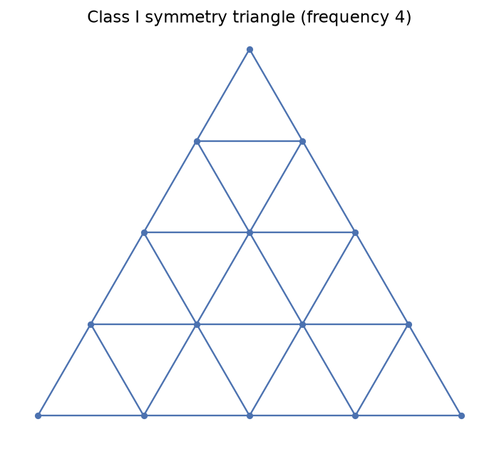
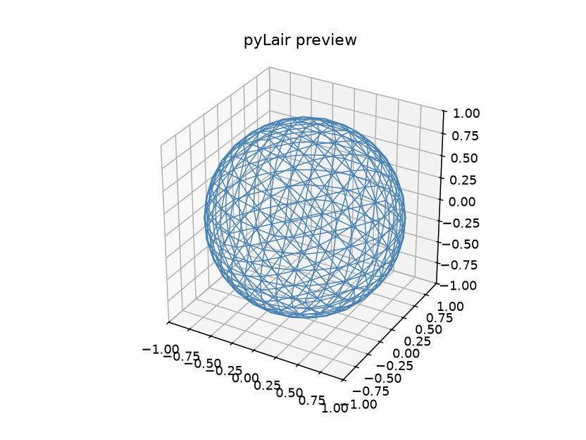

# Chapter 4: Class I — The Default Subdivision

Chapter 3 picked a starting shape. This chapter is where pyLair actually starts *computing* something — the first, and simplest, of the three subdivision methods this book teaches, and the one every other chapter's more complicated version gets compared back against. It's also where **the Actual Secret Lair** — the flagship design this book spends the rest of Parts II through V earning the right to build for real — makes its first appearance, in the plainest, least remarkable form it will ever take.

## The One Thing pyLair Actually Has to Solve

Here is a fact worth sitting with before touching a single flag: pyLair does not compute a separate subdivision for each of an icosahedron's 20 faces, or each of an octahedron's 8. It computes **one**, for a single face, and then copies rotated versions of that one result onto every other face on the polyhedron. This single computed piece — a triangular grid subdividing one flat face — is called the **symmetry triangle**, and it is, quite literally, the only piece of genuinely new geometry any of pyLair's three subdivision classes has to work out. Everything else — the whole rest of the dome — is replication, not recomputation.

This matters for more than just efficiency. It means that whatever is *true* of one symmetry triangle — its vertex count, its internal grid pattern, any subtlety in how its points are placed — is true, identically, of every face on the finished sphere. Get the symmetry triangle right once, and the whole dome inherits that correctness by construction. Get it wrong once, and the whole dome inherits *that*, too — which is exactly the shape of the real historical bug Chapter 6 walks through in painful, illuminating detail once Class III makes the symmetry triangle harder to get right.

## Class I: The Simplest Grid There Is

pyLair's default subdivision — the one you get if you don't pass `-c` at all, or pass `-c 1` explicitly — is called **Class I**, historically also known as the "Alternate" method. Its symmetry triangle is built the most straightforward way imaginable: draw a grid of lines parallel to the face's own three edges, evenly spaced according to the requested frequency. Here is exactly that grid, computed by pyLair's own `ClassOneMethodOneSymmetryTriangle` for one face at frequency 4 — not a hand-drawn approximation, but the real internal vertex/chord data plotted flat, before it's ever replicated or projected onto anything:

*(Figure 4-1: One bare Class I symmetry triangle, frequency 4 — the single piece of geometry pyLair computes directly. Chapters 5 and 6 each get their own version of this same figure, so the three classes' grids can be compared side by side.)*



Count what's there: 15 vertices, 30 chords, 16 small triangular faces — and in general, at frequency `f`, a Class I symmetry triangle has `(f+1)(f+2)/2` vertices and `f²` small faces (16 at `f=4`, matching the figure exactly). Once this one triangle is computed, `GeodesicSphere` takes over: it copies a rotated version of this exact grid onto every face of the base polyhedron, merges the vertices that land on shared edges between faces (Chapter 7 covers exactly how), and projects the whole result outward onto a sphere of the requested radius.

## The Golden-Value Formula, Now for a Whole Sphere

Chapter 3 gave you the base polyhedron's own raw face count. Once Class I subdivision is applied on top of it, an icosahedron-derived sphere at frequency `f` has exact, well-known counts:

| | Formula | At `f=4` |
|---|---|---|
| Vertices | `10f²+2` | 162 |
| Edges | `30f²` | 480 |
| Faces | `20f²` | 320 |

These are the same formulas Chapter 3's table already introduced (there, described as the base polyhedron's own "Class I at frequency `f`" counts, since Class I *is* the plain, unmultiplied case every other class's formula gets compared against). You can, and should, use this formula as a first sanity check on any Class I result before trusting anything downstream of it — a real result that doesn't match this formula means something upstream is already wrong, before a single strut length or hub angle has even been computed.

**Prompt:**
> Build a Class I icosahedral dome at frequency 4. Does the reported vertex count match the golden-value formula?

**What Comes Back** (a real `design_dome` result):

```json
{"vertex_count": 162, "edge_count": 480, "face_count": 320,
 "resolved_parameters": {"polyhedron": "icosahedron", "dome_class": 1, "frequency": 4}}
```

**What It Means:** `10(4)²+2 = 162`. `30(4)² = 480`. `20(4)² = 320`. All three match, exactly, with no rounding required — which is the entire point of a golden-value check: not "does this look about right," but "does this equal a specific number computed independently of the tool being checked."

## Any Positive Frequency Works — No Exceptions, No Special Cases

Unlike the other two classes this book teaches — Class II, which Chapter 5 shows requires an even frequency by construction, and Class III, which needs two distinct frequency parameters entirely — Class I places no structural requirement on frequency at all beyond being a positive integer. Frequency 1, frequency 2, frequency 200: all of them produce a valid, correctly-closing Class I dome, because the "draw a grid parallel to the edges" construction never depended on frequency having any particular property to begin with. This is worth knowing plainly, because it means Class I is always available as a fallback baseline — the shape this book reaches for whenever a chapter needs *a* dome to demonstrate something that has nothing to do with subdivision class itself (Chapters 8 through 11, for instance, reuse Class I almost exclusively, precisely so elongation and truncation are the only variable actually being taught).

## Introducing the Actual Secret Lair

Every dome this book builds toward in earnest — the one Part V finally exports for real, and the one Part VI finally nests onto actual plywood — starts, right here, as an unremarkable Class I icosahedral sphere:

```
pylair -o class1-secret-lair -f 6 -p icosahedron -c 1 -r 1.0 -P
```

*(Figure 4-2: The Actual Secret Lair's first appearance — a plain Class I icosahedral sphere at frequency 6, real `-P` output. Nothing about this shape is final yet: Chapter 5 will show the same nominal frequency rebuilt entirely differently under Class II, Chapter 6 will replace this subdivision with a genuinely chiral one, and Chapters 8 through 10 will elongate and truncate whatever subdivision survives that choice.)*



Nothing here is the final design — that's rather the point of introducing it this early. Every later chapter that reshapes this dome is reshaping *this* shape specifically, so that the running example accumulates real decisions instead of resetting to a fresh, unrelated dome each time a new concept needs demonstrating.

**Prompt:**
> If I double the frequency, how much does the face count actually grow — and is that what you expected before I told you?

**What Comes Back** (two real `design_dome` results, Class I icosahedron, `f=4` and `f=8`):

```json
{"frequency": 4, "face_count": 320}
{"frequency": 8, "face_count": 1280}
```

**What It Means:** `1280 / 320 = 4`, not 2. Doubling the frequency quadruples the face count, because face count scales with `f²`, not `f` — a direct consequence of the symmetry triangle being a two-dimensional grid, not a one-dimensional list. A reader expecting "twice the frequency, roughly twice the detail" is off by a factor of two in the wrong direction, with real consequences once that same growth rate reaches strut counts (this chapter), file sizes (Chapter 17), and — new to this book's own pipeline — the size of a nesting job Part VI eventually has to pack onto actual sheet stock.

## What `-v/--vthreshold` Is Actually Measuring

One flag deserves a closer look here rather than being left for a footnote, because getting it wrong silently produces a dome that looks fine in a summary and is actually broken at the seams. `-v/--vthreshold` (default `1e-7`) sets the distance below which two computed vertices are treated as the same point during the deduplication step Chapter 7 covers in full. What's worth understanding now, precisely, is *what coordinate space* that distance is measured in: it's checked against the dome's flat, unprojected construction — the symmetry triangle replicated across the base polyhedron's own faces, at that polyhedron's natural unit scale — **before** the final projection step multiplies everything out to the requested `-r/--radius`. Practically, that means `-v` is comparing against a fixed, small-scale coordinate system every time, regardless of how large or small a radius you actually asked for.

What it's built to catch is a specific, narrow situation: two vertices that are supposed to be the *same* physical point — one edge, computed independently by each of the two polyhedron faces that share it — landing at very slightly different floating-point positions instead of exactly coincident ones. Nudge the threshold too far in either direction from the documented default, and two different failures appear, both real and both worth seeing once:

**Too tight** (`-v 0.0`, at frequency 6): the seam-duplicate points, which really do differ by a tiny amount of floating-point roundoff, no longer count as "close enough" to merge at all.

```json
{"vertex_count": 552}
```

Instead of the golden `362`, the dome comes back with `552` vertices — every shared-edge seam left cracked open, each side of the seam keeping its own, separately-computed copy of what should be one point.

**Too loose** (`-v 0.2`, same dome): now the threshold is wide enough to catch far more than just seam duplicates.

```json
{"vertex_count": 1}
```

Every vertex on the entire sphere collapses into one — the dome doesn't just lose a little precision, it stops existing as a shape at all. Between these two extremes sits a wide, comfortable range (this exact dome stays correctly at `362` vertices anywhere from roughly `1e-15` up through `0.1`) that the documented default sits safely inside — which is exactly why `-v` almost never needs to be touched in practice, and exactly why it's worth knowing what actually happens on the rare occasion you're tempted to.

## What's Next

Chapter 5 rebuilds this exact dome, at this exact nominal frequency, under a genuinely different construction — Class II, the "Triacon" method — and shows why "same frequency number" between the two classes does not mean "same amount of detail." Chapter 6 goes further still, into a subdivision that isn't just differently-shaped but genuinely handed — and the real, instructive bug pyLair's own git history has to show for it.
