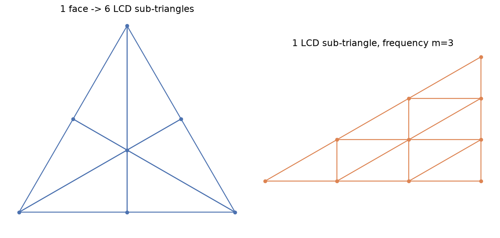
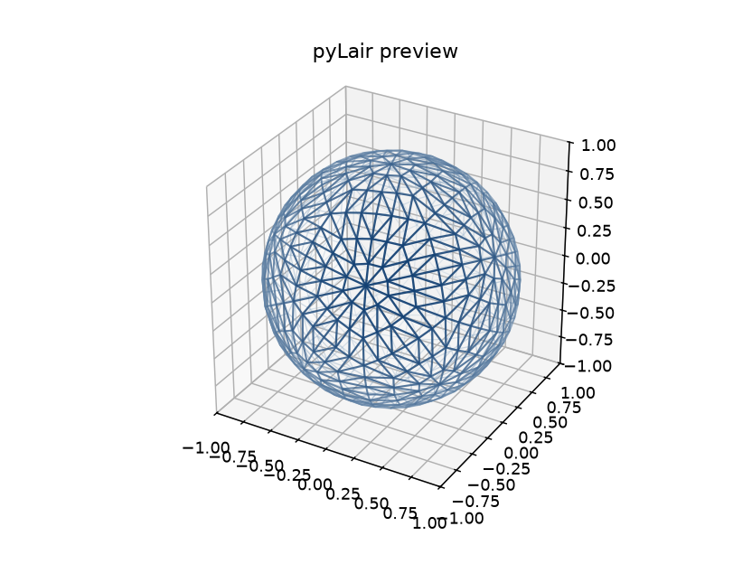

# Chapter 5: Class II — Triacon and the Even-Frequency Requirement

Chapter 4 taught the simplest possible symmetry triangle: a grid drawn parallel to a face's own edges. This chapter's subdivision — Class II, historically called the "Triacon" method — starts from a genuinely different idea, not just a different-looking grid laid over the same problem. It's also where this book teaches its first real correctness-checking habit worth carrying well beyond pyLair: how to use Euler's formula to catch a bug that a naive glance at a rendered dome would never reveal.

## A Different Construction, Not a Different Decoration

Class I subdivides a polyhedron face directly. Class II does something else first: before any frequency-based grid gets laid down at all, **each polyhedron face is split into 6 smaller right triangles arranged around its own centroid** — one for each combination of a face vertex and an adjacent edge's midpoint. Here is exactly that split, computed from one real icosahedron face:

*(Figure 5-1, left: One polyhedron face split into its 6 LCD ["lowest common denominator"] sub-triangles — the step Class II takes before any frequency grid is applied at all. Right: one of those 6 sub-triangles, with its own frequency-3 grid laid over it — the actual symmetry triangle Class II computes and then replicates 6 times per original face, not once. Compare this grid's visibly skewed shape against Chapter 4's equilateral one in Figure 4-1 — the two classes' symmetry triangles aren't just differently divided, they're differently *shaped* triangles to begin with.)*



Look closely at what each of those 6 wedges actually is: a right triangle, with legs running from a face vertex to an adjacent edge's midpoint, and from that midpoint to the face's centroid. (The right angle sits at the midpoint precisely because a triangle's median is also its altitude — a fact about equilateral triangles specifically, not a coincidence.) pyLair's own `build_lcd_faces` builds exactly these 6 triangles per face; `ClassTwoMethodOneSymmetryTriangle` then computes a frequency-`m` grid for **one** of them, the same "compute one, replicate the rest" principle Chapter 4 introduced — except now there are 6 replicated copies per original polyhedron face instead of 1.

This is why Class II's own frequency parameter behaves differently from Class I's, and why it has to: **each original polyhedron edge is already implicitly split once — at its own midpoint — by the LCD construction itself**, before the frequency-`m` grid ever subdivides anything further. Ask for the same nominal frequency `f` in both classes, and Class II is quietly starting from a construction that's already one subdivision step ahead. pyLair accounts for this by treating the requested `frequency` as `2m` internally for Class II — which is also exactly why Class II frequencies must be even.

## Why Frequency Must Be Even, and What Happens If It Isn't

A frequency that isn't evenly divisible by 2 simply has no valid `m` for Class II's construction to use, and pyLair refuses outright rather than guessing:

**Prompt:**
> Try building a Class II dome at frequency 3. What error do you get, and why does frequency have to be even here specifically?

**What Comes Back** (a real error, identical whether triggered through the CLI or through `design_dome` — both share `pylair/api.py`'s one validation engine):

```
-c 2 (Class II / Triacon) requires an even --frequency. Exiting.
```

**What It Means:** Frequency 3 has no corresponding integer `m` (`m = f/2 = 1.5`), and there's no sensible way to lay a fractional-frequency grid over an LCD sub-triangle. The fix is never to round — it's to pick the nearest even frequency that actually reflects the level of detail you want (2 or 4, not 3), understanding that Class II's `m` will end up half of whatever even number you choose.

## The Golden-Value Formulas — and a Genuine Surprise

Once you know `m = f/2`, Class II's own golden-value formulas for a full icosahedral sphere are:

| | Formula (in terms of `m`) | At `f=6` (`m=3`) |
|---|---|---|
| Vertices | `60m²+2` | 542 |
| Edges | `180m²` | 1620 |
| Faces | `120m²` | 1080 |

Compare this against Chapter 4's Class I table at the *same nominal frequency*, `f=6` (not the same `m`): Class I gives `20(6)²=720` faces; Class II gives `120(3)²=1080`. **Class II produces more faces than Class I at the same stated frequency, not fewer** — a real, easy-to-get-backwards surprise, and worth internalizing precisely because "same frequency number" is exactly the kind of thing a reader (or an agent) might assume means "same amount of detail" between two subdivision classes that happen to share one flag name.

**Prompt:**
> Check this Class II result against Euler's formula by hand. Does `V - E + F` actually equal 2?

**What Comes Back** (a real `design_dome` result, Class II, `f=6`):

```json
{"vertex_count": 542, "edge_count": 1620, "face_count": 1080}
```

**What It Means:** `542 - 1620 + 1080 = 2`. Euler's formula — true of *any* closed, simply-connected polyhedral surface, not just this one — holds exactly. A second, independent identity holds too, worth checking alongside it: every face here is a triangle with 3 edges, and every edge borders exactly 2 faces, so `2 × (edge count)` must always equal `3 × (face count)` for a closed triangulated mesh: `2(1620) = 3240`, and `3(1080) = 3240`. Both match. Neither check is specific to pyLair, or to geodesic domes at all — they're general facts about closed triangulated surfaces, which is exactly what makes them useful: a bug that only manages to fool pyLair's own internal bookkeeping would still have to fool these two independent, external mathematical facts as well.

## The Bug These Two Checks Actually Caught

That last sentence isn't hypothetical for this codebase. An earlier version of `ClassTwoMethodOneSymmetryTriangle` had a real, shipped bug, and the story of how it was found is worth knowing in full, because it's the sharpest illustration this chapter has of *why* Euler's formula is worth checking rather than just trusting a rendered preview.

Look again at the code comment embedded in `ClassTwoMethodOneSymmetryTriangle` itself:

> Unlike Class I's equilateral triangle (where vertex-to-centroid happens to be perpendicular to the opposite edge, since median=altitude there), this LCD triangle's `x_dir`/`y_dir` are **not** orthogonal, so solve for each point's `(a, b)` in that actual oblique basis rather than assuming an orthonormal one.

Class I's symmetry triangle is equilateral, and in an equilateral triangle, a line from any vertex to the midpoint of the opposite side (the median) happens to also be perpendicular to that side (the altitude). That's a genuine, if easy-to-miss, geometric coincidence — and it means that placing a grid point using two independent, perpendicular direction vectors just *works* for Class I's triangle, with no need to think about whether those two directions are actually at right angles to each other.

Class II's LCD sub-triangle is a 30-60-90 right triangle, not equilateral — and its own two natural local directions genuinely are not perpendicular to each other. An earlier implementation of this exact class reused Class I's simpler, orthonormal-basis approach anyway, quietly assuming the same convenient coincidence would hold. It doesn't. The result wasn't an obvious crash or a visibly mangled shape — a rendered preview of the resulting "dome" would have looked plausible enough to wave through at a glance. It failed **Euler's formula**, immediately, the moment anyone actually checked `V - E + F` against 2 instead of just eyeballing the output. That's the whole reason this chapter teaches the check as a habit rather than a footnote: a construction can be wrong in a way that looks fine and still fails a five-second arithmetic check, and the only way to catch that class of bug is to actually run the check.

The fix, visible in the real code above, replaces the naive orthonormal assumption with an honest one: build the LCD triangle's actual two local direction vectors, confirm (or rather, no longer assume) whether they're orthogonal, and solve a real 2×2 linear system (`np.linalg.solve(basis, ...)`) for each grid point's position in that actual, possibly-oblique basis. Once that fix shipped, Euler's formula held — and, just as importantly, it's held on every Class II configuration checked since, which is a different and stronger claim than "it held once."

## Continuing the Actual Secret Lair

The dome Chapter 4 introduced gets rebuilt here, at the identical nominal frequency, under Class II instead.

**Prompt:**
> Rebuild that same dome — frequency 6, icosahedron, radius 1.0 — but switch it to Class II and preview it.

**What Comes Back** (a real `preview_dome` render, `dome_class=2`, `frequency=6`):

*(Figure 5-2: The Actual Secret Lair, same nominal frequency as Figure 4-2, rebuilt under Class II. Visibly denser than its Class I counterpart — 1080 faces against 720 — which is exactly the "same frequency number, more detail" surprise this chapter's golden-value table predicts.)*



Neither version is "more correct" than the other — they're two different, both entirely valid, subdivision strategies for the same starting polyhedron. Which one the Actual Secret Lair actually ships with isn't decided until Chapter 6 offers a third, more dramatically different option still.

## What's Next

Chapter 6 introduces Class III — a subdivision whose grid isn't just a different shape, but genuinely **handed**: its own mirror image is a different, equally valid dome, not the same one rotated. It's also home to this book's single most important gotcha, one that makes this chapter's Euler's-formula check look almost too easy by comparison.
