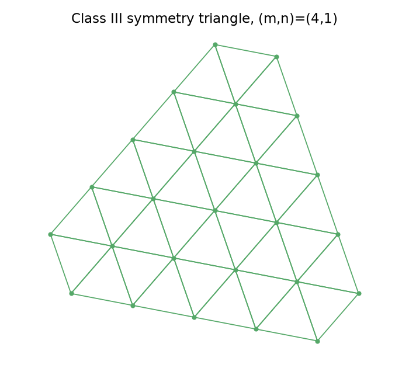
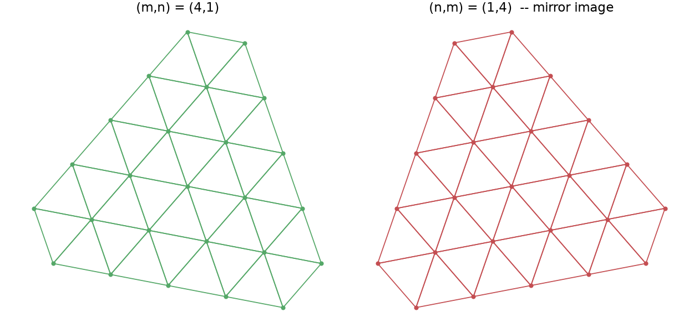
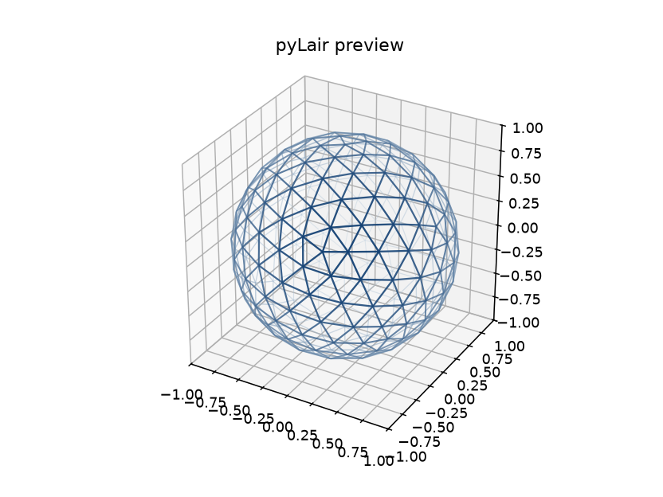

# Chapter 6: Class III — Going Chiral

Every chapter so far has built toward this one without quite saying so. Class I's grid is symmetric under reflection. Class II's is too — six identical wedges around a centroid, arranged with as much mirror symmetry as an equilateral triangle allows. Class III breaks that symmetry on purpose, and in doing so, introduces the single idea this book returns to more than any other: **chirality**. This chapter defines it precisely, builds it into a real dome, and then tells you the most instructive bug in pyLair's entire git history — one that passed every check the last two chapters taught you to trust, and was still wrong.

## Chirality, Defined Precisely

A shape is **chiral** if it cannot be superimposed on its own mirror image using only rotation and translation — no combination of turning it and sliding it around ever makes it coincide with its reflection. A shape that *can* be superimposed on its mirror image this way is called **achiral**. The textbook example is your own hands: a left hand and a right hand share every length and every angle exactly, and neither one can be rotated into matching the other — you'd have to reflect one through a mirror first. That's not a metaphor borrowed for this chapter's convenience; it's the literal, formal definition this chapter is about to apply to an entire dome's worth of struts.

Class I and Class II domes are both achiral, and it's worth understanding precisely why, rather than taking it on faith. Class I's symmetry triangle is equilateral, and an equilateral triangle's own mirror image is just itself, rotated — reflect it across any of its three medians and you get back the identical shape. Class II's six-LCD-wedge construction is built from that same equilateral face, arranged with three-fold rotational symmetry around its centroid; its mirror image is, again, achievable by rotation alone. Neither class's grid has a "handedness" to begin with, so neither class's finished dome does either.

## The (m,n) Construction, and Why It Breaks That Symmetry

Class III — historically the "Skew" method — lays its grid down at an angle instead, and it's parameterized by two positive integers, `m` and `n` (pyLair's `frequency`/`n_frequency` parameters), rather than the single frequency Class I and II each use. Both classes turn out to be special cases of a single more general formula, the **Caspar-Klug/Goldberg-Coxeter triangulation number**:

```
T = m² + mn + n²
```

Set `n=0` and `T` reduces to `m²` — Class I's own single-symmetry-triangle count. Set `m=n` and `T` becomes `3m²` — Class II's LCD construction, arrived at from the same general formula. Class III is the genuinely general case, `m≠n`, and this is exactly where the achiral coincidences of the last two chapters stop holding. Here is a real, bare Class III symmetry triangle, `(m,n)=(4,1)`, computed directly from pyLair's own `ClassThreeSymmetryTriangle`:

*(Figure 6-1: A bare Class III symmetry triangle, `(m,n)=(4,1)` — the third and last of this book's three per-class symmetry-triangle figures. Compare its visibly angled grid against Class I's parallel-to-edges one (Figure 4-1) and Class II's centroid-radiating one (Figure 5-1, right panel): none of the three classes share a construction, only a family of triangulation-number formulas.)*



Now build the same `T` a second way — swap the two parameters, `(n,m)=(1,4)` — and place the result directly beside the first:

*(Figure 6-2: `(m,n)=(4,1)` next to `(n,m)=(1,4)`. These aren't the same triangle rotated — reflecting the left triangle's local x-coordinate maps it onto the right one exactly, to within `1.2×10⁻¹⁶` (floating-point noise, not a real discrepancy), while no rotation of either triangle produces the other. This is chirality, made concrete: identical lengths, identical angles, genuinely different handedness.)*



That reflection relationship isn't asserted from a formula — it was checked directly, point by point, against pyLair's own real vertex data for both configurations, and it's worth stating exactly what was checked: every point in the `(4,1)` triangle has a point in the `(1,4)` triangle at *exactly* the position you'd get by negating one local coordinate and nothing else — not "approximately the same shape," but a specific, checkable reflection with a residual small enough to be pure floating-point roundoff. `(m,n)` and `(n,m)` are mirror-image constructions of the same underlying lattice, not two independent triangles that happen to share a name.

## Same Size, Different Pattern

Because `T = m²+mn+n²` is symmetric in its two arguments (swapping `m` and `n` leaves the formula unchanged), `(m,n)` and `(n,m)` always produce the exact same `T`, and therefore the exact same golden-value vertex, edge, and face counts. A real, full-sphere comparison confirms this precisely:

```json
{"m": 4, "n": 1, "vertex_count": 212, "edge_count": 630, "face_count": 420, "total_strut_length": 164.278399}
{"m": 1, "n": 4, "vertex_count": 212, "edge_count": 630, "face_count": 420, "total_strut_length": 164.278399}
```

Both match the golden-value formula (`T=21`: `10(21)+2=212`; `30(21)=630`; `20(21)=420`) exactly, and — because mirroring never changes a length or an angle, only handedness — even the *total strut length* matches to the last printed digit. This is worth stating precisely, because it's the exact trap the sample prompt below is built to expose:

**Prompt:**
> Build a Class III dome with `f=4, n=1`. Then build one with `f=1, n=4`. Are these the same dome, or mirror images? Do their vertex/edge/face counts actually differ?

**What Comes Back:** Mirror images, not the same dome — and no, the counts don't differ at all, by construction. Every golden-value check this book has taught so far (Chapters 4 and 5) will report these two configurations as identical, because `T` is symmetric under swapping `m` and `n`. Only a direct check of *which* physical strut pattern resulted — the chirality flag Chapters 14 and 20 introduce, or the literal reflection check above — actually distinguishes them.

**What It Means:** A count-based sanity check answers "is the total amount of material right," never "is the physical shape the one I actually meant to build." Those are different questions, and this chapter's whole reason for existing is the fact that pyLair's own history once conflated them.

## The Real Bug: When Every Count Agreed, and the Dome Was Still Wrong

Here is the story, told from pyLair's own source comments, because it's too instructive to paraphrase away from its own words. Building a chiral lattice means each polyhedron face's grid gets computed independently, from that face's own local coordinate basis — and because a chiral (`m≠n`) lattice has no reflection symmetry, a point sitting near (but not exactly on) a face's shared edge generally does **not** land at the same 3D position as the corresponding point computed independently by the neighboring face. Class I and Class II never have this problem, because their grids' own mirror symmetry means a shared edge's points, computed from either side, coincide automatically.

A first implementation of Class III's cross-face merging reused Class I and II's own approach anyway: match up nearby vertices by ordinary 3D proximity, via the same KD-tree Chapter 7 teaches. It should not have worked, and in one very specific, very concrete way, it didn't: for `(m,n)=(3,2)`, the resulting mesh reported the *exact right* vertex, edge, and face counts — every golden-value formula in this chapter's own table passed — and Euler's formula held too. And it was still wrong. Thirty of its edges were anomalously long: exactly the base icosahedron's own 30 original edges, at their full, entirely unsubdivided length, sitting inside a mesh that otherwise looked correctly subdivided everywhere else. Proximity-based merging had quietly failed to stitch the chiral lattice across every face boundary in the dome, leaving each original polyhedron edge as one long, un-strutted chord masquerading as a correctly finished structure.

This is the sharpest illustration in this entire book of a distinction worth carrying into every other geometry tool you ever use: **a count-based check like Euler's formula or a golden-value formula can only catch a *count* bug. It cannot catch a *shape* bug that happens to preserve the right counts.** Chapter 5's Euler's-formula check was a genuine, valuable habit — and it would have said nothing at all was wrong here, because nothing about the vertex/edge/face bookkeeping actually was.

## The Fix, and How It Was Actually Verified

The real fix (`pylair/class_three.py`) throws away proximity matching for cross-face stitching entirely and replaces it with something combinatorial: each grid point's lattice position is encoded as a redundant three-part index (derived from the lattice's own `(p,q)` coordinates), and two faces sharing an edge have their indices rotated into a common frame, in which a point on one face and a point on its neighbor are recognized as the *same physical vertex* whenever their rotated indices sum to a fixed, known constant — a rule driven entirely by the lattice's own internal structure, with no reference to 3D position at all. This is why Class III supplies its own `cross_face_matches` *in addition to* the ordinary KD-tree proximity pass Chapter 7 teaches, rather than replacing it: proximity still correctly handles the ordinary case, while the combinatorial matches handle the specific case a chiral lattice makes proximity blind to.

Fixing the bug and merely believing it was fixed are two different claims, and this project's own history keeps them separate on purpose. The corrected construction was cross-checked, bit-for-bit, against [`antitile`](https://github.com/brsr/antitile) — an independent, separately-written implementation of the same general Goldberg-Coxeter construction — comparing the full sorted, mean-normalized edge-length distribution across several `(m,n)` pairs on both base polyhedra. They matched to within `1e-15`: close enough that either both implementations are correct, or both happen to be wrong in the exact same way, which is precisely the kind of independent verification Chapter 5's Euler's-formula check couldn't provide on its own, and exactly the pattern Chapter 24 asks you to recognize as a recurring habit rather than a one-off precaution.

## Confirming Class III's Own Guardrails

Two of Class III's own validation rules are worth triggering once, live, the same way Chapter 5 did for Class II's even-frequency requirement.

**Prompt:**
> Ask `design_dome` for a Class III dome at frequency 3 without giving it an `n_frequency`. What happens?

**What Comes Back** (a real tool error):

```
-c 3 (Class III / Skew) requires -n or --n-frequency. Exiting.
```

**Prompt:**
> Now give it `n_frequency=3` too — the same as the frequency.

**What Comes Back** (a real tool error):

```
-c 3 (Class III / Skew) requires --n-frequency to differ from --frequency
(equal values are Class II -- use -c 2 instead). Exiting.
```

The second message is worth reading carefully: it isn't just refusing an edge case, it's actively telling you that `m=n` isn't a degenerate or invalid Class III configuration so much as *literally Class II under a different name* — the same `T=3m²` this chapter's formula reduces to when the two parameters are equal, exactly as this chapter's own opening section derived algebraically.

## The Actual Secret Lair, Finally Chiral

The dome this book has been building toward gets its real subdivision choice here — Class III, `(4,1)` rather than its mirror `(1,4)`, chosen deliberately for a specific strut-pattern aesthetic rather than picked arbitrarily, precisely because this chapter just demonstrated that the two are not interchangeable.

**Prompt:**
> Switch our running dome to Class III with `(m,n)=(4,1)` — frequency 4, n_frequency 1, icosahedron, radius 1.0 — and preview it.

**What Comes Back** (a real `preview_dome` render, `dome_class=3`, `frequency=4`, `n_frequency=1`):

*(Figure 6-3: The Actual Secret Lair's final subdivision — Class III, `(m,n)=(4,1)` — the flagship shape Chapters 8 through 21 spend the rest of this book elongating, truncating, accounting for, exporting, and finally nesting onto real sheet stock.)*



## What's Next

Chapter 7 finishes the geometric pipeline all three classes share: pushing every symmetry triangle's still-flat points outward onto an actual sphere, and deduplicating the vertices every subdivision class leaves shared along adjacent faces — Class III's own combinatorial matches included, running alongside, not instead of, the ordinary proximity pass this chapter's bug so thoroughly showed the limits of.
