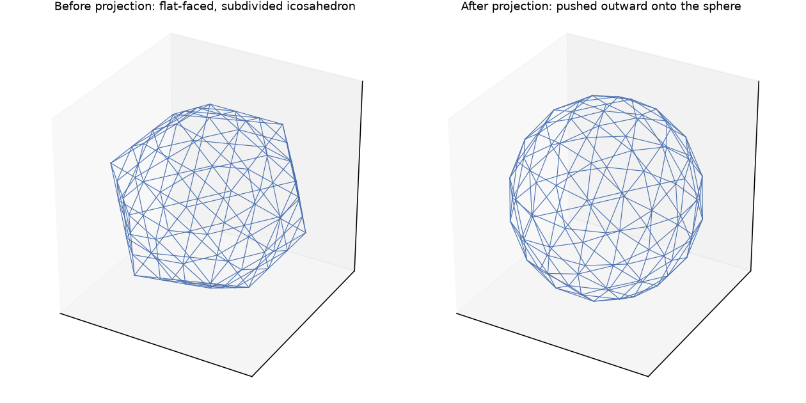

# Chapter 7: Projecting Onto the Sphere

Every subdivision class this book has taught — Class I's parallel grid, Class II's six centroid-radiating wedges, Class III's angled chiral lattice — ends up in the same place: a set of still-flat points, sitting on the flat faces of the original polyhedron, that haven't yet become anything resembling a dome. This chapter is the step all three classes share to finish the job: merge whatever needs merging, then push every point outward onto an actual sphere.

## Flat, Then Push Outward — In That Order

Here's the two-step process, made concrete rather than described in the abstract. First, `GeodesicSphere` takes the single symmetry triangle each class computed and replicates it — rotated into position via each face's own transfer matrix — onto every face of the base polyhedron. The result at this stage is **not yet a sphere**. It's a subdivided version of the original flat-faced polyhedron: every small triangle still lies exactly in the plane of whichever original face it came from, so the whole assembly still has visible flat facets and creases at the original polyhedron's own edges. Only *after* that flat assembly is finished — chords and faces fully wired up, duplicate seam vertices merged — does `project_onto_sphere()` take every surviving vertex, normalize it to a unit vector, and scale it out to the requested radius. Here is exactly that transition, computed from pyLair's own real internal state at a small enough frequency to see clearly:

*(Figure 7-1: The same Class I icosahedral construction, frequency 3, shown before and after `project_onto_sphere()`. Left: still flat-faced — every small triangle lies in its original face's own plane, and the base icosahedron's 20 facets and creases are still visible. Right: every vertex pushed radially outward to the same fixed radius — the facets are gone, and what's left reads as a genuine sphere.)*



Notice what has to happen *before* that final push, not after: **chord and face connectivity is entirely settled while the geometry is still flat.** This isn't an arbitrary implementation choice — it's a genuine ordering requirement. Two symmetry-triangle vertices that are supposed to be the same physical point (a shared edge between two adjacent faces, computed independently by each face's own local construction) are only recognizably "close together" while they're still sitting near each other in the flat, unprojected assembly. Projecting first and merging afterward would still work in principle for Class I and Class II, since projection is a smooth, distance-preserving-enough operation at this scale — but Class III's own combinatorial cross-face matches (Chapter 6) are keyed to the flat construction's own `(p,q)` lattice coordinates, which only exist meaningfully before projection has replaced them with 3D sphere positions. Merge first, project second, every time.

## Why Deduplication Needs a Spatial Index

The merging step itself — `locate_duplicate_vertices()` — has an obvious naive implementation: compare every vertex against every other vertex, and merge any pair closer than `-v/--vthreshold`. That's an `O(n²)` comparison, and at any frequency worth actually building, it's slow enough to notice. Here's a real, timed comparison, run on the Actual Secret Lair's own construction at frequency 16 — the highest frequency this book (and pyLair's own test suite) actually exercises:

```
raw (unprojected) vertex count: 3060
naive all-pairs comparison: 9.064s, found 570 duplicate pairs
KD-tree query_pairs:         0.0016s, found 570 duplicate pairs
```

Both approaches find the exact same 570 duplicate pairs — this isn't a case of the faster method cutting a corner the slower one didn't. It's roughly **5,700 times faster**, and the gap only widens at higher frequency, since the naive approach's cost grows with the *square* of the vertex count while a KD-tree's grows close to linearly. `locate_duplicate_vertices()` uses `scipy.spatial.cKDTree`'s own `query_pairs` for exactly this reason: at frequency 16, the difference is "instant" versus "long enough to wonder if the process hung."

**Prompt:**
> At a high frequency, how many vertices get deduplicated during projection, and does that number make sense given the face count?

**What Comes Back:** At frequency 16, Class I icosahedron: `3060` raw vertices (`20` faces × `153` symmetry-triangle vertices each, since a Class I symmetry triangle at frequency `f` has `(f+1)(f+2)/2` vertices — `153` at `f=16`) collapse to the golden-value `2562` (`10(16)²+2`), a reduction of `498`. That's not the same as the `570` duplicate *pairs* found above — and the difference is worth understanding rather than shrugging off: an icosahedron's own original 12 vertices are each shared by 5 faces, not 2, so several of those 570 pairwise relationships describe the *same* underlying shared point being duplicated more than once, and a whole cluster of 5 mutually-"duplicate" copies collapses to one final vertex rather than being counted pair by pair. `locate_duplicate_vertices()` handles exactly this with a union-find structure (Chapter 4 already showed you its two failure extremes; here's the ordinary, correct case actually working).

**What It Means:** `498` is a real, checkable number, not a rounding curiosity — and it's the kind of sanity check worth running before trusting a high-frequency result at all: raw count minus final count should always equal exactly the number of points that genuinely needed merging, no more and no less.

## The Safe Zone Narrows as Frequency Rises

Chapter 4 showed `-v/--vthreshold`'s two failure extremes at frequency 6: too tight (`0.0`) leaves seams cracked; too loose (`0.2`) collapses the entire dome to one point. The same two failures exist at frequency 16 — but the safe range between them is narrower, and it's worth seeing exactly how much narrower, because it's a real consequence of higher frequency packing vertices more tightly together:

```json
{"frequency": 6,  "v": 0.10, "vertex_count": 362,  "golden": 362}
{"frequency": 16, "v": 0.10, "vertex_count": 1,     "golden": 2562}
```

The identical threshold, `0.1`, is comfortably safe at frequency 6 and catastrophic at frequency 16 — collapsing the whole sphere to a single vertex, the same total-collapse failure Chapter 4 first showed at a *looser* setting (`0.2`) on the coarser dome. At frequency 16, that same collapse already happens somewhere between `0.05` (still correct) and `0.08` (already collapsed). The documented default, `1e-7`, sits so far below either boundary at any frequency this book or pyLair's own test suite has tried that it never needs to move — but "the safe zone exists and is wide" is a different, weaker claim than "the safe zone is infinitely wide," and a reader who's deliberately widened `-v` for some other reason (there isn't a good one, but this book won't assume you'll never try) should know the margin shrinks as frequency grows, not stays fixed.

## Diagnosing a Cracked Seam: Two Different Root Causes, One Symptom

Here's a genuinely practical skill this chapter's own content makes possible: if an exported dome shows a visible crack or gap at a seam — two hubs that should be the identical physical point showing up as separate points instead — the *symptom* looks identical regardless of cause, but the *fix* depends entirely on which of two, very differently-located problems produced it.

**Prompt:**
> If two hubs that should be identical show up as separate points in the output, what's the first setting you'd check?

**What Comes Back:**
> First, check which subdivision class the dome uses. If it's Class I or Class II, this is almost certainly an ordinary `-v/--vthreshold` problem — the threshold is too tight for the two points' actual floating-point separation, and Chapter 4's "too tight" failure (real seam duplicates left unmerged) is the direct cause. Widen `-v` slightly and re-check the golden-value vertex count.
>
> If it's Class III, don't reach for `-v` first. A chiral lattice's cross-face points generally don't land near each other in 3D at all — that's the entire premise of Chapter 6's own historical bug — so `-v` was never going to be the mechanism responsible for stitching them correctly in the first place. A cracked Class III seam more likely means the combinatorial `cross_face_matches` themselves are missing or wrong for this specific `(m,n)` pair, which is a construction bug in `class_three.py`, not a threshold-tuning problem in `geodesic_sphere.py`.

**What It Means:** The same visible symptom — a gap where a seam should be seamless — has two structurally different causes depending on which subdivision class produced it, and only one of them is a `-v` problem at all. Confusing the two wastes time nudging a threshold that was never going to fix a Class III construction gap, or, worse, nudging it far enough to cause the opposite failure this chapter just demonstrated.

## What's Next

The geometric pipeline every subdivision class shares is now complete: pick a polyhedron, subdivide one face, replicate it, merge the seams, project outward. Part III picks the finished sphere back up and starts reshaping it on purpose — Chapter 8 stretches and squashes it into a general ellipsoid, and Chapter 9 slices it into an actual, ground-flush dome.
