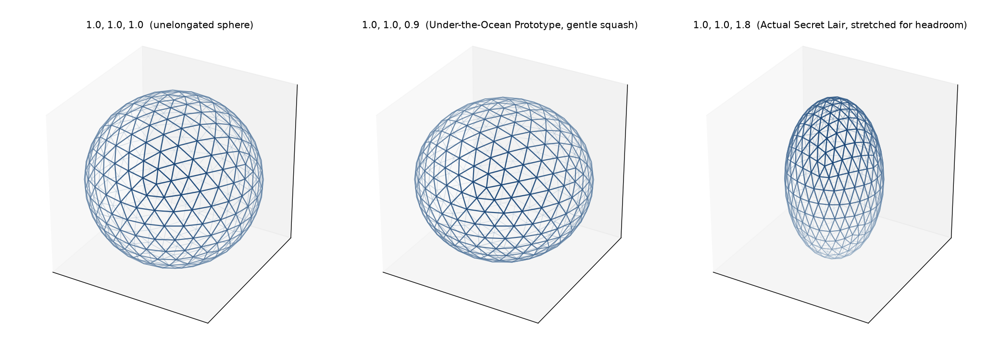

# Chapter 8: Squash and Stretch — Ellipsoid Elongation

Part II built a sphere. Part III turns that sphere into a building. This chapter is the first of three shaping tools — elongation here, truncation in Chapter 9, both together producing the specific quad-panel case Chapter 10 exists to handle — and it introduces this book's second running example properly: **the Under-the-Ocean Prototype**, whose entire design philosophy is the opposite of the Actual Secret Lair's.

## One Setting, Three Independent Axes

`design_dome`/`preview_dome`/`export_dome` all take three elongation factors — `elongation_x`, `elongation_y`, `elongation_z` — and scale every vertex on the finished sphere by those factors independently, one axis at a time. The implementation (`pylair/elongation.py`) is about as simple as a geometric operation gets:

```python
def elongate(vertices, factors):
  scale = np.array(factors, dtype=float)
  return [v * scale for v in vertices]
```

A per-vertex multiply, nothing more — chord and face connectivity are completely unaffected, since scaling never changes which vertices are connected to which, only where those vertices sit. A factor greater than 1 stretches that axis outward; a factor less than 1 squashes it inward; `1.0` leaves it untouched. The result, once more than one axis differs from `1.0`, is a general **triaxial ellipsoid** — three independent semi-axes, no two of which need match.

**Prompt:**
> Preview the same frequency-6 Class I sphere three ways: unelongated, squashed to `(1.0, 1.0, 0.9)`, and stretched to `(1.0, 1.0, 1.8)`.

**What Comes Back** (three real `preview_dome` renders):

*(Figure 8-1: Left: unelongated. Center: the Under-the-Ocean Prototype's gentle inward squash, `elongation_z=0.9`. Right: the Actual Secret Lair's upward stretch, `elongation_z=1.8`. Notice how subtle the center shape's difference from the sphere actually looks — that's not an error in the render, it's the honest visual size of a 10% squash next to an 80% stretch.)*



*(Figure 8-2: An independently-produced reference for the same general-ellipsoid shape, from pyLair's own earlier documentation.)*


## Two Opposite Design Philosophies, One Flag

**The Under-the-Ocean Prototype** wants to stay as close to a true sphere as elongation ever gets — `"1.0,1.0,0.9"`, a gentle inward squash on Z alone. This isn't indecisiveness; it's the correct instinct for a pressure hull. A sphere distributes external pressure with total axial symmetry, which is exactly what you want deep underwater, and any elongation at all trades away some of that symmetry. `0.9` is as far from `1.0` as this design is willing to go, kept that close specifically because pressure resistance, not headroom, is the actual design goal here.

**The Actual Secret Lair** wants the opposite thing entirely — `"1.0,1.0,1.8"`, a dramatic upward stretch, purely because a secret laboratory needs ceiling height and a plain sphere of a reasonable footprint doesn't have much of it. Nothing about this elongation improves structural performance; it's a livability decision, made deliberately at the cost of the perfect symmetry the Under-the-Ocean Prototype refuses to give up.

Both are valid uses of the identical flag, in opposite directions, for entirely different reasons — which is the whole point of introducing the two side by side here rather than teaching elongation the same abstract, example-free way through a single generic dome.

## Why This Chapter's Own Angle Math Needs More Than a Position Vector

Here's a fact worth stating precisely before it becomes a problem three chapters from now: **on a true sphere, the outward surface normal at any point is just that point's own position vector, normalized.** It's a genuine geometric fact, not a convenient approximation — a sphere is defined as every point equidistant from its center, so the direction "straight out" from any point on it always points directly away from that center. Chapter 12's hub angle calculations lean on exactly this normal vector to figure out how far a strut deflects from a hub's own local surface.

The moment you elongate a sphere into a general ellipsoid, that convenient fact stops being true. An ellipsoid's outward normal is no longer generally parallel to its position vector — except at the six points where it crosses its own three axes, where the two directions still happen to coincide by symmetry. Here is the actual, verified difference, in numbers rather than just words, using the exact hand-computable case pyLair's own test suite checks against: a point on a `z`-elongated (factor `2.0`) ellipsoid at 45°, position `(0.7071, 0, 1.4142)`.

```
True ellipsoid normal (gradient of x²/a² + z²/c² = 1):  (0.8944, 0, 0.4472)
Naive normal (just the position vector, normalized):    (0.4472, 0, 0.8944)
```

Look closely at those two vectors: they aren't just different, they're each other's components **swapped** — the true normal weights the x-component more heavily and the naive one weights z more heavily, in exactly reversed proportion. This isn't a rounding difference an agent could shrug off; it's a qualitatively wrong direction, and any downstream calculation that treats the wrong one as "straight out from the surface" — a tangent-plane deflection angle, say — inherits that same wrongness.

The correct formula (`pylair/bill_of_materials.py`'s `_ellipsoid_normal`) comes from the ellipsoid's own implicit equation, `x²/(fx)² + y²/(fy)² + z²/(fz)² = 1` (radius `a` cancels out of the normalization, so only the three elongation factors matter): the true normal direction is proportional to `(x/fx², y/fy², z/fz²)`, which reduces *exactly* to the plain position vector when all three factors equal `1.0` — confirming that the sphere case was never a separate formula, just this one's own special case.

## Verified Two Different Ways, Not Just Derived Once

Getting a formula right on paper and getting it right in running code are different claims, and this project keeps them separately checked. Beyond the hand-computed 45° case above (and a second, matching case on the X axis instead of Z, specifically to make sure the formula wasn't accidentally only correct for the one axis it was first derived against), the fully general **triaxial** case — three genuinely different elongation factors at once, not just one axis stretched — is checked against an entirely different method: a numerical, finite-difference approximation of the same gradient, computed independently of `_ellipsoid_normal`'s own analytic formula. At a real test point (`fx,fy,fz = 2.0, 3.0, 0.5`), the finite-difference gradient and the analytic formula agree to within `1e-5` — close enough that either both are correct, or both happen to be wrong in the same specific way, which is exactly the same style of independent cross-check Chapter 6 used to validate Class III's chiral construction, applied here to a completely different piece of geometry.

**Prompt:**
> Why would using the naive position-vector-as-normal shortcut here give a wrong answer, specifically?

**What Comes Back:**
> Because a sphere's own defining property — every point equidistant from the center — is exactly what makes its position vector and its surface normal coincide, and elongation breaks that property the moment more than one axis stops matching. The correct normal comes from the ellipsoid's implicit equation's gradient, `(x/fx², y/fy², z/fz²)`, normalized — which happens to reduce back to the plain position vector only when every elongation factor is `1.0`. Anywhere else, using the position vector directly gives a direction that can be qualitatively wrong, not just imprecise, as the 45° hand-computed case above shows directly: its two components are exactly swapped, not just slightly off.

## Seeing the Difference on a Real Hub

The Actual Secret Lair's own frequency-6 sphere makes this concrete rather than abstract. Take one specific hub — vertex 0 — and compare its five reported tangent-plane angles before and after an 1.8x Z-axis stretch:

```json
{"elongation": "1.0,1.0,1.0", "hub_0_tangent_angles_degrees": [4.6624, 4.6624, 4.6624, 4.6624, 4.6624]}
{"elongation": "1.0,1.0,1.8", "hub_0_tangent_angles_degrees": [3.0904, 4.7289, 4.7289, 3.3204, 3.3204]}
```

**Prompt:**
> Elongate this dome upward by 1.8x on Z only. How much does that change the reported hub tangent-plane angles compared to the unelongated version?

**What It Means:** Unelongated, all five struts meeting at this hub report the *identical* tangent-plane angle — a direct consequence of the hub sitting at a point of full rotational symmetry on a plain sphere. Elongated, that symmetry is gone: the five angles split into three distinct values (`3.09°`, `4.73°`, `3.32°`, each appearing more than once for hubs sharing the same relative position to the stretch axis), because the true ellipsoid normal now depends on more than just this hub's distance from the origin — it depends on *which direction* the stretch actually pulled. A reader expecting elongation to just uniformly rescale every reported angle by some fixed factor will find that's not what happens at all; it changes the angles' entire pattern, not just their magnitude.

## The Other Way to Get This Wrong: A Zero Factor

Elongation factors must each be strictly greater than zero — a reader reaching for `0` hoping to flatten an axis into a two-dimensional disc gets a clear refusal instead of a degenerate, zero-thickness dome.

**Prompt:**
> Try elongating this dome with a Z factor of `0.0` — I want to see what happens if I try to flatten it completely.

**What Comes Back** (a real tool error):

```
-e or --elongation arguments must each be greater than zero. Exiting.
```

There's no meaningful ellipsoid at a zero semi-axis — the implicit equation this whole chapter is built on divides by each factor squared, and pyLair refuses before that division ever has a chance to produce something nonsensical.

## One More Ordering Fact, Held for Chapter 9

Elongation always happens **before** truncation in pyLair's pipeline — every axis is stretched or squashed first, and only afterward does a truncation cutoff (Chapter 9) get computed against whatever range that stretching left behind. This matters more than it might sound: a truncation cutoff fraction describes "keep this portion of the *current* range on this axis," and "current" means *after* elongation, not the original unit sphere's range. Chapter 9 picks this up in full once there's an actual cutoff to reason about; for now, just hold onto the ordering itself; getting it backwards would make every truncation fraction in this book describe the wrong thing.

## What's Next

Chapter 9 takes whichever shape this chapter produced — sphere, gentle squash, or dramatic stretch — and slices it into an actual, ground-flush dome, introducing pyLair's own most dramatic failure mode: a cutoff that lands exactly wrong, and refuses outright rather than silently producing something broken.
