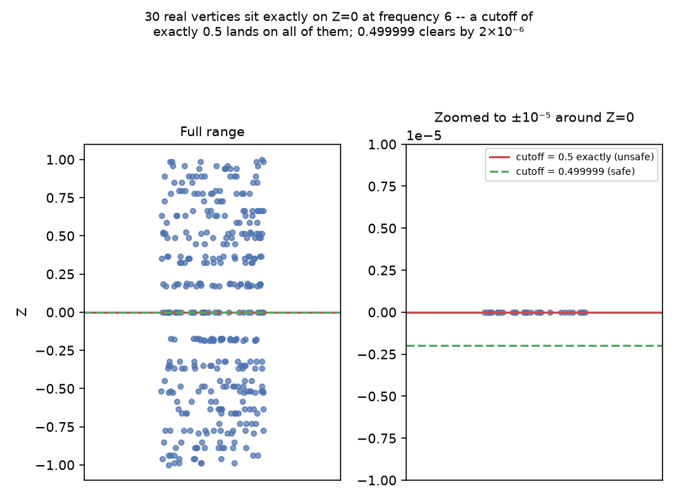
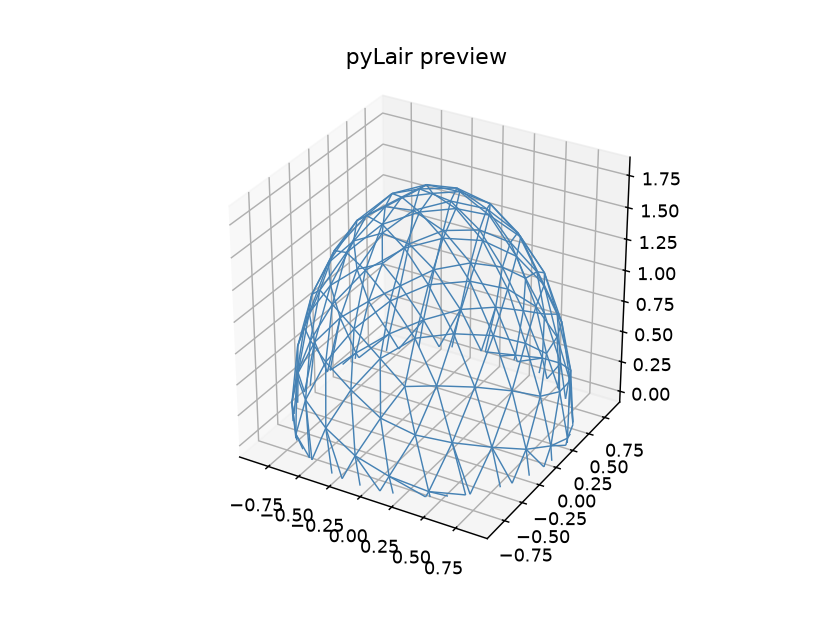
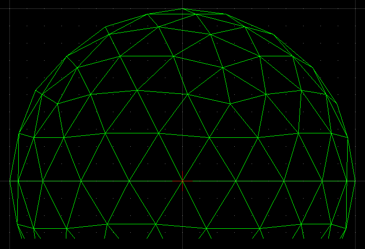

# Chapter 9: Cutting a Dome From a Sphere — Truncation

Every dome this book has built so far has been a complete sphere or ellipsoid — structurally interesting, but not yet a *building*. Nothing built in Chapters 3 through 8 has a floor. This chapter fixes that: **truncation**, the operation that slices a finished shape at a chosen height and keeps only the portion above it, turning a sphere into an actual, ground-flush dome. It's also home to this book's most dramatic failure mode so far — a refusal, not a silent mistake — and a genuine ordering subtlety worth getting right before Chapter 10 complicates it further.

## What a Cutoff Fraction Actually Measures

`-t/--truncation` (and its per-axis siblings `-x`/`-y`, both covered later in this chapter) take a single number between 0 and 1: the fraction of that axis's own range, measured from the bottom, above which everything is kept. `truncate()`'s own logic makes this precise — for a chosen axis, find that axis's minimum and maximum vertex coordinate across the whole shape, and compute:

```python
cutoff = min_value + cutoff_from_bottom * (max_value - min_value)
```

Everything at or above `cutoff` survives; everything below it is discarded, and any chord or face straddling the cutoff plane gets clipped exactly at the crossing point (Chapter 10 covers what happens to a face that gets clipped this way in full). A cutoff of `0.5` keeps the top half of whatever range that axis currently has; a cutoff of `0.0` keeps everything; a cutoff close to `1.0` keeps only a thin cap near the very top.

## The Flat-Chord Failure, Reproduced Live

Here's the danger this chapter exists to teach you to recognize and avoid, demonstrated exactly as it actually happens rather than described in the abstract. Take a plain, unelongated Class I icosahedral sphere at frequency 6, and truncate it at exactly `0.5`:

```
$ pylair -o bad -f 6 -t 0.5 -r 1.0
Truncation cutoff plane lies exactly on a chord that is flat along
the cutoff axis. Choose a slightly different truncation value to
avoid this degenerate case.
```

This isn't a bug — it's `truncate()` refusing to do something it can't do safely. A chord that runs exactly flat along the cutoff plane (both endpoints at precisely the same coordinate on the truncation axis) has no well-defined single crossing point: dividing by that chord's near-zero extent along the cutoff axis would otherwise produce an `inf`/`nan` vertex silently, rather than failing loudly. `truncate()` checks for exactly this degenerate case and refuses outright instead.

*(Figure 9-1: Every one of the real frequency-6 sphere's 362 vertices, plotted by their Z-coordinate. Left: the full range. Right: zoomed to ±10⁻⁵ around Z=0 — 30 real vertices sit at *exactly* Z=0, which is precisely where a cutoff of `0.5` lands. The documented safe cutoff, `0.499999`, clears that entire ring by only `2×10⁻⁶` — a hair's breadth, not a generous margin.)*



Why does frequency 6 specifically produce a vertex ring exactly at the equator? A quick sweep across frequencies shows the pattern plainly: `-t 0.5` fails at every *even* frequency (2, 4, 6, 8, 10...) and succeeds at every *odd* one, for this base construction — an even frequency's grid happens to land a full ring of vertices exactly on the midplane, where an odd one doesn't. This is exactly why the CLI's own `-t/--truncation` help text recommends `0.499999` or `0.333333` over rounder-looking numbers: both are chosen specifically to avoid landing exactly on a vertex ring at the frequencies this construction typically produces one at.

**Prompt:**
> Truncate this dome at the equator on Z only, using the documented safe cutoff. Then try `0.5` exactly — what happens, and why?

**What Comes Back:** `0.499999` succeeds cleanly. `0.5` exactly raises the flat-chord `ValueError` above, because this specific frequency's construction places a real ring of vertices precisely on the cutoff plane. Nudging the cutoff by `0.000001` — imperceptible on a physical build, decisive to a floating-point comparison — is the entire fix.

**What It Means:** The documented safe values aren't a magic number; they're a deliberately, slightly-off-round choice, chosen because on-the-nose fractions are exactly where a symmetric construction's own vertex rings are most likely to sit. It's worth being honest about what this actually guarantees, too: it's a mitigation earned by testing, not a mathematical proof that no frequency or shape combination could ever land a ring at `0.499999` specifically — across every frequency this book (and pyLair's own test suite) actually exercises, `0.499999` has never failed, which is real, useful evidence, not the same claim as universal immunity.

## Truncating the Actual Secret Lair

The dome this book has been building — Class III at `(m,n)=(4,1)` (Chapter 6), stretched `1.8`× on Z for headroom (Chapter 8) — finally gets a floor here, sliced at exactly the documented safe value:

```
pylair -o truncated-secret-lair -f 4 -n 1 -c 3 -r 1.0 -e "1.0,1.0,1.8" -t 0.499999 -P
```

*(Figure 9-2: The Actual Secret Lair, finally ground-flush — Class III, elongated, and now truncated at the documented safe cutoff. This is the first time in the book this shape has looked like a building rather than a suspended shape.)*



For a second, independently-produced reference showing the same kind of result — a correctly truncated dome loaded back into a CAD viewer — see pyLair's own earlier documentation images:




## Combining Axes: Order Is Fixed, and It Matters

`-t`/`-x`/`-y` can be combined — truncating on 2 or all 3 axes at once — and pyLair applies them in a specific, fixed internal order every time: **X, then Y, then Z**, regardless of what order you happen to type those flags on the command line. This isn't cosmetic. Each axis's cutoff fraction is computed against *that axis's own range at the moment its `truncate()` call runs* — and if an earlier axis's cut has already removed the vertices that used to define a later axis's extreme values, the later axis's own range genuinely changes as a result.

Most of the time, this ordering is invisible, because a moderate cutoff on one axis doesn't happen to remove the vertices that define another axis's range. But it's a real effect, not a hypothetical one, and it's worth seeing it actually matter rather than trusting that it's always harmless. Take the same frequency-6 sphere and truncate it two different ways — X first at a *deliberately aggressive* cutoff (`0.9`, keeping only the top 10% of the X range, aggressive enough to remove the pole vertex that would otherwise define Z's own maximum), then Z at `0.4` on whatever remains — against the reverse order:

```json
{"order": "X (0.9) then Z (0.4)", "vertex_count": 60,  "edge_count": 99,  "z_range": [-0.1157, 0.6031]}
{"order": "Z (0.4) then X (0.9)", "vertex_count": 72,  "edge_count": 125, "z_range": [-0.2000, 0.6031]}
```

These are genuinely different shapes — different vertex counts, different edge counts, and a different Z range on the low end (`-0.1157` versus `-0.2000`) — computed from the exact same two cutoff fractions, differing only in which axis was cut first. Cutting X first removed the very vertex (the pole) that used to anchor Z's own minimum-defining point, so Z's subsequent cutoff computed its own range against a shape that no longer included it; cutting Z first left that vertex in place for the X cut to remove afterward instead. Because pyLair always resolves this by applying X, then Y, then Z internally — never in whatever order you typed the flags — this specific ambiguity never actually reaches you as a user; it's resolved, consistently, before you ever see a result. But it's worth understanding *why* that fixed order is a real, load-bearing engineering decision rather than an arbitrary convention, precisely because the numbers above show what would happen if it weren't fixed at all.

**Prompt:**
> Now truncate on X and Z together. Does the order I specify the flags in change the resulting shape?

**What Comes Back:**
> No — pyLair always applies truncation in a fixed X, then Y, then Z order internally, regardless of the order `-x`/`-y`/`-t` appear on the command line or in an MCP call's parameters. What *would* change the shape is which axis's cutoff is computed first, which is exactly why that internal order is fixed rather than left to whatever sequence a caller happens to type: each later axis's cutoff is computed against whatever range the earlier axis's cut already left behind, and reversing that internal order can produce a measurably different dome from the identical two cutoff fractions.

**What It Means:** "Does flag order matter" and "does truncation order matter" are two different questions with two different answers — the first is no, by design; the second is genuinely yes, which is exactly why the first question's answer had to be designed rather than left to chance.

## What's Next

Chapter 10 picks up exactly where this chapter's own face-clipping logic leaves off: what happens to a single triangular panel when truncation clips off one of its corners, leaving a four-sided shape where a three-sided one used to be — and the real, since-fixed piece of this project's own history about whether that new seam gets treated as a genuine, strutted edge or an invisible bookkeeping artifact.
