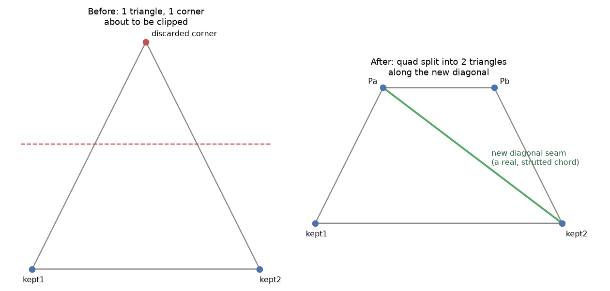

# Chapter 10: Faces, Diagonals, and the Case of the Un-strutted Seam

Chapter 9 taught truncation as a chord-clipping operation — a strut running through the cutoff plane gets shortened to the crossing point, and that's the whole story for a wireframe dome. But pyLair's face-aware output formats (`face_output`, `stl`, `obj`, `hub_templates`/`face_templates`, `cost_per_unit_area`, `panel_areal_density`) need more than that: they need every clipped *panel* to still be a valid, correctly-accounted-for shape too, not just a wireframe that happens to stop at the right place. This chapter is about the one specific, easy-to-get-wrong case that requirement creates — and a real piece of this project's own history about getting it wrong the first time.

## When a Triangle's Corner Gets Clipped

Every face on a geodesic sphere is a triangle. Truncation's cutoff plane can clip a triangle three ways, depending on how many of its corners survive: keep all three (untouched), keep none (discarded entirely), or keep exactly one, or exactly two. The interesting case — the one this whole chapter is about — is keeping **two**: cut off a single corner, and what's left is no longer a triangle at all. It's a four-sided shape, a quadrilateral, sitting where a three-sided panel used to be.

pyLair's bill of materials, its DXF/STL/OBJ exports, and its cutting templates all assume every panel is a simple, three-edge triangle — so a clipped quad can't just be reported as-is. `_clip_face` handles it by splitting that quadrilateral into two triangles along a diagonal, drawn from one of the two new edge-crossing points:

*(Figure 10-1: A single triangular panel, magnified, showing exactly this case. Left: one corner about to be clipped by a cutoff plane. Right: the resulting quadrilateral, split into two triangles along a new diagonal — the seam this entire chapter is about.)*



Two details are worth being precise about here, because getting either one wrong would silently corrupt the output. First: the two new corner points (`Pa`, `Pb` in the figure) are computed via the exact same edge-crossing function Chapter 9's chord-clipping uses — `_edge_crossing`, shared between the chord path and the face-clipping path specifically so that a strut running along a cut and the panel corner sitting at that same physical point land on the *identical* coordinate, not two independently-rounded near-duplicates that happen to be extremely close. Second: the diagonal itself — `Pa` to `kept2` in the figure — isn't a rendering artifact or a triangulation convenience. Both of the two resulting sub-triangles lie exactly in the same flat plane as the *original*, undivided triangle (a straight cut through a flat shape can only ever produce more flat shapes, never bend anything), which means this diagonal is a real, physically bracable edge, exactly as load-bearing as any strut that was part of the original design.

## The Real History: A Seam That Used to Be Invisible to the Bill of Materials

Here's a piece of this project's own git history worth knowing in full, because it's a genuinely instructive example of a bug that's easy to miss precisely *because* it doesn't break anything visually. An earlier version of `_clip_face` computed this exact diagonal correctly for area and edge-length bookkeeping — the quad-split geometry itself was always right — but never added that diagonal to the actual chord list. The seam existed in the panel data and nowhere else: no strut length in the bill of materials, no bevel angle in the panel-edge report, nothing a builder would ever see as a thing they needed to actually cut and install.

The fix is simple to state and was simple to make: `_clip_face` now reports that diagonal as a genuine new chord alongside the panel split itself, so it flows through the same strut-length, bill-of-materials, and bevel-angle machinery as every other edge in the design — the same machinery Chapters 12 and 13 teach in full. A blog post describing this project once kept describing the diagonal as an unresolved, unstrutted edge case after this exact fix had already shipped — worth knowing not as a scolding note about documentation hygiene, but as a real, concrete reminder that "the code was fixed" and "every description of the code reflects that fix" are two different claims, and only one of them happens automatically.

## Seeing It for Real: Truncating on Two Axes Through the Same Triangle

The clearest way to produce this exact case honestly, rather than construct a contrived one, is to truncate on two axes aggressively enough that at least one original triangle gets a corner clipped by *both* cuts: a frequency-6 Class I sphere, truncated on X (`0.9`) and Z (`0.4`) together.

**Prompt:**
> Truncate this dome on two axes through the same triangle — `truncation_x=0.9`, `truncation_z=0.4` — and check its bill of materials. Does the resulting diagonal seam show up as a real strut?

**What Comes Back** (real, from the bevel-angle section of a real `get_bill_of_materials` report on this exact dome):

```json
{"vertex 1": 24, "vertex 2": 2, "face 1": 2, "face 2": 3,
 "dihedral angle (degrees)": 180.0, "bevel angle (degrees)": 0.0}
```

**What It Means:** Yes — chord `(24, 2)` is a genuine entry in this dome's chord list, with a real strut length (`0.170` units, at this dome's scale) computed the same way every other strut's length is. It isn't flagged, hidden, or treated specially anywhere in the report; it's exactly as ordinary an edge as any strut this book has shown you, which is precisely the point of the fix described above — a builder reading this bill of materials never needs to know or care that this particular strut came from a clipped panel's diagonal rather than the original subdivision.

## Why a ~180° Reading Here Is Correct, Not a Bug

**Prompt:**
> What bevel angle would you expect for that seam, and why does a ~180° dihedral reading there mean the geometry is correct, not broken?

**What Comes Back:**
> Exactly `180°` dihedral, `0°` bevel — and that's the geometrically necessary answer, not a rounding coincidence. Bevel angle measures how far two adjacent panels deviate from lying perfectly flat against each other; a `180°` dihedral means the two faces meeting at that edge are coplanar, requiring no bevel cut at all to sit flush. Both of this diagonal's two sub-triangles were carved out of the *same* original, undivided triangle by a single straight cut — they were flat against each other before the cut, and a straight cut through a flat shape can't introduce any new bend between the pieces it produces. A dihedral reading anywhere other than `180°` here would indicate something had gone wrong; the flat reading is the correctness check succeeding, not a suspicious edge case to double-check.

**What It Means:** This is worth holding onto as a general habit, not just a fact about this one seam: an unusual-*looking* number (a strut with a perfectly flat `0°` bevel, when most of this dome's real struts bevel at several degrees) isn't automatically a red flag. Chapter 16 teaches the opposite lesson — a genuinely *wrong* near-zero value (a truncation-artifact sliver) that does need catching — and the two are worth being able to tell apart on sight: a `0°` bevel on a diagonal seam between two coplanar sub-triangles is geometrically guaranteed to be exactly right, while a near-zero panel area or strut length elsewhere in the same report is exactly the kind of thing worth double-checking before trusting it.

## Multi-Axis Truncation Still Composes Correctly Here

One more thing worth confirming rather than assuming: Chapter 9 showed that sequential multi-axis truncation (X, then Y, then Z) matters because each later axis computes its cutoff against whatever range the earlier axis's cut left behind. That same sequential logic applies just as correctly to a face that's *already* been quad-split by an earlier axis's cut. When the second axis's `truncate()` call runs, it doesn't know or care that one of the triangles it's clipping used to be half of a quad from a previous pass — it just clips whatever triangle is in front of it, computing fresh crossing points against the *current* geometry, diagonal seam included, using the same `_edge_crossing`/`_clip_face` logic this chapter has already shown you. There's no separate code path for "a face that's already been through one truncation pass" — it's the same function, called again, on whatever the previous call actually produced.

## What's Next

Chapter 11 is a practicum, not a new feature: applying everything Chapters 3 through 10 taught — polyhedron choice, subdivision class, elongation, truncation — together, deliberately, against a series of real environmental design goals. Part IV picks the bill of materials itself back up in full afterward, starting with the two hub-angle types this exact chapter's diagonal seam already gave you an honest preview of.
