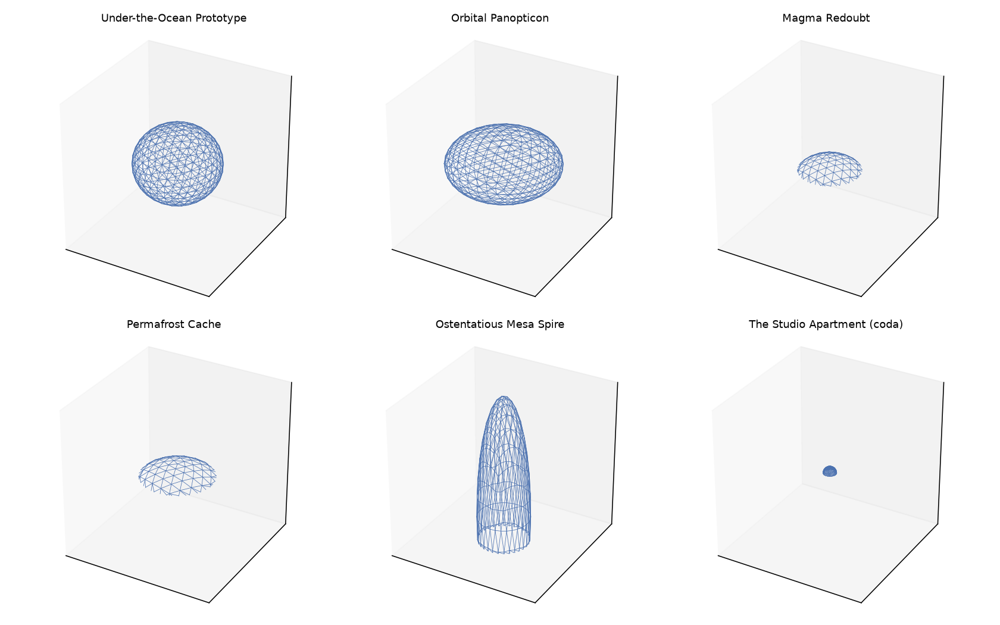
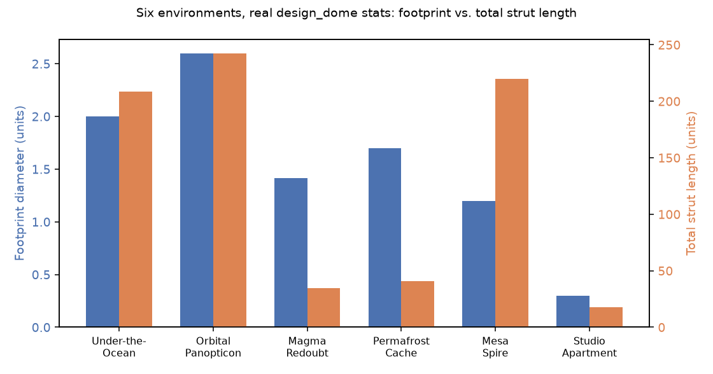

# Chapter 11: Location, Location, Location — Designing for Hostile (and Ridiculous) Environments

Nothing in this chapter is a new pyLair feature. Chapters 3 through 10 already gave you every tool this chapter uses — polyhedron choice, subdivision class, elongation, truncation. What this chapter teaches instead is how a real commission actually arrives: never as "build a Class III dome," always as "build a dome that survives *down there*, or *up there*, or *in there*." Six stops, one design lens, applied deliberately each time.

*(Figure 11-1: All six of this chapter's stops, real `design_dome` builds, plotted at a single shared scale so their true relative sizes and proportions are honestly comparable — not six independently-scaled images that would each look similarly sized regardless of their actual dimensions.)*



## Stop One: The Under-the-Ocean Prototype, Completed

Chapters 3 and 8 already made two of this design's three real decisions: an icosahedron, for its already-flatter near-equatorial vertex structure (Chapter 3), and a gentle `"1.0,1.0,0.9"` squash, kept as close to a true sphere as this design is willing to go (Chapter 8). The third decision belongs here: **no truncation at all**, if the actual goal is a fully closed, pressure-resistant shell with no seam anywhere for water to concentrate against.

```json
{"footprint_diameter": 2.0000, "height": 1.8000, "total_strut_length": 208.7384}
```

A real airlock changes this calculus — a flat mounting face is worth a small, carefully-chosen cutoff that stays clear of a vertex ring (Chapter 9's own safe-cutoff lesson, unchanged by which environment is asking for it). But absent that specific need, the closed shell is the honest default for this design goal, and it's worth resisting the temptation to truncate just because every other stop in this chapter does.

**Prompt:**
> Compare a frequency-4 and a frequency-8 Class I icosahedral dome for The Under-the-Ocean Prototype. Which one produces fewer distinct panel types, and why might that matter for a pressure-rated build?

**What Comes Back** (real `get_bill_of_materials` results, both elongated `"1.0,1.0,0.9"`):

```json
{"frequency": 4, "total_panels": 320,  "distinct_panel_shape_groups": 20}
{"frequency": 8, "total_panels": 1280, "distinct_panel_shape_groups": 71}
```

**What It Means:** Frequency 8 doesn't just have more panels — it has more than three times as many *distinct shapes*, each one needing its own cutting template (Chapter 15) and its own entry in a fabricator's parts list. For a pressure-rated hull, where every seam is a potential weak point and every distinct panel shape is one more opportunity to install the wrong piece in the wrong slot, frequency 4's 20 shape groups is a meaningfully simpler build than frequency 8's 71 — a real, concrete reason to prefer the coarser frequency here specifically, not just "lower numbers are simpler" as a vague instinct.

## Stop Two: The Orbital Panopticon

Zero gravity makes "which way is down" a design choice, not a constraint — so this stop's dome skips truncation entirely and instead asks a cost question Chapter 8 didn't need to: given a fixed footprint, which elongation ratio is *cheapest to launch*? Total strut length is a reasonable proxy for that, since more material sent to orbit costs more regardless of what it's made of.

**Prompt:**
> For the Orbital Panopticon, hold the footprint diameter fixed and try three different elongation ratios. Which one minimizes total strut length — and therefore launch mass?

**What Comes Back** (three real builds, all `fx=fy=1.3` — holding the X/Y footprint fixed exactly the way Chapter 8 showed Z-only elongation does — varying only `fz`):

```json
{"fz": 0.5, "footprint_diameter": 2.6000, "total_strut_length": 233.2433}
{"fz": 0.7, "footprint_diameter": 2.6000, "total_strut_length": 242.5685}
{"fz": 1.0, "footprint_diameter": 2.6000, "total_strut_length": 260.0654}
```

**What It Means:** All three configurations share the exact same footprint, by construction — only `fz` differs. The flattest option (`fz=0.5`) is also the cheapest, by a real, measurable margin: about 10% less strut material than the roundest option (`fz=1.0`) at the identical footprint. This is worth noting as a genuinely useful pattern, not a coincidence specific to this one example: at a fixed horizontal footprint, flattening the vertical axis reduces total surface area, and therefore total strut length, monotonically — a real design lever for a launch-mass-constrained station, not just a stylistic choice.

## Stops Three and Four: The Magma Redoubt and the Permafrost Cache

These two share one design logic for two opposite reasons: keep most of the structure buried, expose only a small cap. pyLair's own truncation only ever describes what to keep *above* a cutoff, so an aggressive, close-to-1 cutoff (`0.85` for both stops here) keeps just the small top fraction this chapter's own images show — the physically buried remainder isn't part of either model at all, an important scope boundary this chapter returns to below.

```json
{"stop": "Magma Redoubt",     "elongation": "1.0,1.0,1.0", "truncation_z": 0.85, "height": 0.3000, "footprint_diameter": 1.4135, "total_strut_length": 34.8225}
{"stop": "Permafrost Cache",  "elongation": "1.2,1.2,1.0", "truncation_z": 0.85, "height": 0.3000, "footprint_diameter": 1.6962, "total_strut_length": 40.8807}
```

The Permafrost Cache's slightly wider `1.2,1.2` footprint reflects a real, different structural argument: even load distribution under accumulating snow weight matters more here than under the Magma Redoubt's heat exposure, and a shallower, wider cap distributes that load over more area for the same cap height — the same "geodesic domes distribute stress evenly" pitch this book's own companion blog post opens with, applied here to one specific, real load direction instead of stated as an abstract selling point.

## Stop Five: The Ostentatious Mesa Spire

Every other stop in this chapter reaches for a flattened, low-profile shape. This one deliberately doesn't, because the design goal here is the opposite of every other stop's: a supervillain who *wants* to be seen, not hidden. Aggressive vertical elongation (`"0.6,0.6,3.0"`), moderate truncation for a real floor (`0.4`):

```json
{"footprint_diameter": 1.2000, "height": 3.6000, "total_strut_length": 220.0035}
```

*(Figure 11-2: Footprint diameter versus total strut length across all six stops — real `design_dome` output, not estimated. Notice the Mesa Spire's bar pair: the smallest footprint of any stop in this chapter, paired with the second-highest strut total. A compact footprint and a cheap build are not the same claim.)*



That comparison is this stop's own real lesson, worth stating plainly: the Mesa Spire has the *smallest* footprint of any stop in this chapter, and very nearly the *highest* total strut length — more material than the much wider Under-the-Ocean Prototype, for a noticeably smaller footprint. "What does this environment demand" and "what does this villain want" are genuinely different, sometimes directly opposed inputs to the same design tool, and this stop is the chapter's clearest proof that the second one has real, measurable material costs the first would never have chosen to pay.

## A Callback to the Studio Apartment

One last stop, purely for the joke, and to make one final point honestly: the same tool, the same flags, work exactly as well at a scale that matters to no one but our heroine's original studio-apartment ambitions.

```
pylair -o env-studio -f 6 -p icosahedron -c 1 -r 0.15 -t 0.499999 -P
```

```json
{"footprint_diameter": 0.3000, "height": 0.1500, "total_strut_length": 17.5946}
```

Every parameter this chapter has used at volcano-lair and orbital-station scale — frequency, class, elongation, truncation — is exactly as usable for a closet-sized home addition. Nothing about pyLair's geometry engine cares whether the number after `-r` describes a modest renovation or a circumpolar fortress.

## What pyLair Actually Checked, and What It Flatly Didn't

Every one of this chapter's six stops built cleanly, reported sensible numbers, and rendered a plausible-looking shape. It's worth being exactly as honest about what that does and doesn't prove as every other chapter in this book has been:

- **pyLair's truncation is always an axis-aligned plane, never a terrain-conforming surface.** The Magma Redoubt's caldera rim, in reality, is not a flat plane at a fixed Z — it's an irregular, surveyed rock edge. `truncate()` gives a flat cut at a chosen fraction of an axis, full stop; reconciling that flat cut against an actual site survey is entirely outside pyLair's scope and stays the reader's own problem, the same honest boundary Chapter 1 drew around "pyLair reports geometry, not a validated build."
- **Elongation is one uniform `(fx, fy, fz)` triple applied to the whole dome — pyLair has no notion of regional or local deformation.** A design that wants, say, a bulging equatorial ring for a spin-gravity station (a more ambitious version of the Orbital Panopticon) can only get pyLair's general-ellipsoid approximation as a starting silhouette; anything more locally shaped than a single ellipsoid is beyond what `elongate()` computes, full stop, not a missing flag waiting to be discovered.
- **`-w/--panel-density` and `-a/--area-cost` are one plain number each, supplied by the reader — pyLair has no per-environment materials database.** Figuring out what areal density and unit cost actually apply to an underwater-rated composite versus an orbital-rated alloy versus volcanic-heat-rated ceramic is real research the tool has no opinion on; it will multiply whatever number it's given with complete indifference to whether that number was researched or guessed.
- **The chapter's central, load-bearing caveat, stated as plainly as the rest of this book states its others:** every check this book has taught so far — Euler's formula, the golden-value formulas, the antitile/trimesh/ezdxf oracles, the flat-chord `ValueError`, the truncation-artifact sliver flags Chapter 16 covers next — validates that pyLair's own geometry is *internally* correct. None of them, individually or together, validate that a design survives real water pressure, orbital debris, magma heat, or snow load. A `preview_dome` image that looks plausible is a sanity check on the shape, not engineering sign-off on the environment — and a reader who conflates the two is making the one mistake this entire chapter exists to head off.

**Prompt:**
> Design a dome meant to sit mostly below a caldera rim, using a single Z truncation. What has pyLair actually checked for you here, and what hasn't it checked at all before I try to fit this into an actual volcano?

**What Comes Back:**
> pyLair has checked that the resulting shape is internally consistent — the vertex/edge/face counts satisfy the correct golden-value formula and Euler's identity, the truncation cutoff didn't land on a degenerate flat chord, and every reported strut length and hub angle is geometrically self-consistent with the requested radius, elongation, and cutoff. It has checked none of the following: whether the actual caldera rim is flat (it almost certainly isn't), whether the panel material or thickness specified through `-a`/`-w` is actually rated for volcanic heat, or whether the real site's geology can support a structure of this footprint at all. Those are every bit as real questions as the ones pyLair does answer — they're just not this tool's questions to answer.

## What's Next

Part IV picks the bill of materials back up in earnest, starting with the two hub-angle types every one of this chapter's six domes already has waiting to be read off — Chapter 12 teaches what they mean and why they need the true ellipsoid normal Chapter 8 introduced, on whichever of this chapter's shapes you find most interesting to keep building.
