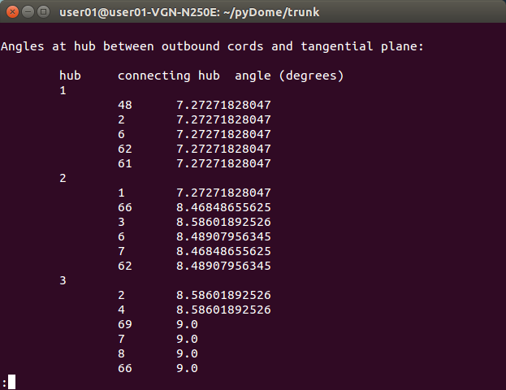
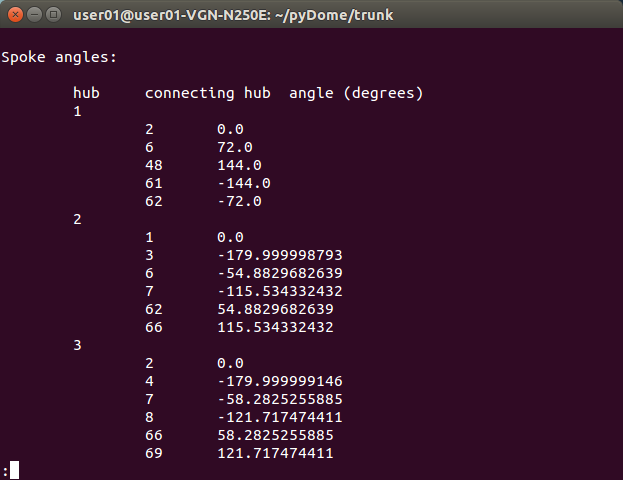

# Chapter 12: Hub Angles — Tangent Deflection and Spoke Angles

Every chapter in Part IV answers the same underlying question: given a finished, shaped dome, what does a builder actually need to know to *fabricate* it? This chapter starts with the joints — the hubs where multiple struts meet — and the two angle types pyLair reports for each one. Together, they're what actually makes a bill of materials buildable, not just a list of strut lengths with nothing to say about how those struts physically come together.

## Two Angles, Two Different Physical Cuts

At every hub, each connecting strut gets two numbers. The **tangent-plane deflection angle** measures how far a connector bends *inward* to receive that strut — the angle between the strut itself and the plane tangent to the dome's surface at that hub. The **spoke angle** measures something different: how far *around* the hub, in that same tangent plane, one strut sits relative to another, using one connecting strut as an arbitrarily chosen zero-degree reference.

*(Figure 12-1: The tangent-plane deflection angle, illustrated — the view faces directly along the tangent plane, so it appears as a line. Two chords are shown for clarity; a real hub typically has five or six.)*


*(Figure 12-2: The spoke angle, illustrated — this time viewed orthogonally to the same tangent plane, showing each chord projected onto it and measured against a chosen reference chord.)*


Put plainly: the tangent-plane angle is the cut that lets a connector plate sit flush against a curved surface instead of poking through it; the spoke angle is the rotation that puts each of that connector's several strut-sockets in the right place around the hub. A fabricator needs both — a connector cut at the right inward angle but rotated wrong will still refuse to accept its struts in the right positions, and one rotated correctly but cut at the wrong angle will sit proud of the surface instead of flush against it.

## A Real Worked Example

Here's both angle types, reported for a real hub on the Actual Secret Lair — Class III `(4,1)`, elongated `1.8`× on Z, truncated at `0.499999` (Chapters 6, 8, and 9 combined) — specifically a typical, ordinary 6-strut hub, not an unusual one:

**Prompt:**
> For one hub on this dome, report both the tangent-plane deflection angles and the spoke angles for every strut meeting there.

**What Comes Back** (real `compute_hub_data`/`compute_spoke_angles` output, hub vertex `1`, position `(0.107, 0.182, 1.759)` — near the dome's elongated crown):

```json
{
  "tangent_plane_angles_degrees": {"0": 10.3853, "2": 12.3198, "3": 12.3198, "11": 12.1743, "14": 11.4037, "15": 11.7717},
  "spoke_angles_degrees":         {"0": 0.0,      "2": 53.3198, "3": -53.3198, "11": 115.3563, "14": 180.0, "15": -118.5569}
}
```

**What It Means:** Six struts meet here, each with its own tangent-plane deflection (roughly `10–12°`, all inward bends of a similar rough magnitude near this dome's crown) and its own spoke angle (spread across the full `360°` around the hub, as you'd expect for struts radiating outward in every direction from a single point). Struts `2` and `3` share the identical tangent angle (`12.3198°`) and mirror-opposite spoke angles (`±53.3198°`) — a real, visible hint of local symmetry at this specific hub, not a coincidence worth ignoring. This pair of angle lists, taken together, is a complete fabrication spec for this one joint: cut six connector sockets at these six inward angles, arranged at these six rotations around the hub, and every strut meeting here will sit correctly.

This matches what those numbers actually look like printed as a real report, the same way pyLair's own documentation has shown them from the start:




## Why Elongation Changes the Whole Pattern, Not Just the Numbers

Chapter 8 first showed that elongating a sphere breaks the convenient fact that a surface normal always equals the position vector — and hub angles are exactly where that matters most, because both angle types are measured *against* that normal. Here's the same real vertex, compared before and after an 1.8× Z-axis stretch, with truncation removed from both so the comparison is a clean, direct one:

```json
{"elongation": "1.0,1.0,1.0", "vertex": [0.894, 0.0, 0.447], "tangent_angles": [6.1061, 6.1061, 6.1061, 6.1061, 6.1061]}
{"elongation": "1.0,1.0,1.8", "vertex": [0.894, 0.0, 0.805], "tangent_angles": [4.1481, 5.6306, 6.5689, 4.7556, 4.0230]}
```

**Prompt:**
> This dome is elongated. Show me how much the reported hub angles would differ if it were a plain sphere instead.

**What It Means:** On the plain sphere, this is one of the base icosahedron's own original 12 vertices — a genuine 5-fold-symmetric point, and all five of its tangent angles report the identical value, `6.1061°`, because a true sphere's surface normal at this point treats every direction radiating outward from it with total symmetry. Elongate the same dome, and that symmetry is gone entirely: five *different* values, ranging from `4.02°` to `6.57°`, because the true ellipsoid normal (Chapter 8's own formula) now depends on which direction each strut actually runs relative to the stretch axis, not just this hub's distance from the center. This is why Chapter 8 insisted on the true ellipsoid normal rather than the naive position-vector shortcut: using the wrong normal here wouldn't just be imprecise, it would report five angles as identical when they're demonstrably not, for a dome that's very much not a plain sphere.

## The One Number That Isn't What It Looks Like

Here's a real gotcha worth internalizing before Chapter 15 teaches you to cluster hubs by shape: a hub's spoke angles are always reported **relative to one specific connecting strut, chosen as the zero-degree reference** — specifically, the lowest-index connecting vertex, per `compute_spoke_angles`'s own documented convention. That reference is a bookkeeping choice, not a physical compass direction rooted in the dome's own geometry.

The practical consequence: two hubs that are genuinely, physically identical in shape — same set of tangent angles, same set of gaps between consecutive struts — can still report two completely different-looking raw spoke-angle lists, purely because pyLair happened to number their connecting vertices differently. A `0°`/`53°`/`115°`/`180°`/`-119°` hub and a `0°`/`38°`/`103°`/`165°`/`-134°` hub might be the exact same physical connector, just rotated to a different starting reference before their angles were listed out.

This matters concretely: comparing two hubs "by eye," row by row against their raw spoke-angle numbers, is not a reliable way to tell whether they're the same shape — you'd need to first rotate one hub's whole angle list until some strut lines up, and only then compare. Chapter 15's own rotation-invariant hub-shape clustering exists specifically to do that correctly and automatically, comparing the *cyclic pattern of gaps* between consecutive spoke angles rather than the raw angle values themselves. Until you reach that chapter, the safe rule is: never conclude two hubs differ in shape just because their raw spoke-angle lists don't match number-for-number.

## What's Next

Chapter 13 moves from the joints to the struts themselves — not their angles, but how their lengths get grouped into an actual bill-of-materials row count, and the real, deliberate tradeoff baked into the one setting that controls both how that grouping happens and how many decimal places get printed.
