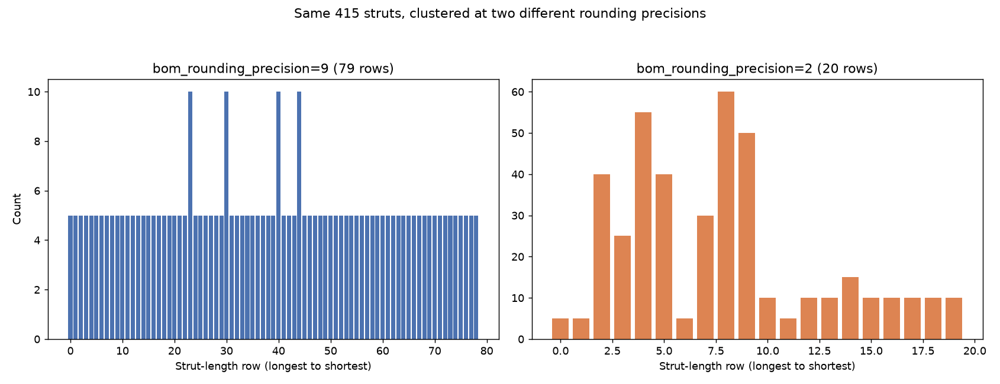

# Chapter 13: Counting Struts — Clustering, Rounding, and the Merge Tradeoff

A bill of materials is only useful if its strut-length rows mean what they claim to mean: "cut exactly this many struts to exactly this length." This chapter is about the one setting that decides how those rows get formed in the first place — `bom_rounding_precision` — and a design choice in how it works that's worth understanding precisely before you ever reach for a non-default value.

## Why Chords Are Clustered, Not Independently Rounded

Here's the naive approach `get_bill_of_materials` deliberately does *not* take: round each chord's raw length to `bom_rounding_precision` decimal places, then group rows by the rounded value. That sounds reasonable, and it's wrong in a specific, avoidable way. Floating-point geometry pipelines produce tiny amounts of noise — two chords that are supposed to be the exact same true strut length might come back as `0.4748131498...` and `0.4748131503...`, a difference in the 10th decimal place, meaningless to any real fabrication process. Independently rounding each one to, say, 9 decimal places risks landing them on opposite sides of a rounding boundary, splitting one genuine strut length into two separate report rows over a difference that was never real to begin with.

The actual implementation (`pylair/bill_of_materials.py`'s own comments explain this directly) does something more careful: sort all the raw chord lengths, then split them into clusters wherever the gap between consecutive sorted lengths exceeds a tolerance — never by independently rounding first. That tolerance is derived from `bom_rounding_precision` itself:

```python
cluster_tolerance = max(scale * 1e-9, 0.5 * 10 ** (-rounding_precision))
```

Two things worth reading precisely here. First, the tolerance floors out at a tiny, scale-relative noise-only value (`scale * 1e-9`, where `scale` is the dome's largest strut length) — so even at an extremely fine `bom_rounding_precision`, pure floating-point noise still merges rather than reporting spurious near-duplicate lengths as distinct struts. Second, and this is the real design decision worth understanding: **`bom_rounding_precision` isn't just display precision.** The same number that decides how many decimal places get printed also decides how large a gap two chord lengths can have and still be merged into the same row. One flag, two jobs, on purpose — not an accidental coupling.

## Seeing Both Roles at Once, on a Real Dome

Here's the Actual Secret Lair — Class III `(4,1)`, elongated, truncated at `0.499999` — at four different `bom_rounding_precision` values, all describing the exact same 415 physical struts.

**Prompt:**
> Get this dome's bill of materials at `bom_rounding_precision` 9, 3, 2, and 1. How many distinct strut-length rows does each one report?

**What Comes Back** (four real `get_bill_of_materials` results):

```json
{"bom_rounding_precision": 9, "distinct_rows": 79}
{"bom_rounding_precision": 3, "distinct_rows": 61}
{"bom_rounding_precision": 2, "distinct_rows": 20}
{"bom_rounding_precision": 1, "distinct_rows": 2}
```

*(Figure 13-1: The same 415 struts on the same dome, clustered at the default `bom_rounding_precision=9` (left, 79 distinct rows — mostly groups of 5, matching this dome's own local symmetry) versus a deliberately coarse `bom_rounding_precision=2` (right, 20 distinct rows, several groups now 50–60 struts wide). Nothing changed about the dome itself between the two charts — only how aggressively nearby lengths get treated as "the same.")*



**Prompt:**
> Generate the bill of materials at the default rounding, then again at `bom_rounding_precision=2`. Do any distinct strut lengths get merged together at the coarser setting?

**What Comes Back** (a real, concrete case, pulled directly from comparing the two reports): at the default `bom_rounding_precision=9`, two genuinely separate rows exist — `0.047485003` (5 struts) and `0.051270148` (5 struts), a real difference of about `0.0038` units, nowhere close to floating-point noise. At `bom_rounding_precision=2`, both collapse into a single row: `length: 0.05, count: 10`.

**What It Means:** This is exactly the merge tradeoff this chapter exists to teach, shown with real numbers rather than described abstractly: two strut lengths that differ by nearly 8% of their own length — a difference a caliper would catch instantly — get reported as one identical strut type at the coarser setting. Whether that's a useful simplification or a real mistake depends entirely on what you're about to do with the number, which is exactly why this isn't a bug to file, but a tradeoff to choose deliberately.

## When Coarser Is Useful, and When It's Dangerous

The documented default, `bom_rounding_precision=9`, stays exact — no unintended merging at all — at any dome frequency this book or pyLair's own test suite has exercised; the minimum gap between two genuinely distinct strut lengths on the dome above is about `4.7×10⁻⁶`, comfortably larger than `bom_rounding_precision=9`'s own cluster tolerance (about `9,400`× larger, in fact). A coarser value is worth reaching for specifically when your actual fabrication tools can't reliably distinguish lengths as close as the default would report them separately — a laser cutter or hand saw that can't tell two struts `0.5mm` apart isn't served by a bill of materials insisting they're different, and merging them into one row is a genuine, useful simplification in that case.

It's dangerous for exactly the same reason it's useful, applied to the wrong case: if you lower `bom_rounding_precision` far enough to merge lengths that *do* matter for your build — the `0.047485003`/`0.051270148` pair above, on a build where that 4mm difference is structurally meaningful — you've told the bill of materials to lie to you, cheaply and silently. Nothing about a merged row looks wrong; it just no longer describes two different things that used to be two different things.

**Prompt:**
> Given my laser cutter can't reliably distinguish lengths under 0.5mm apart, what `bom_rounding_precision` value should I actually use?

**What Comes Back:**
> Work out what `bom_rounding_precision` value gives a `cluster_tolerance` close to your actual tolerance, in whatever units your radius is expressed in. Since `cluster_tolerance ≈ 0.5 × 10⁻ᵇ` for any practical `bom_rounding_precision` (the floating-point-noise floor only matters at extremely fine settings), solving for `b` given a target tolerance `t` is `b ≈ -log₁₀(2t)`. If your dome's radius is in meters and your laser cutter's tolerance is `0.5mm = 0.0005m`, that's `b ≈ -log₁₀(0.001) = 3` — `bom_rounding_precision=3` gives a cluster tolerance of exactly `0.0005`, matching your tool's own limit. Get the units right first, though: this formula assumes your `radius` is already expressed in the same units as your fabrication tolerance: passing `bom_rounding_precision=3` to a dome whose radius is secretly in *centimeters*, not meters, would merge lengths ten times further apart than you actually intended.

**What It Means:** There's no universally "correct" `bom_rounding_precision` — the right value is always relative to two things you supply yourself: the units your dome is modeled in, and the tolerance your actual fabrication process can and can't resolve. The default, `9`, is simply the value chosen to almost never merge anything at all, which is the safe assumption right up until you have a specific, deliberate reason to choose otherwise — and whenever you do lower it deliberately, the honest habit is checking the DXF or report before cutting material to a length that used to be two different lengths.

## What's Next

Chapter 14 moves from strut lengths to panel shapes, and reintroduces chirality — Chapter 6's whole-dome mirror-image relationship, now showing up at the scale of a single flat triangular panel, and the real trap it sets for anyone about to order directional cladding material.
