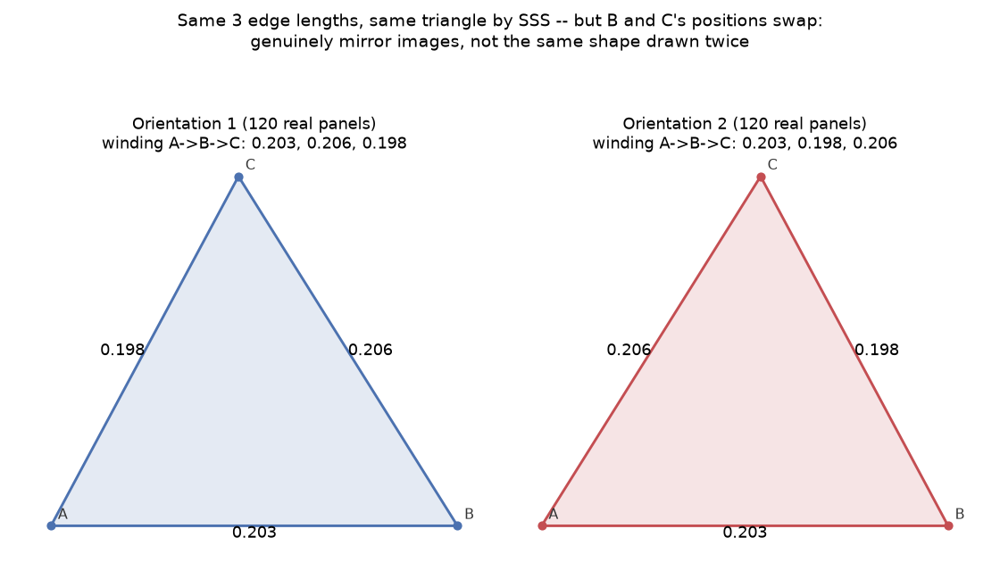

# Chapter 14: Skinning the Dome — Panel Shapes and the Chirality Trap

Chapter 13 grouped struts by length. This chapter groups panels by shape — and runs directly into Chapter 6's chirality definition again, at a scale one order smaller than a whole dome: a single flat triangle. The result is a genuine, easy-to-miss trap for anyone about to order directional cladding material, and — a real surprise worth sitting with — it shows up in a place you might not expect.

## Grouping Panels the Same Way You Grouped Struts

Every panel on a dome is a triangle, and pyLair groups them into shape "types" the same conceptual way Chapter 13 grouped struts by length — except a triangle needs three numbers to describe, not one. `_face_type_signature` computes exactly that: the panel's three edge lengths, sorted, an **SSS** (side-side-side) fingerprint. Two panels sharing that fingerprint get treated as the same cutting template — one DXF file serves every panel in the group, which is the entire point of grouping them at all.

## The Ambiguity SSS Alone Can't Resolve

Here's the catch, stated in `_face_type_signature`'s own source comment: sorting three edge lengths throws away one piece of information — which order those edges actually connect the panel's corners in, going around it. Two triangles with the *identical* three edge lengths can still be arranged as genuine mirror images of each other, distinguishable only by that winding order — precisely Chapter 6's chirality definition, applied to a single flat triangle instead of an entire dome's strut lattice. `_face_chirality_key` is pyLair's actual fix: a second fingerprint, this one keeping the winding-order sequence (canonicalized over its 3 rotations, but never reflected), so two panels that share an SSS signature but differ here are flagged as genuinely different, mirror-image shapes — not the same shape reported twice.

## A Real, Surprising Example — On the Plainest Dome in This Book

Here's the part worth pausing on: you don't need Class III's chiral construction, elongation, or truncation to see this happen. It shows up on a completely plain, untruncated, unelongated Class I icosahedral sphere at frequency 6 — the simplest dome this entire book builds:

```json
{"edge_lengths": [0.198, 0.203, 0.206], "count": 240, "chiral": true,
 "orientations": [{"count": 120}, {"count": 120}]}
```

**Prompt:**
> Group this dome's panels by shape. Are any of the groups flagged as chiral, and what does that mean for a one-sided material?

**What Comes Back:** Yes — on this exact dome, 2 of 6 total panel shape groups are flagged `chiral`. The largest one, edge lengths `(0.198, 0.203, 0.206)`, has 240 total panels split *exactly* 120/120 between two genuinely different winding-order orientations. Here they are, both real, both drawn from this exact dome's actual panel data:

*(Figure 14-1: The same three edge lengths — `0.203` along the base in both — but the `0.198` and `0.206` edges swap sides between the two. Same SSS signature, same cutting outline once you allow flipping the template over; genuinely different panels if you can't.)*



**What It Means:** You were about to order a run of wood-grain veneer panels, count the largest shape group at `240` total, and cut all `240` from a single template, oriented the same way every time. Half of them — the `120` panels in "Orientation 2" — would come out with the grain running the wrong direction relative to the other half, because they are not, in fact, the same shape traced twice. They're mirror images, and no amount of careful cutting from a single-orientation template fixes that; the template itself has to be flipped for half the batch.

## Why This Isn't a Class III-Only Curiosity

Here's the genuinely surprising finding, verified directly rather than assumed: on the exact same dome family, Class III's own chiral `(4,1)` construction — the subdivision method Chapter 6 built an entire chapter around, precisely because it produces genuinely handed strut patterns — reports **zero** chiral panel groups on every configuration this book tested, elongated, truncated, or plain. Class I, the *achiral* construction, is where real mirror-image panel pairs actually showed up.

This isn't a contradiction — it's two different questions, easy to conflate, worth keeping separate. Chapter 6's chirality is about the *whole dome*: is `(m,n)` superimposable on `(n,m)`? Class III's own construction is built consistently from one fixed combinatorial rule, replicated identically across every face — so within any *single* `(m,n)` dome, every copy of a given panel shape comes out with the same, consistent handedness. You'd only ever see its mirror counterpart by building the *separate* `(n,m)` dome, a different object entirely. Class I's grid, by contrast, is itself mirror-symmetric — but the icosahedron it gets replicated across has 3D symmetry operations that include orientation-reversing ones (a rotation in 3D space that, restricted to one flat face's own local 2D grid, looks like a reflection). Replicate a mirror-symmetric local grid across a polyhedron using symmetries that include reflections, and some of those replicated copies end up mirrored relative to others — real chirality, introduced by the replication step, on a subdivision method that has none of its own.

**Prompt:**
> If I'm using plain plywood with no grain direction, does the chirality flag actually matter for my build?

**What Comes Back:**
> No — not physically. A `chiral: true` flag only matters when the material itself has a direction that matters: wood grain, a printed pattern, a one-sided laminate or finish. Plain, non-directional plywood looks identical from either side and in either orientation, so a template that happens to produce a mirror-image panel instead of a direct copy cuts exactly as usable a piece either way. The flag exists to tell you *when* to check, not to declare every chiral group an emergency regardless of what you're actually cutting it from.

## Checking the Actual Secret Lair Itself

Running this same check against the real, continuing Actual Secret Lair — Class III `(4,1)`, elongated, truncated at `0.499999` — comes back clean: every one of its 52 panel shape groups reports `chiral: false`. That's consistent with the mechanism above, not a coincidence to be suspicious of: a single Class III dome never contains its own mirror-image panel pairs, by the same construction logic that makes `(4,1)` and `(1,4)` two separate objects rather than one dome with both handedness mixed in. It's still worth having actually run the check rather than assumed the result from the general rule above — the same "verify, don't assume" habit Chapter 16 teaches next, applied one chapter early.

## One Template Still Covers Both Orientations

This is worth stating plainly so the chirality flag doesn't get over-corrected into "twice as much fabrication work": a DXF cutting template still only needs **one file per shape group**, chiral or not — never one per orientation. A physical template can always be flipped over on the material itself; the shape traced from either face of the same template is exactly the mirror image needed. The chirality flag is about *awareness* — knowing that a batch labeled "one shape, 240 panels" is actually two distinct 120-panel sub-batches that need the template used in two different orientations — not about needing to generate, track, or store twice as many cutting files. Chapter 15 picks this up concretely once cutting templates themselves are the subject.

## What's Next

Chapter 15 generates real cutting templates for both hubs and panels, and shows exactly how this chapter's chirality flag and Chapter 12's spoke-angle reference-strut gotcha both resolve at the point where a builder actually needs a finite, correctly-deduplicated set of files to send to a fabricator.
