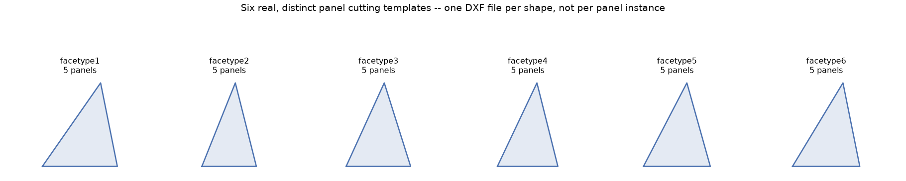

# Chapter 15: Cutting Templates — Hubs, Panels, and a Clustering-Tolerance Gotcha

Four chapters of geometry work — subdivision, projection, shaping, and now hub angles, strut clustering, and panel shapes — all converge here, on the two file types a fabricator actually needs: one cutting template per genuinely distinct hub connector shape, and one per genuinely distinct panel shape. This chapter is also this book's bridge into Part VI: every panel-template DXF file `-T` writes is exactly the kind of file a pyFit nesting job (Chapter 20) expects as input.

## Rotation-Invariant Clustering: What "Same Shape" Actually Means Here

A geodesic dome has far more physical hubs and panels than genuinely distinct *shapes* — Chapter 12 already hinted at this by showing one hub's own spoke angles depend on an arbitrary reference strut. `group_hub_types` solves that arbitrariness directly: rather than comparing hubs by their raw, reference-dependent spoke-angle lists, it builds a rotation-invariant fingerprint — valence, plus the cyclic sequence of (angular gap to the next strut, that strut's tangential angle) going all the way around the hub in true angular order — and then tries every possible rotation of that sequence, keeping the lexicographically smallest one. Two hubs that are the same physical shape, just rotated relative to each other, are guaranteed to produce the *identical* signature this way, because a laser-cut flat template's absolute rotation on the page never mattered in the first place — only the angles *between* struts do. `group_face_types` (Chapter 14) does the equivalent job for panels, using edge lengths instead of angles.

## Generating Real Templates for the Actual Secret Lair

Here's the payoff, run for real on the Actual Secret Lair — Class III `(4,1)`, elongated `1.8`× on Z, truncated at `0.499999`:

```
pylair -o lair -f 4 -n 1 -c 3 -p icosahedron -r 1.0 -e "1.0,1.0,1.8" -t 0.499999 -F -T -H
```

**Prompt:**
> Generate hub connector templates for this dome. How many genuinely distinct hub shapes are there, versus the total number of hubs?

**What Comes Back:** This dome has `156` total hubs. `group_hub_types` finds `28` genuinely distinct shape groups among them — but only `27` `_hubtype*.dxf` files actually get written. The missing one is deliberate, not a bug: `25` of those `156` hubs share a single-strut (`valence: 1`) shape — the truncated dome's own base row, where the cutoff left a stub with only one remaining chord — and a connector plate with only one strut socket has no angular pattern to draw a template for at all, so `get_bill_of_materials` explicitly skips any group with `valence <= 1` before writing files.

**What It Means:** `156` physical hubs collapse to `27` real, distinct connector templates — not `156` separate files, and not naively `28` either, once you account for the one shape that genuinely doesn't need a cutting template because there's nothing to cut. A builder ordering connector plates needs 27 distinct part numbers, cut in the quantities each group's `count` reports, not one custom plate per physical joint.

Panel templates follow the identical logic on the shape side: this same dome's `260` total panels collapse to `52` distinct `_facetype*.dxf` files.

*(Figure 15-1: Six of this dome's real, distinct panel cutting templates, drawn directly from their actual edge-length data — genuinely different shapes, even though several look superficially similar at a glance, which is exactly why a shape-matching algorithm, not a human eyeballing a pile of triangles, is doing this grouping.)*



## The Empirically-Tuned Number Behind the Clustering

Both `group_hub_types` and `group_face_types` round angle/length values before comparing them, for the same reason Chapter 13's strut clustering does: the geometry pipeline's own floating-point arithmetic produces tiny amounts of noise between values that are supposed to be identical. The specific tolerance chosen for hub-angle comparison — 3 decimal places — is a real, empirically-tuned number, not a round default reached for out of habit, and it's worth seeing exactly why.

Two hubs from the *exact same symmetry orbit* — physically identical positions on the dome, related by an exact rotational symmetry of the underlying construction — were observed differing by about `2×10⁻⁶` degrees (e.g. `64.465668°` versus `64.465666°`, a difference showing up at the 6th decimal place). A precision of 6 decimal places does *not* absorb that difference — it still reports the two hubs as different shapes, because their 6th-decimal digits genuinely disagree. A precision of 3 comfortably does, since both values round to the identical `64.466°`.

This isn't a one-off observation; it was checked empirically across a real range, and this book's own testing confirms the same pattern directly on the Actual Secret Lair:

```json
{"angle_precision": 1, "distinct_hub_groups": 28}
{"angle_precision": 2, "distinct_hub_groups": 28}
{"angle_precision": 3, "distinct_hub_groups": 28}
{"angle_precision": 4, "distinct_hub_groups": 28}
{"angle_precision": 5, "distinct_hub_groups": 31}
{"angle_precision": 6, "distinct_hub_groups": 36}
```

Precision 1 through 4 all agree on the identical, stable count — a genuine plateau, not a coincidence — while precision 5 and 6 start reporting spurious extra groups, purely from noise that a coarser tolerance correctly treats as "the same." `3` is deliberately chosen as a safety margin comfortably inside that stable plateau, not the loosest value that happened to pass a single test.

**Prompt:**
> If that template count looks suspiciously high for how symmetric this dome should be, what's the first thing you'd check?

**What Comes Back:**
> This specific tolerance isn't exposed as a CLI flag — it's a fixed internal constant, verified stable across frequencies 4 through 16 in pyLair's own test suite. At any frequency within that tested range, floating-point noise inflating the template count past what the dome's real symmetry would suggest is unlikely to be the cause. If you're deliberately working at a frequency well outside that range and a hub-template count looks implausibly large for how symmetric the design should be, this exact noise floor — genuinely identical hubs disagreeing at the 5th or 6th decimal place — is the documented, first thing worth suspecting, even though it isn't something you can currently tune away yourself; it would be worth reporting as a real edge case rather than assuming your dome is secretly less symmetric than it looks.

## Panel Templates and Chirality, Paid Off

Chapter 14 raised the chirality flag and promised this chapter would show what it means for template count specifically. Here's the payoff: `-T` writes **one file per shape group, never per orientation** — a chiral group's `240` panels split `120`/`120` between two true mirror images still produces exactly one `_facetypeN.dxf` file, not two. This isn't an oversight; a physical template can always be flipped over on the material itself, so one file genuinely covers both orientations. The chirality flag stays useful precisely because template *count* doesn't reflect it at all — a builder still needs to know, separately, that half of a given group's panels need that template used flipped, which is exactly the awareness Chapter 14 taught, not something the file count alone would ever reveal.

## What This Chapter's Numbers Don't Yet Answer

One honest gap, worth stating in exactly one sentence before Part VI closes it: knowing that this dome needs `52` distinct panel shapes, in specific quantities each, says nothing at all about how many sheets of actual plywood it takes to cut them all out — that's a materially different question, and Chapter 20 is where it finally gets answered for real.

## What's Next

Chapter 16 covers the last gotcha in this dome's own bill of materials: truncation-boundary slivers — chords and panels shrunk to near-nothing by an unlucky cutoff — and why pyLair flags rather than silently drops them. After that, Part V exports every one of this chapter's real templates to disk for good, and Part VI picks up exactly where this chapter's own open question left off.
