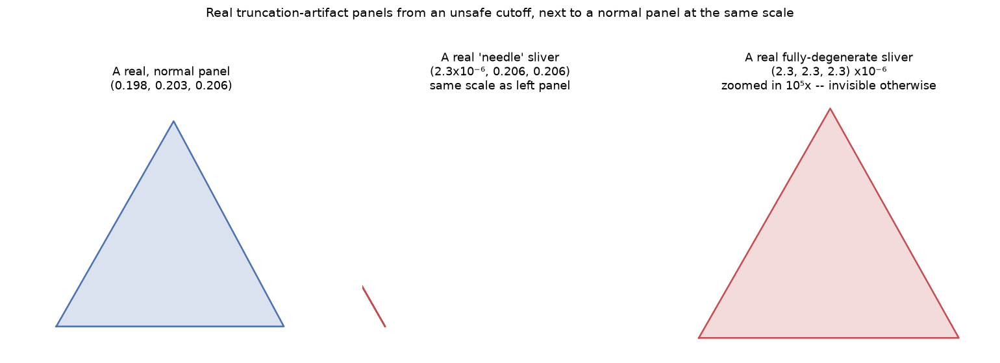

# Chapter 16: Spotting the Slivers — Truncation-Artifact Chords and Panels

Chapter 9's flat-chord `ValueError` refuses outright when a truncation cutoff lands *exactly* on a vertex ring. This chapter is about the case one step away from that: a cutoff landing extremely close to a ring, but not exactly on it — mathematically valid, structurally absurd, and, unlike Chapter 9's failure, something pyLair lets through rather than refuses. The reason it lets it through, and how it flags the result instead, is this chapter's whole subject.

## A Cutoff That's Merely Close, Not Exact

Nudge a truncation cutoff a hair closer to a vertex ring than the flat-chord degenerate case — not `0.5` exactly, but `0.4999999`, one more `9` than the documented safe value — and `truncate()` doesn't refuse. It succeeds, and produces something real but useless: a chord shrunk to a near-zero length, or a panel clipped down to a near-zero-area sliver. `pylair/bill_of_materials.py`'s own source comment names this exact cutoff as its own worked example, worth quoting directly:

> Real geodesic subdivisions essentially never produce legitimate strut-length classes differing by more than roughly one order of magnitude from each other (e.g. a frequency-6 Class I icosahedron's longest and shortest struts differ by well under 2×) — so a strut three orders of magnitude below the dome's largest is overwhelmingly more likely to be a sliver left over from a truncation cutoff landing extremely close to (but not exactly on) a vertex ring, as observed for e.g. `-t 0.4999999`.

That threshold — anything under `0.1%` (`SMALL_CHORD_ARTIFACT_RATIO = 1e-3`) of the dome's largest strut length — is exactly what it sounds like: a boundary chosen because real, legitimate strut classes just don't span three orders of magnitude, so anything that far below the dome's own largest strut is far more likely to be a rounding artifact than an intentional, tiny, structurally meaningful strut.

## Reproducing Real Slivers, Live

Here's the exact case from the comment above, reproduced for real on a frequency-6 Class I icosahedral sphere — the same construction Chapter 9 already showed has a genuine vertex ring exactly at the equator:

```json
{"truncation": 0.4999999, "artifact_chords": 4, "artifact_panels": 3}
{"truncation": 0.45,      "artifact_chords": 0, "artifact_panels": 0}
```

**Prompt:**
> Truncate this dome at a cutoff suspiciously close to a vertex ring. Does the report flag any artifact chords or panels?

**What Comes Back:** Yes — real, verified flagged entries, not a hypothetical case. Here's one of the actual flagged chord rows:

```json
{"length": 2.363e-07, "count": 10}
```

And two real flagged panel shapes, both genuinely degenerate in different ways:

```json
{"edge_lengths": [2.31e-06, 2.34e-06, 2.35e-06], "count": 10}
{"edge_lengths": [2.31e-06, 0.206, 0.206], "count": 5}
```

**What It Means:** The first panel is what you'd call a fully-degenerate sliver — all three edges collapsed to near-nothing, essentially a single point pretending to be a triangle. The second is a "needle": two of its edges are perfectly ordinary strut lengths (`0.206`, matching real panels elsewhere on the same dome), but its third edge has been squeezed down to a sixth of a millionth of that scale — a triangle so thin it would be functionally a slit, not a panel, if anyone tried to actually cut it. Both are mathematically valid triangles. Neither is buildable.

*(Figure 16-1: A real, normal panel from this dome (left) next to two real sliver artifacts at the identical scale (center: a "needle," essentially invisible at this zoom; right: a fully-degenerate sliver, still invisible at the dome's own scale even after zooming in 100,000×). Nothing here is exaggerated for effect — every triangle shown is a real, computed panel from this exact dome.)*



## Even the "Safe" Cutoff Isn't Immune Here

This is worth stating plainly, because it's a stronger and more honest claim than "always use `0.499999` and you're covered": on this *exact* frequency-6 dome, the documented safe cutoff itself still produces flagged artifacts, just smaller ones than the unsafe cutoff does:

```json
{"truncation": 0.499999,  "artifact_chords": 6, "artifact_panels": 3}
{"truncation": 0.4999999, "artifact_chords": 4, "artifact_panels": 3}
```

**Prompt:**
> Now re-cut at the documented safe cutoff instead. Did the flagged list shrink, and did it disappear entirely?

**What Comes Back:** It shrank — the largest flagged chord length dropped by roughly an order of magnitude, from about `2.4×10⁻⁷` at `0.4999999` to about `2.4×10⁻⁶` at `0.499999` (both minuscule, but the safer cutoff's slivers are further from the same absolute zero). It did **not** disappear: this specific frequency's vertex ring sits close enough to *both* cutoffs that some sliver artifacts survive either way. A genuinely clean result, with zero flagged entries at all, only showed up at a cutoff meaningfully further from the ring (`0.45`) — or at an odd frequency, where this construction never places a ring at the exact equator to begin with.

**What It Means:** "Reduces the risk" and "eliminates the risk" are different claims, and this book won't blur them even about its own documented advice. `0.499999` is a good, sensible default specifically because it's *usually* far enough from wherever a vertex ring happens to land — but "usually" is doing real work in that sentence, and this exact frequency is a real, reproducible case where it isn't quite enough on its own. The honest habit this chapter teaches isn't "trust the documented safe value and stop checking" — it's "generate the report, and actually look at whether the artifact lists are empty," regardless of which cutoff you used to get there.

## Two Different Safety Nets, Not One

It's worth being precise about how this chapter's flagging differs from Chapter 9's flat-chord `ValueError`, because they solve two genuinely different problems and neither one substitutes for the other. The `ValueError` refuses outright on an **exact** degenerate case — a chord lying flat against the cutoff plane, where the underlying math would otherwise divide by zero. This chapter's flagging surfaces a **near**-degenerate case that's still technically, numerically valid — nothing divides by zero, nothing crashes, the geometry is mathematically fine, just absurd. Refusing outright on *every* small chord the way Chapter 9's check refuses on an exact one would reject a great many perfectly legitimate designs — plenty of real subdivisions have honestly short struts near a pole or a tight truncation — right alongside the rare cases that are actually artifacts. Flagging instead of refusing is the correct compromise for exactly this reason: a builder shouldn't have to eyeball a hundred-row report looking for the one entry that's secretly a rounding artifact, but the tool also shouldn't refuse to hand over a design that's actually fine just because one of its struts happens to be short.

## What's Next

Part IV closes here — six chapters covering everything a bill of materials actually promises, from hub angles to cutting templates to the artifacts that can hide inside them. Part V picks the finished, verified Actual Secret Lair back up and finally gets it out the door: real export files, and the four MCP tools that turn "design a dome" from a single command into the iterate-then-commit workflow this book has been building toward since Chapter 1.
