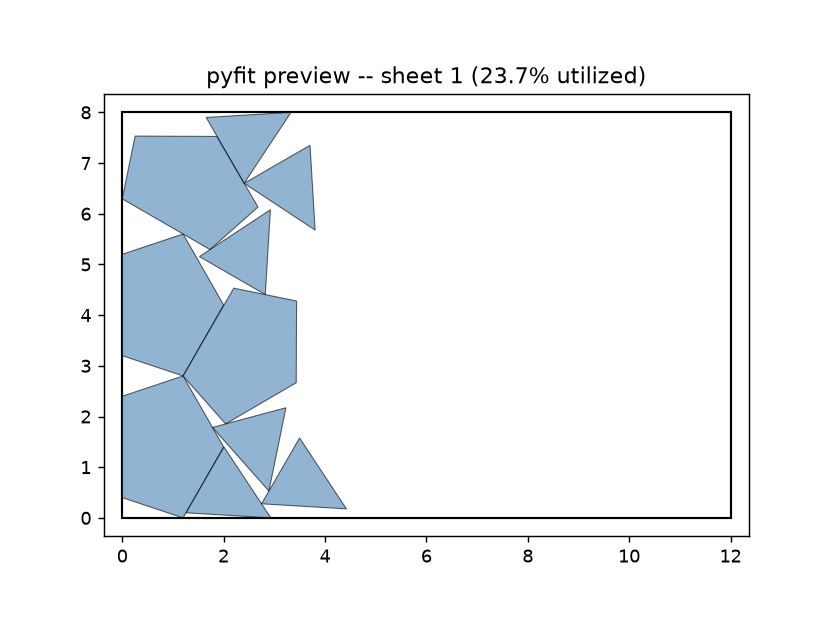
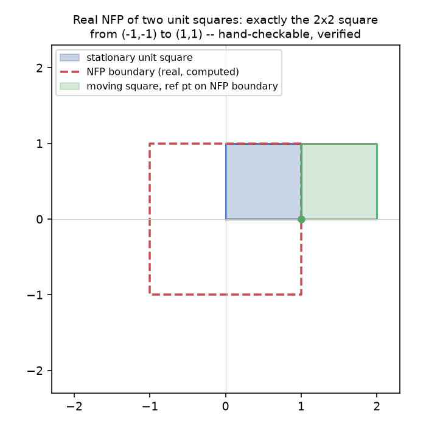
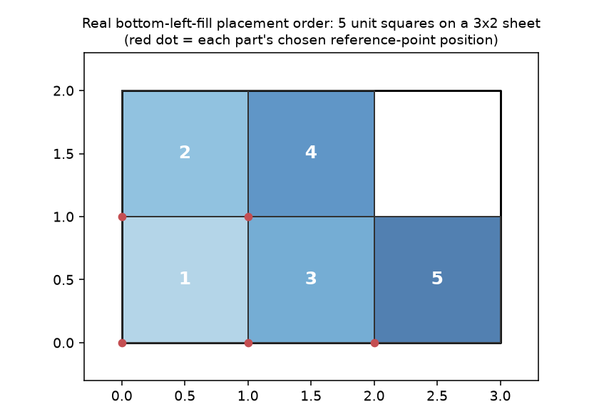

# Chapter 19: Introducing pyFit — Nesting as a Second Geometry Problem

Every dome this book has built has an answer now: what shape, subdivided which way, shaped how, accounted for in exactly what struts and panels, exported to exactly what files. What none of it has answered yet is the question a henchman standing in front of a sheet of plywood actually has: where does each of those 52 panel shapes *go*? This part of the book is about **pyFit** — a genuinely separate project from pyLair, owing it nothing but a shared file format, built to answer exactly that question.

## A Standalone Tool That Happens to Read pyLair's Files

pyFit has no code dependency on pyLair at all. It reads DXF files — pyLair's panel templates, or any other tool's, or a hand-drawn shape — and arranges however many copies of each you need onto rectangular sheet stock, minimizing wasted material. A henchman payroll generates its own steady stream of 2D cutting problems that have nothing whatsoever to do with a dome — uniform patches need cutting in bulk before morale gets any worse, and a proper throwing-star stencil doesn't nest itself — and pyFit doesn't care in the slightest which kind of shape it's asked to arrange. Before this chapter ever touches a dome panel, here's pyFit doing exactly that on something that has nothing to do with any dome.

**Prompt:**
> Nest a batch of henchman-uniform patch blanks and throwing-star stencils — two shapes, ten total parts — on a 12×8 sheet, and preview the result.

**What Comes Back** (a real `preview_nest` render):

*(Figure 19-1: A real pyFit nesting result — henchman-uniform patches and throwing-star stencils, nothing to do with any geodesic dome, at `23.7%` real utilization on a `12×8` sheet. Proof, before this chapter ever nests a single pyLair panel, that pyFit owes nothing to pyLair's own geometry.)*



## The Question Underneath: The No-Fit-Polygon

Nesting reduces to one core geometric question, asked over and over: given a shape already placed on the sheet, where is a *second* shape allowed to go without overlapping it? The **no-fit-polygon (NFP)** answers exactly that — the region a moving shape's own reference point must stay *outside* of to avoid overlapping a fixed one. Inside the NFP, the two shapes overlap; on its boundary, they touch; outside, they're clear.

pyFit computes the NFP as a Minkowski sum — `NFP(A, B) = A ⊕ (−B)`, the stationary shape swept by the moving shape reflected through its own local origin — and the hand-checkable sanity case this book keeps promising is worth actually computing rather than taking on faith:

**Prompt:**
> Show me the no-fit-polygon of two unit squares. Does it match what you'd expect by hand?

**What Comes Back** (pyFit's own real `no_fit_polygon` function, called directly on two unit squares):

```python
no_fit_polygon([(0,0),(1,0),(1,1),(0,1)], [(0,0),(1,0),(1,1),(0,1)])
# -> [[(1.0, 1.0), (-1.0, 1.0), (-1.0, -1.0), (1.0, -1.0)]]
```

*(Figure 19-2: The real, computed no-fit-polygon of two unit squares — exactly the 2×2 square from `(-1,-1)` to `(1,1)`, with the moving square shown touching the NFP boundary at one legal position.)*



**What It Means:** By hand: if a unit square's reference corner is anywhere inside a `2×2` square centered on the stationary square's own center, the two overlap; right at that boundary, they touch edge-to-edge; anywhere outside it, they're clear. The code's real output matches that exactly, with no rounding required — the same style of hand-checkable sanity test Chapter 6 used for Class III's own construction, applied here to a completely different geometric primitive.

## Bottom-Left-Fill, Watched in Action

On top of the NFP, pyFit runs a **bottom-left-fill heuristic**: place the largest remaining part first, try a range of rotation angles (and mirrored orientations, unless a part's `allow_mirror` is `false`), compute every legal candidate position against everything already placed, and pick whichever legal candidate sits furthest left, then furthest down. Here's that loop, watched directly rather than described.

**Prompt:**
> Nest five identical unit squares on a 3×2 sheet, and give me the full placement report so I can see the order they were placed in.

**What Comes Back** (a real `get_nest_report` result, plotted in placement order):

*(Figure 19-3: A real placement sequence — five unit squares, numbered in the actual order pyFit placed them, each red dot marking that part's chosen reference point. Notice the pattern: fill the bottom row left to right, then the next row up, exactly "leftmost, then bottommost.")*



**Prompt:**
> Explain, in your own words, why nesting a set of triangles onto plywood is a harder problem than computing their shapes in the first place.

**What Comes Back:**
> Computing a triangle's shape is a closed-form geometric calculation — given the inputs, there's one correct answer, computable directly. Deciding where a *set* of shapes should go on a sheet is a combinatorial search: every part's position depends on every other part already placed, the number of ways to arrange even a modest batch grows explosively, and 2D irregular nesting is a well-known NP-hard problem — no known algorithm finds the provably optimal layout in reasonable time as the part count grows. pyFit's own real code doesn't pretend otherwise: it's a heuristic, in the same family as tools like SVGnest and DeepNest, built to find a *good* layout quickly, not to search every possibility for the *best* one.

**What It Means:** This is a genuinely different kind of correctness claim than anything pyLair made. A pyLair dome either matches its golden-value formula or it doesn't — closed-form, checkable, unambiguous. A pyFit layout is never "the" correct layout, only *a* legal one; every placement is re-validated for overlap and containment before being accepted, so pyFit's honest guarantee is "this layout is valid," never "this layout is optimal." Chapter 24 returns to this exact distinction once both toolkits' correctness stories can be compared side by side.

## A Real, Documented Gotcha — Told the Same Way pyLair's Own Are

`pyclipper.MinkowskiSum` doesn't hand back one clean, resolved polygon — it returns the *raw* swept contours, and for a small pattern swept around a larger path, one of those raw contours can have opposite winding and *look* like it's marking a hole. It isn't one, and can't be: the Minkowski sum of two convex, filled shapes is always itself convex, and a convex shape is simply connected — no holes are geometrically possible. pyFit's real fix (`pyfit/nfp.py`) treats every returned contour as an independent solid region and unions them via `shapely`, ignoring Clipper's own winding-implied fill rule entirely.

What makes this worth telling in full, the same way this book has told pyLair's own historical bugs: **this exact issue passed its first hand-computable test case — two unit squares — cleanly**, and only surfaced on a second, differently-shaped and differently-sized case. One verified case is not the same claim as a verified method; Chapter 24 picks this exact lesson back up as a direct parallel to Class III's own historical stitching bug, which made precisely the same mistake in a completely different part of the codebase.

## What the Search Deliberately Doesn't Try

One more thing worth stating as a scope decision, not a shortcoming to apologize for: pyFit's candidate-placement search isn't full NFP-boundary tracing. It considers the sheet's own corners, every NFP vertex, and every NFP-vs-boundary and NFP-vs-NFP crossing — enough, in practice, to tile six unit squares perfectly onto a `3×2` sheet with zero wasted area, which is a genuinely tight result, not a loose approximation. It can still occasionally miss an even tighter placement a full boundary trace might find. The one guarantee that never bends: every candidate is re-validated for overlap and sheet containment before acceptance, so this scope limitation can only ever produce a *non-optimal* layout, never an *invalid* one — the same "wrong shape versus wrong count" distinction Chapter 6 drew for pyLair's own geometry, one problem domain over.

**Prompt:**
> Nest this batch of patch/stencil blanks — nothing to do with any dome — just to see pyFit work on its own terms first.

**What Comes Back:** Figure 19-1, above, from `preview_nest` — a real, legal, if not perfectly tight, layout. Nothing about that result depended on pyLair, a geodesic dome, or anything this book has built in its first eighteen chapters. That's deliberate: pyFit's next chapter is where it finally meets pyLair's own output, but this one exists to prove, first, that it doesn't need to.

## What's Next

Chapter 20 builds a real job spec directly from a real bill of materials — pyLair's own panel templates (from `export_dome`'s `face_templates=True`) and their reported `panel_count`s, becoming a pyFit job spec's `"dxf"` and `"quantity"` fields with zero hand-typing — and nests the Actual Secret Lair's own panels for the first time.
