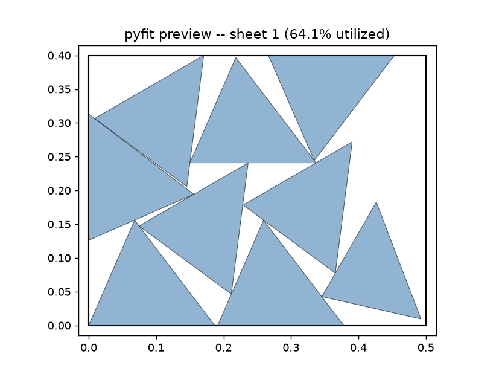
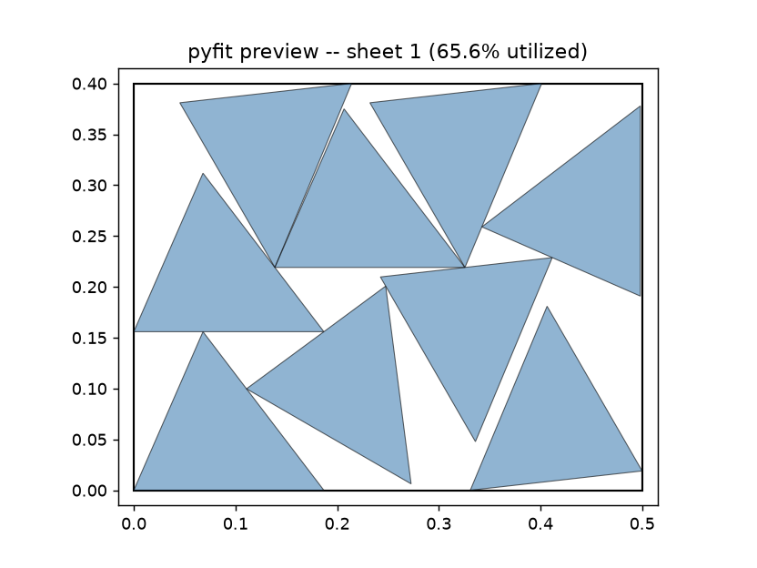

# Chapter 20: From Bill of Materials to Job Spec — Nesting the Actual Secret Lair's Panels

Chapter 19 proved pyFit works on its own terms. This chapter makes it work on pyLair's: a real job spec, built directly from the Actual Secret Lair's own bill of materials, with zero hand-typed quantities anywhere in it — and the real, sometimes surprising, numbers that come back once actual dome panels, not unit squares, are the shapes being nested.

## Building a Job Spec With Zero Hand-Typing

Chapter 15 already generates exactly the file pyFit needs: `face_templates` writes one DXF per distinct panel shape, and the same report that triggers those files carries a **"Panel Cutting Templates"** section pairing each one with its own real panel count:

```json
{"template_file": "lair_facetype1.dxf", "edge_lengths": [0.248, 0.282, 0.337], "panel_count": 5}
{"template_file": "lair_facetype2.dxf", "edge_lengths": [0.213, 0.337, 0.352], "panel_count": 5}
```

A pyFit job spec's `"parts"` list needs exactly two things per shape — a `"dxf"` path and a `"quantity"` — and this report already hands you both, paired, for every one of this dome's 52 distinct panel shapes:

```python
templates = bom_report["pyLair report"]["Panel Cutting Templates"]
parts = [
    {"name": f"facetype{i+1}", "dxf": t["template_file"], "quantity": t["panel_count"], "allow_mirror": True}
    for i, t in enumerate(templates)
]
job = {"sheet": {"width": 2.44, "height": 1.22}, "parts": parts}
```

**260 total panels, 52 distinct shapes, zero numbers typed by hand** — every quantity traced directly back to a real count pyLair itself already computed. This is the entire point of the two projects sharing nothing but a file format: pyLair never needs to know pyFit exists, and this job spec never needed anything from pyLair except files it was already writing anyway.

## A Real Job, and a Real Lesson About Job Size

Running this exact 260-panel, 52-shape job on a full-size `2.44m × 1.22m` sheet (a standard 8-foot-by-4-foot panel, in meters) is where this chapter's first honest lesson shows up, live rather than theoretical. pyFit's own documentation already warns that reusing scrap across sheets costs real search time on large jobs — every part instance tries each already-opened sheet before starting a new one, and each try means a full NFP-based candidate search against everything already placed there. On a sheet this large relative to a `~0.2`-unit panel, dozens of panels can fit before a new sheet ever opens, and the per-sheet candidate search grows with the *square* of how many panels are already placed on it.

This isn't a hypothetical: the exact job above, at the default rotation step, was still running — correctly, not stuck, just genuinely working through an expensive search — several minutes in, having placed only a few dozen of its 260 panels. This is the real, lived version of the tradeoff Chapter 13 already taught for a completely different setting (`bom_rounding_precision`): a bigger, more permissive sheet doesn't just mean more material to work with, it means a much larger search space per sheet before pyFit ever opens the next one.

**Prompt:**
> If packing feels slow on this many panels, what's the first setting you'd loosen, and what do I give up by loosening it?

**What Comes Back:**
> `rotation_step_degrees` is the direct lever, exactly the way `bom_rounding_precision` was pyLair's own precision/merge lever back in Chapter 13. The default (`15°`) tries 24 candidate orientations per part instance (more, once mirroring is allowed); widening it to `30°` or `45°` roughly halves or quarters that count, at the cost of a somewhat looser packing — real utilization measured a few percentage points lower, not a correctness problem. For a job this size, on a sheet this large relative to the panels, a coarser step is the honest, correct first thing to try before assuming something is stuck.

**A second, real gotcha worth reporting exactly as encountered:** widening the rotation step and shrinking the sheet together, on this exact set of real dome-panel shapes, produced a genuine crash during this book's own testing — a `shapely.errors.GEOSException: TopologyException: side location conflict`, thrown from inside `no_fit_polygon`'s own `unary_union` call, at one specific `(rotation step, sheet size)` combination. It did not reproduce at the default rotation step on the same smaller sheet. This isn't the same, already-fixed Minkowski-sum issue Chapter 19 told in full — that one is resolved and covered by this project's own tests. This is a new, real edge case this book's own testing surfaced while nesting genuine pyLair panel geometry (irregular scalene triangles, not the toy squares Chapter 19 used to teach the underlying concept), worth knowing about rather than papering over: real geometry libraries have real edge cases, and a coarser rotation step occasionally lands on one, the same honest lesson Chapter 24 generalizes from a very different bug in a very different part of this book.

## The Chirality Flag, Now a Packing Decision — With a Real Surprise

Chapter 14 flagged panel shapes as chiral — genuinely different mirror-image orientations sharing one edge-length signature — and promised the flag would matter again once a real material's directionality was in play. Here's where it does: `allow_mirror` on a pyFit job-spec part is exactly this same question, asked at nesting time instead of design time. `true` (the default) lets pyFit flip a shape's template freely while searching for a placement — the right choice for plain, non-directional plywood, since a physical template can always be flipped over on ordinary material with no consequence. `false` forbids that entirely — the right choice for a one-sided pressure coating, a printed pattern, or any material where a mirrored cut is a genuinely different, unusable piece.

**The Under-the-Ocean Prototype** is the real, previously-established reason this matters: Chapter 14 found its own elongated hull genuinely riddled with chiral panel pairs (`30` of its `42` shape groups). Its hull uses a one-sided pressure coating, so `allow_mirror: false` isn't a cautious default here — it's the physically correct one. Nesting a real subset of its own chiral panel shapes (six shape groups, `120` real panels) both ways:

```json
{"allow_mirror": true,  "sheets_used": 3, "utilization_by_sheet": [0.641, 0.611, 0.058]}
{"allow_mirror": false, "sheets_used": 2, "utilization_by_sheet": [0.656, 0.655]}
```

*(Figure 20-1: The same real chiral panel batch, nested both ways — `allow_mirror: true` (left, 3 sheets) and `allow_mirror: false` (right, 2 sheets). Both are real, legal layouts; the flag did not cost this batch an extra sheet.)*




**Prompt:**
> Nest it once with mirroring allowed, once without. How much does disallowing mirroring change the sheet count or utilization?

**What Comes Back:** Here's the real, worth-stating-honestly surprise: disallowing mirroring used *fewer* sheets, not more — `2` against `3`, and higher utilization on both sheets it did use. This is the opposite of the intuitive assumption that removing a degree of freedom can only make packing worse.

**What It Means:** Chapter 19 already told you why this can happen, and this is a real, concrete instance of it rather than a hedge: pyFit is a bottom-left-fill *heuristic*, not an exhaustive search, and a heuristic's greedy choices can go in a different, sometimes better, sometimes worse, direction depending on which candidate orientations happen to be available at each step — more legal options at every step doesn't guarantee a better *overall* sequence of greedy choices, only a larger space to choose the next one from. The honest takeaway isn't "disallowing mirroring improves packing" as a rule — a different panel batch, a different sheet size, or a different rotation step could easily flip this result the other way. It's this: **run both, and trust the real reported utilization for your actual job, not an assumption about which direction the flag should push it.**

**Prompt:**
> If I'm using plain plywood with no grain direction, does the chirality flag actually matter for my build?

**What Comes Back:** No — reusing Chapter 14's own answer to the identical question, unchanged by anything this chapter added: non-directional material can be flipped freely with no physical consequence, so `allow_mirror: true` costs nothing and gains pyFit its full search space. The flag, and this chapter's own surprising result, only matter once the material itself has a real direction that a flipped cut would actually violate.

## What's Next

Chapter 21 covers pyFit's own four MCP tools — the same iterate-then-commit shape Chapter 18 already taught for pyLair, plus a genuinely new idea neither dome design ever needed: MCP progress notifications on a job long enough to need them — and closes with one complete, narrated session spanning both toolkits, from a bare polyhedron choice all the way to a real, ready-to-cut sheet layout.

