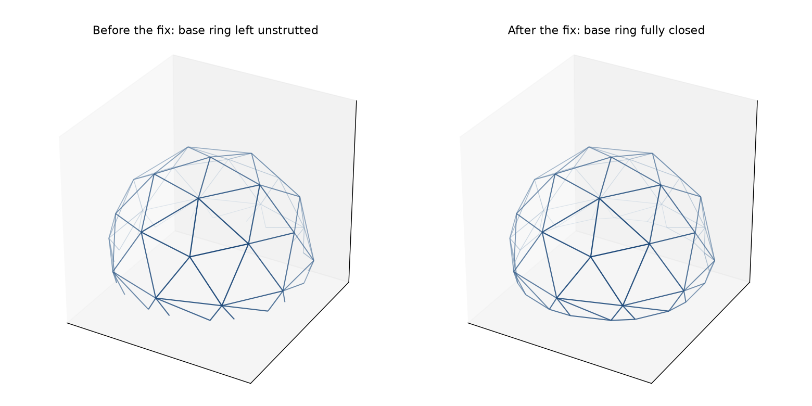
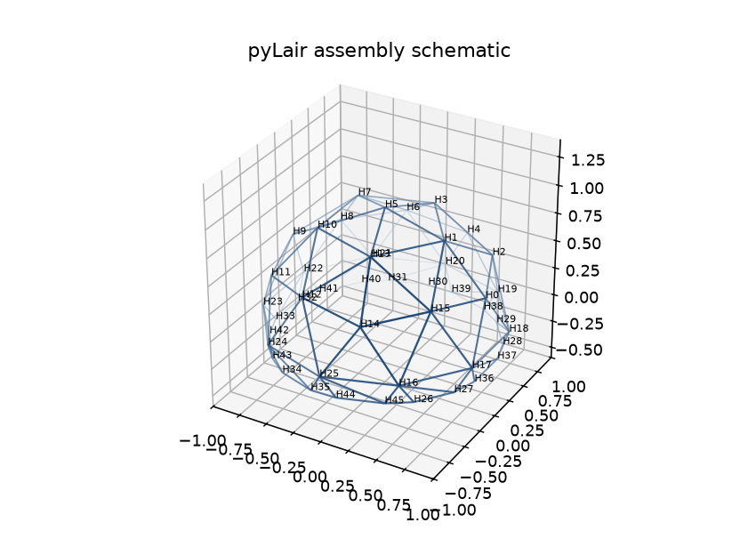

# Chapter 22: Which Piece Goes Where — the Assembly Manifest

Every chapter since Part IV has answered some version of "how many of each thing do I need." Chapter 13 counted struts by length. Chapter 15 counted cutting templates by shape. Chapter 20 turned those counts into a nesting job. None of them ever had to answer the question a henchman actually asks while standing over a labeled bin of identical-looking struts: *which one of these goes where?* This chapter is about the one thing this book's entire pipeline has never tracked until now — not a type, not a count, but a specific, individual piece's own identity — and a real bug this exact tracking caught along the way.

## Two Different Questions, Two Different Data Shapes

`get_bill_of_materials` and `get_assembly_manifest` compute from the exact same dome geometry — the same `V`/`C`/`F_sphere` this book has used since Chapter 3 — and answer two genuinely different questions with it. The Bill of Materials groups: "56 struts share this length, cut them all from the same setting." The assembly manifest doesn't group anything. Every hub, strut, and panel keeps its own stable label — `H12`, `S77`, `P42` — which is nothing more exotic than that instance's own position in the dome's vertex, chord, or face array, the same array index this book has been calling `vertex_count`/`edge_count`/`face_count` all along. Nothing new is computed to produce a label; the identity was always there, and the Bill of Materials was always the one throwing it away on purpose.

That identity is only useful if it comes with real adjacency attached — which strut meets which hub, which hub bounds which panel, which panel borders which strut. `get_assembly_manifest` builds exactly that, for the same running Actual Secret Lair this book has designed, accounted for, exported, and nested since Chapter 4: Class III `(4,1)`, elongated `1.8`× on Z, truncated at `0.499999` — `156` hubs, `415` struts, `260` panels, the same totals Chapter 13 and Chapter 15 already gave you, now individually addressable instead of collapsed into `79` strut-length rows and `32` hub shapes.

## Reading a Real Hub's Own Connections

**Prompt:**
> Get the assembly manifest for this dome and show me the crown hub's own connections — which struts meet there, and at what angles.

**What Comes Back** (a real `get_assembly_manifest` result, hub `H0`, position `(0, 0, 1.8)` — the elongated dome's own apex; `connections` trimmed to 3 of its real 5 entries for space):

```json
{
  "H0": {
    "position": [0.0, 0.0, 1.8],
    "valence": 5,
    "connections": [
      {"to_hub": "H1", "strut": "S0", "tangential_angle_degrees": 10.899, "spoke_angle_degrees": 0.0},
      {"to_hub": "H2", "strut": "S1", "tangential_angle_degrees": 10.899, "spoke_angle_degrees": -72.0},
      {"to_hub": "H3", "strut": "S2", "tangential_angle_degrees": 10.899, "spoke_angle_degrees": 72.0}
    ]
  }
}
```

**What It Means:** This is Chapter 12's own tangent-plane and spoke angles, unchanged — `get_assembly_manifest` doesn't recompute anything Chapter 12 didn't already teach you to trust. What's new is that every angle now comes labeled with exactly which neighboring hub and which specific strut it belongs to, by name, instead of being reported per-hub in isolation the way `get_bill_of_materials` does it. A henchman holding strut `S0` doesn't need to cross-reference a separate report to know it runs from `H0` to `H1` — the manifest says so directly, and `H1`'s own entry says the identical thing back, `S0` connecting it to `H0`.

## The Reverse Link: Which Panels Does a Strut Border

Every panel entry already knows its own three edges and the strut running along each one — that direction was never the hard part. The genuinely missing piece, until this exact work, was the reverse: given a strut, which panel(s) does *it* border? `bordering_panels` answers that for every strut in the manifest:

```json
{"S0":   {"hub_1": "H0", "hub_2": "H1", "length": 0.215, "bordering_panels": ["P30", "P31"]}}
{"S341": {"hub_1": "H106", "hub_2": "H111", "length": 0.121, "bordering_panels": ["P129"]}}
```

**What It Means:** `S0` is an ordinary interior strut — it borders exactly two panels, the two triangles that share that edge, same as every strut this book has shown you so far. `S341` borders exactly *one*. That's not a bug in the manifest. It's a real fact about this specific strut: it sits on the truncated dome's own base ring, where the cutoff left an open edge with a panel above it and nothing at all below. Every strut on this dome borders either 1 panel (the base ring) or 2 (everywhere else) — there is no third case, and, as of this exact chapter's own history, there used to be a fourth: zero.

## The Bug This Reverse Link Caught

Here's that history in full, because it's the sharpest illustration this book has of a bug invisible to every check this book has taught you to trust so far. Chapter 15 already told you this dome has `156` hubs; what it didn't tell you, because it wasn't true yet when this book's own drafting first reached that chapter, is that `50` of those hubs sit on the base ring, and — before the fix this chapter is actually about — `25` of them had a **valence of 1**: one strut, running upward, and nothing else. `get_bill_of_materials`'s own hub-clustering step has always had a real, defensive rule for exactly this case: skip writing a cutting template for any hub shape with valence `<= 1`, because a connector plate with one strut socket has no angular pattern worth drawing. That rule fired, silently, on 25 real hubs of this exact dome, and nobody watching only the vertex/edge/face *counts* would ever have known why.

*(Figure 22-1: The same small truncated dome — a frequency-2 icosahedral cap — before and after this exact fix. Left: the base ring's own closing edges were never emitted as chords at all, leaving a visibly ragged, open bottom. Right: every one of those edges is now a real strut, closing the ring completely. Nothing about the vertex positions changed between the two images — only which pairs of them have a strut connecting them.)*



**What Happened:** `truncate()`'s own face-clipping logic (`pylair/truncation.py`) computes two new crossing points for every boundary triangle it clips — that part was always correct, and it's the same machinery Chapter 10 already walked through in full for the diagonal seam a quad-split panel leaves behind. What it never did was report the segment *between* those two crossing points — the triangle's own third edge, the one lying exactly on the cutoff plane — back as a chord. Every other edge of a clipped face is already covered by the general chord-shortening logic Chapter 9 taught; that logic only ever touches chords that *already existed* before truncation, and this particular edge never did. It was a face-only edge from the moment it was created, with no code path that ever thought to give it a strut.

**Why Nothing Caught It Sooner:** This book has taught you two genuinely powerful correctness habits — the golden-value vertex/edge/face-count formulas (Chapter 4) and Euler's formula (Chapter 5), and a bit-for-bit independent-library comparison (Chapter 6). Neither one was ever going to catch this. Both only apply to a **closed** manifold — the full, untruncated sphere every one of those checks was actually run against. A truncated dome isn't closed; it has an open boundary by definition, so there's no golden-value formula stating what its edge count *should* be, and therefore no way for an undercounted edge total to contradict one. The bug hid in exactly the place this book's own strongest checks structurally couldn't look.

**What Did Catch It:** `bordering_panels` — built for the ordinary, unglamorous reason of letting a builder look up a strut's own neighbors, not as a deliberate bug hunt. Once every strut had to report how many panels it bordered, "zero" turned out to be a real, reachable answer for exactly the 50 edges this bug had silently dropped, and "zero" is not a value any real strut on a real triangulated dome should ever report. The fix (`pylair/truncation.py`) makes both clipping cases — a corner-clipped single triangle and a corner-clipped quad — report that missing edge back as a chord, the same way Chapter 10's diagonal already was. Every hub on this dome now has real valence `>= 3`, every hub-template skip rule sits unused on this exact configuration, and all 156 hubs collapse to 32 genuinely distinct, all-buildable connector shapes — the number Chapter 15 already gave you, now with an honest story behind it.

**Prompt:**
> Which hubs on this dome sit on the base ring, and how many struts does each one actually have now?

**What Comes Back:** Hub `H106`, position `(0.679, -0.729, 0.0)` — sitting exactly on the cutoff plane — connects to four hubs: `H78` and `H82`, further up the dome, and `H111` and `H107`, its own two immediate neighbors *around* the ring. That ring connection is exactly what used to be missing. Across this dome's `50` base-ring hubs, `25` now have valence `3` (one upward strut, two ring neighbors) and `25` have valence `4` (two upward struts, two ring neighbors) — two entirely ordinary, entirely bracable hub shapes, not the single dead-end valence-`1` shape this exact dome used to report.

## Chirality, Once More, at the Job-Spec Level

Chapter 14 taught you that a Class I dome, not Class III, is where real mirror-image panel pairs actually show up — and found exactly one such group on a plain, untruncated, frequency-6 icosahedron: `240` panels, edge lengths `(0.198, 0.203, 0.206)`, split precisely `120`/`120` between two true orientations. Building a job spec from that group is where the chirality flag stops being an awareness check and becomes a real correctness requirement.

**Prompt:**
> Build a per-instance pyFit job spec for this dome's panels. Make sure the chiral group's two orientations don't get mixed up.

**What Comes Back** (two real parts from the same chiral group, `export_assembly_job_spec`):

```json
{"name": "P3", "dxf": "lair_facetype1.dxf", "quantity": 1, "allow_mirror": false}
{"name": "P4", "polygon": [[0.0, 0.0], [0.198, 0.0], [0.102, -0.179]], "quantity": 1, "allow_mirror": false}
```

**What It Means:** `P3` belongs to this group's own "canonical" orientation — the one `OutputFaceTemplateDXF` actually draws — so it references that template file directly. `P4` belongs to the *other* orientation, so it gets its own inline `polygon` instead: the same three edge lengths, reflected, computed once and handed to pyFit directly rather than pointing at a second DXF file that doesn't exist. Both instances are submitted with `allow_mirror: false`, and that's the entire point: `OutputFaceTemplateDXF`'s own output is, without saying so, one specific arbitrary choice between two mirror-image shapes that share the identical three edge lengths. If pyFit's own packer were left free to flip either instance for packing efficiency (`allow_mirror: true`), nothing would stop it from placing a `P3`-orientation piece where a `P4`-orientation piece belongs — a batch that nests perfectly and cuts exactly the wrong-handed panel for its slot. Deciding orientation here, once, in the job spec itself, is what keeps that decision from being left to a packing heuristic that has no idea a dome's own geometry cares which way a panel is facing.

Hub connector plates get no equivalent treatment, and that's an honest gap, not an oversight: `group_hub_types` has no chirality signature the way `group_face_types` does, so `export_assembly_job_spec(kind="hubs")` submits every hub instance with `allow_mirror: true` unconditionally. If a real build ever needs a directional hub-connector material, that gap needs closing in `pylair/bill_of_materials.py` first — this chapter isn't pretending a distinction exists that the underlying geometry code doesn't yet compute.

## An Annotated Schematic, Not Just a Preview

**Prompt:**
> Render this dome with each hub's own label drawn at its position, so a builder can actually match a physical connector to a spot on the structure.

**What Comes Back** (a real `render_assembly_schematic` render, hub labels on):

*(Figure 22-2: The same small truncated dome from Figure 22-1 — after the fix, base ring fully closed — with every hub's own label drawn at its position. The same depth-cued wireframe Chapter 2 introduced, now annotated rather than plain.)*



**What It Means:** `render_assembly_schematic` reuses the identical depth-cued renderer `preview_dome` already uses — near struts dark, far struts pale — and optionally draws each hub's, strut's, or panel's own label at its position. Hub labels default on; strut and panel labels default off. That's not an arbitrary asymmetry: a real dome has far more struts than hubs, and far more panels than either, so turning all three label kinds on at once past a low frequency produces an unreadable smear of text, not a usable diagram. The Actual Secret Lair's own `156` hubs are already too many to label legibly in one image — the figure above deliberately uses a much smaller, coarser dome instead, the same honest scope choice Chapter 11's own environment gallery made for a different reason. A real build documenting a full-size dome would want this schematic generated per ring or per subassembly, not all at once — a real limitation worth stating plainly rather than papering over with a smaller example and pretending it scales.

## Getting All Three at Once

Every capability this chapter covered is one call away, in both interfaces, at no cost beyond what you'd already pay for the Bill of Materials itself:

```json
{
  "files_written": [
    "lair_manifest.json",
    "lair_facetype1.dxf", "... 51 more facetype files (52 total) ...",
    "lair_jobspec.json"
  ]
}
```

**What It Means:** `get_assembly_manifest` (no files), `export_assembly_job_spec` (writes real cutting templates plus the job spec above), and `render_assembly_schematic` (the annotated image) round out pyLair's MCP surface to seven tools total — the original four from Chapter 18, plus these three. The CLI's own equivalents, `--assembly-manifest`, `--pyfit-job-spec=panels|hubs`, and `--assembly-schematic`, write the identical files as a byproduct of an ordinary `pylair` invocation, the same discipline every other flag in this book has followed since Chapter 2.

## What's Next

Part VI closes here. Chapters 3 through this one have taken a shape from "pick a polyhedron" all the way to "here is exactly which physical piece a henchman is holding and where it goes" — design, shape, account, export, nest, and now, finally, assemble. Part VII steps back from the pipeline itself. Chapter 23 is a prompting clinic spanning both toolkits at once, Chapter 24 is the retrospective this whole book has been quietly building toward since its very first gotcha, and Chapter 25 sends the Actual Secret Lair off to be built.
